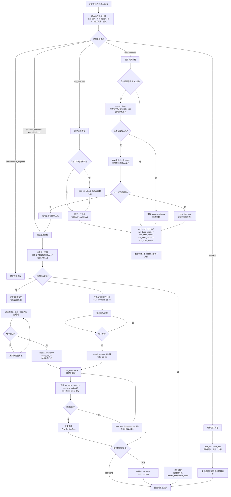
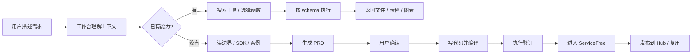

# AI-Agent-OS Agent 工作流流程图

> 这张图描述的是工作台 Agent 的主流程：用户在当前目录提出需求后，Agent 如何识别目标角色、读取上下文、选择工具、生成或执行能力，并最终把结果沉淀为平台资产。

## 简化版

适合放在官网或演示 PPT 里：

## 核心原则

- **先复用，再生成**：当前目录有能力就直接执行；没有再 `search_tools`；还没有再搜 Hub；最后才创建。
- **先方案，再落盘**：创建和修改应用必须先出 PRD 或修改方案，用户确认后再写代码。
- **先验证，再交付**：生成或修改后必须 `build_workspace`，有可执行函数时要调用 `run_*` 验证。
- **标准能力沉淀**：每个生成的 Form/Table/Chart 都会进入 ServiceTree，后续可搜索、可执行、可复制、可发布。
