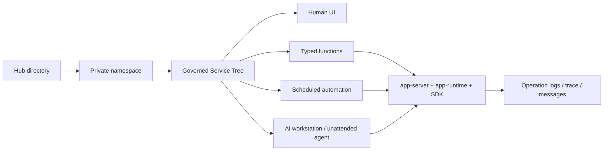

# Kageos

Language: **English** | [简体中文](README.zh-CN.md)

Translations can follow the `README.<locale>.md` pattern.

**AI-native service platform for individuals, teams, and enterprises: governed directories, unattended agents, typed functions, and self-hosted execution.**

**Source-available · Self-hostable · BSL 1.1 · Apache-2.0 after 4 years**

Kageos turns personal and business capabilities into ready-to-run directories. A directory is not a static template or a one-off prompt result: it can contain Forms, Tables, Charts, Docs, Functions, code, data models, runbooks, schedules, messages, and permissions. Humans can open it. AI agents can call it through typed schemas. Unattended agent sessions can run it on a schedule. The platform can govern, audit, version, install, export, and reuse it.

Kageos is created by [QiaYan AI](https://qiayan.ai). The core platform is source-available and designed for self-hosting. It is licensed under the Business Source License 1.1 today and converts to Apache License 2.0 four years after release. See [LICENSE](LICENSE) and [LICENSE_FAQ.md](LICENSE_FAQ.md) for the exact terms.

## Why Kageos

AI can now create tools quickly, but fast tool creation often creates another kind of sprawl: isolated pages, scripts, prompts, automations, data tables, and agents that cannot see each other, cannot be reliably called, and cannot be governed as durable assets.

Kageos takes a different route:

- Start from **ready-to-run directories**, not blank prompts.
- Make every capability **human-usable and AI-callable**.
- Use **typed function schemas** instead of relying on model interpretation as the contract.
- Let **unattended agents** inspect, analyze, run tools, and notify users on schedule.
- Put capabilities on a **Service Tree** so permissions, logs, traces, messages, schedules, and versions have one shared coordinate system.
- Keep the runtime **self-hostable**, so personal data, team workflows, and enterprise systems can run in a private namespace.

The goal is not to be a cheaper AI app generator. The goal is to make useful capabilities installable, operable, composable, auditable, and reusable.

## Core Ideas

| Idea | Meaning in Kageos |
| --- | --- |
| Directory | A runnable capability unit mounted on the Service Tree. It can contain UI, functions, docs, data, schedules, and runtime context. |
| Service Tree | The governed coordinate system for directories, functions, docs, messages, schedules, permissions, and operation logs. |
| Human UI + AI call surface | The same Form/Table/Chart can be used by a person in the web UI and called by an AI workstation tool through schema. |
| Typed functions | Function inputs and outputs are defined by code and SDK metadata, not guessed from natural language. |
| Unattended agents | Scheduled `agent.session` tasks create workstation sessions that can search, inspect directories, call tools, run functions, write results, and send notifications without a live user. |
| Capability bundle | A portable `capability.bundle.v1` package for exporting, installing, seeding, and eventually publishing directories through Hub. |

## What Works Today

- **Service Tree** for organizing workspaces, directories, functions, and docs.
- **Form/Table/Chart/Docs** resources rendered by the Vue web app and backed by Go SDK schemas.
- **AI workstation sessions** with tool calling, PRD drafting, code editing, build repair, runtime verification, and persistent chat history.
- **Runtime tools** for `run_form_submit`, `run_table_search`, table writes, `run_chart_query`, Python execution, notifications, and scheduled task management.
- **Unattended automation** through `timer-scheduler`, including fixed `app.function` jobs and flexible `agent.session` jobs.
- **Inbox and notifications** through `message-server`, SDK `ctx.SendNotification`, and the Agent `send_notification` tool.
- **Operation logs, trace IDs, source refs, and resource paths** for audit and debugging.
- **Capability bundle import/export** for moving directories between namespaces and seeding built-in tools.
- **Self-hostable runtime** built with Go, Vue 3, MySQL, NATS, MinIO, and Podman or Docker.

## Product Status

| Area | Status |
| --- | --- |
| Core platform | Mainline: Service Tree, access, operation logs, AI workstation, Form/Table/Chart/Docs, inbox, function tasks, Agent tasks, app runtime. |
| Directory lifecycle | Mainline: private namespace, generated app runtime, capability bundle export/import, built-in seed bundles. |
| Hub | In progress: public directory marketplace, hosted trials, publishing loop, private enterprise Hub. |
| Future workflow layer | Reserved: workflow graph, `workflow.run`, generic approval, discussions, ratings, external notification providers, backup control plane. |

## How It Fits Together



## Architecture

Kageos is a Vue frontend plus a Go service cluster and user app container runtime:

- `api-gateway` routes authenticated HTTP traffic.
- `app-server` owns workspace APIs, Service Tree metadata, access, operation logs, function metadata, and app invocation.
- `agent-server` owns workstation sessions, roles, tools, prompts, LLM orchestration, and scheduled Agent workers.
- `app-runtime` writes namespace files, builds Go apps, manages versions, and starts user app containers.
- `timer-scheduler` stores task state, executions, leases, heartbeat, recovery, and outbox events.
- `message-server` stores inbox messages, threads, unread state, and notification commands.
- `kageos-sdk/agent-app` is the public Go SDK used by generated workspace applications.

For the full architecture map, see [docs/current-architecture.md](docs/current-architecture.md) and [docs/kageos-blueprint.md](docs/kageos-blueprint.md).

## Repository Map

| Path | Purpose |
| --- | --- |
| `core/agent-server` | AI workstation, tool calling, PRD/code workflow, scheduled Agent execution |
| `core/app-server` | Workspace APIs, Service Tree, access, operation logs, function metadata, app invocation |
| `core/app-runtime` | Namespace file writing, Go build, app version metadata, container lifecycle |
| `core/app-storage` | Upload, download, object metadata, presigned URLs |
| `core/api-gateway` | API gateway, auth forwarding, static frontend entry |
| `core/hr-server` | Login, users, departments, system settings |
| `core/connector-server` | OAuth provider bindings and connector proxy |
| `core/timer-scheduler` | Scheduled tasks, executions, leases, retry/outbox |
| `core/message-server` | Inbox, threads, unread state, notification command consumer |
| `core/app-server/system-seed` | Built-in `capability.bundle.v1` seed directories |
| `pkg/scheduledsdk` | Scheduler client and worker contract |
| `web` | Vue 3 frontend |
| `deploy` | Local development, production, AIO, image, and security deployment material |
| `docs` | Product thinking, architecture notes, SOPs, and governance docs |

## Quick Start

Prerequisites:

- Go 1.25 or newer.
- Node.js 20.19 or newer, or 22.12 or newer.
- Docker Compose or Podman Compose.
- The bundled development stack provides MySQL, NATS, and MinIO through `kagectl`.

No manual environment variables are required for the normal local path.
`kagectl bootstrap --dev` generates the local `.kageos/` env files for backend
secrets, database passwords, NATS, MinIO, JWT, and the `system` user. For a
local backend, the frontend also needs no `.env` file; Vite proxies API traffic
to `http://localhost:9090` by default.

Clone the repository:

```bash
git clone https://github.com/kageos/kageos.git
cd kageos
```

Start the local development backend:

```bash
go run ./cmd/kagectl bootstrap --dev
```

Start the frontend in another terminal:

```bash
cd web
npm install
npm run dev
```

Open the web app at `http://localhost:5173`. During `bootstrap --dev`,
`kagectl` prints a `Kageos dev initialization summary`; sign in with username
`system` and the printed `Admin password`. If you need to see the password
again, re-run `go run ./cmd/kagectl init --dev` or read
`SYSTEM_USER_PASSWORD` from `.kageos/dev/env/kageos.env`.

Local email verification uses log mode. If you register another account, use
the verification code printed in the backend logs or returned as `debug_code`.

The frontend uses relative API paths by default. To point only the frontend at a remote backend, create `web/.env.development.local` from `web/.env.development.local.example` and set `VITE_PROXY_TARGET`.

AI workstation features need an LLM configuration after login, but LLM API keys
are not required just to boot the platform and sign in.

If startup gets stuck, run `go run ./cmd/kagectl doctor`,
`go run ./cmd/kagectl verify`, `go run ./cmd/kagectl status`, or
`go run ./cmd/kagectl logs infra` from the repository root.

Contributor workflow, IDE debugging, frontend-only development, and verification checks live in [CONTRIBUTING.md](CONTRIBUTING.md). Detailed dependency notes and troubleshooting live in [deploy/dev/README.md](deploy/dev/README.md).

## Production Deployment

The current production path is single-machine deployment through `kagectl` and Compose. For the shortest path:

```bash
sudo ./install.sh --base-url app.example.com
tail -f .kageos/prod/kagectl-up.log
```

See [deploy/prod/QUICK_START.md](deploy/prod/QUICK_START.md), [deploy/prod/README.md](deploy/prod/README.md), and [deploy/aio/README.md](deploy/aio/README.md) for production and all-in-one image details.

## Verification

Backend:

```bash
go vet -tags exclude_graphdriver_btrfs ./cmd/... ./core/... ./dto/... ./pkg/...
bash scripts/test-core-go.sh
go run golang.org/x/vuln/cmd/govulncheck@latest ./cmd/... ./core/... ./dto/... ./pkg/...
```

Frontend:

```bash
cd web
npm audit --omit=dev
npm run check:architecture
npm run lint
npm run type-check
npm run test:unit -- --run
npm run build
```

Repository governance checks:

```bash
bash scripts/check-sensitive-files.sh
bash scripts/check-sdk-boundaries.sh
bash scripts/check-doc-links.sh
```

The same checks are wired into GitHub Actions in `.github/workflows/ci.yml`.

## Documentation

- [Kageos Blueprint](docs/kageos-blueprint.md)
- [Current architecture](docs/current-architecture.md)
- [Platform capabilities](docs/platform-capabilities.md)
- [Directory vs Skills: certainty architecture](docs/directory-vs-skills-certainty-architecture.md)
- [Product thinking](docs/product-thinking-ai-era-application-governance.md)
- [Website story and positioning](docs/website-story-and-positioning.md)
- [Scheduled task architecture](docs/scheduled-tasks-architecture-design.md)
- [Local development](deploy/dev/README.md)
- [Production deployment](deploy/prod/README.md)
- [Release SOP](docs/release-sop.md)
- [License FAQ](LICENSE_FAQ.md)

## Chinese Overview

Kageos 是面向个人、团队和企业的 AI 原生服务平台。它把业务目录变成人可用、AI 可调、无人值守可运行、平台可治理的能力资产。Kageos 的核心不是低价生成孤立应用，而是让成熟能力可以从 Hub 安装到私有 namespace，用自己的数据长期运行，通过 AI 工作台改造和执行，并在稳定后发布回生态。

完整中文介绍见 [README.zh-CN.md](README.zh-CN.md)。

## Naming

- Write the product name as `Kageos` in prose, UI copy, docs, SDK docs, and website content.
- Use lowercase `kageos` for package, module, path, and domain identifiers.
- Use all-caps `KAGEOS_*` only for environment variables or config keys.
- Use "source-available and self-hostable" for the BSL-licensed core. Do not call the current core "OSI open source" until the relevant version has converted to Apache-2.0.

## Contributing

Pull requests are welcome. Before opening one, please read:

- [CONTRIBUTING.md](CONTRIBUTING.md) - contributor workflow, branch model, commit style, local development, and verification checks.
- [CODE_OF_CONDUCT.md](CODE_OF_CONDUCT.md) - community behavior expectations for issues, discussions, pull requests, and project spaces.

Please keep pull requests focused, include tests or verification notes when behavior changes, and update docs when public behavior, deployment, or positioning changes.

Do not commit real `.env` files, production `kage.yaml`, customer licenses, generated deployment output, `namespace/`, `local/`, or other private workspaces. Use example files and local overrides instead.

## Security

Please do not report suspected vulnerabilities through public GitHub issues.

Send security reports privately to [admin@kageos.ai](mailto:admin@kageos.ai). Include the affected version, branch, commit, deployment mode, reproduction steps, proof of concept, and likely impact when safe to share. See [SECURITY.md](SECURITY.md) for the full policy.

## License

Kageos core is licensed under the Business Source License 1.1 and converts to Apache License 2.0 four years after release. The source code is public and self-hostable under the BSL grant, while unauthorized commercial SaaS, managed-service, white-label, OEM, embedded, rebranded, resale, and competing offerings are restricted.

See [LICENSE](LICENSE) and [LICENSE_FAQ.md](LICENSE_FAQ.md) for details. SDKs, examples, templates, and docs may use separate permissive licenses when their own license files say so.

## Acknowledgements

Kageos is created and maintained by [QiaYan AI](https://qiayan.ai). It is built on the work of the wider open-source infrastructure and developer-tooling ecosystem, including Go, Vue, MySQL, NATS, MinIO, Docker, Podman, and many other projects.

Kageos is not a fork of OCTO, TangSengDaoDao, or WuKongIM. We still appreciate those projects and the broader agent, collaboration, and infrastructure communities for pushing the field forward.
