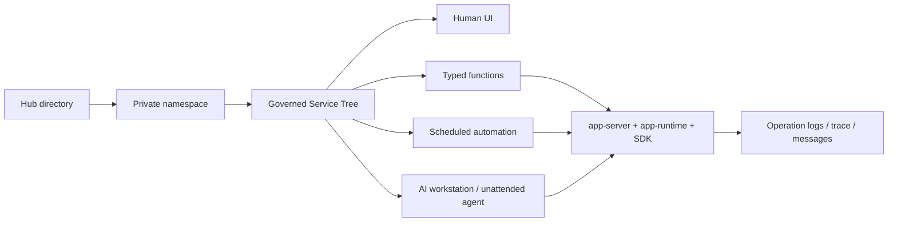

# kageos

语言: [English](README.md) | **简体中文**

后续翻译可以按 `README.<locale>.md` 的形式继续添加。

**面向个人、团队和企业的 AI 原生服务平台：业务目录、无人值守 Agent、类型化函数、自托管运行时和平台治理。**

**源码公开 · 可自托管 · BSL 1.1 · 发布四年后转 Apache-2.0**

kageos 把个人和业务能力变成开箱即用的目录。目录不是静态模板，也不是一次性 prompt 生成结果；它可以包含 Form、Table、Chart、Docs、Function、代码、数据模型、运行手册、定时任务、消息和权限。人可以直接打开使用，AI 可以按 schema 调用，无人值守 Agent 可以按计划运行，平台可以统一治理、审计、版本化、安装、导出和复用。

kageos 由[恰研智能](https://qiayan.ai)创建。核心平台源码公开、可自托管；当前采用 Business Source License 1.1，发布四年后转 Apache License 2.0。准确授权条款见 [LICENSE](LICENSE) 和 [LICENSE_FAQ.md](LICENSE_FAQ.md)。

## 为什么做 kageos

AI 已经能很快生成工具，但更快的工具生产也会带来新的混乱：孤立页面、脚本、prompt、自动化、数据表和 Agent 越来越多，彼此看不见，不能稳定调用，也不能变成长期可治理的资产。

kageos 走另一条路：

- 从**开箱即用的目录**开始，而不是从空白 prompt 开始。
- 让每个能力同时**人可用、AI 可调**。
- 用**类型化函数 schema**做契约，而不是让模型临场猜字段和类型。
- 让**无人值守 Agent**按计划巡检、分析、执行工具并通知用户。
- 把能力挂到 **Service Tree**，让权限、日志、trace、消息、定时任务和版本都有统一坐标。
- 保持运行时**可自托管**，让个人数据、团队流程和企业系统可以跑在私有 namespace 里。

kageos 的目标不是做一个更便宜的 AI app generator，而是让有价值的能力可以被安装、运行、组合、审计、复用和发布。

## 核心概念

| 概念 | 在 kageos 里的含义 |
| --- | --- |
| 目录 | 挂在 Service Tree 上的可运行能力单元，可以包含 UI、函数、文档、数据、定时任务和运行上下文。 |
| Service Tree | 目录、函数、文档、消息、定时任务、权限和操作日志共享的治理坐标系。 |
| 人机双入口 | 同一个 Form/Table/Chart 既能被人在 Web UI 里使用，也能被 AI 工作台通过 schema 调用。 |
| 类型化函数 | 函数输入输出由代码和 SDK 元数据定义，不依赖自然语言猜测。 |
| 无人值守 Agent | 定时的 `agent.session` 任务会创建工作台会话，在用户不在线时搜索、读目录、调用工具、执行函数、写结果并发通知。 |
| 能力包 | 可移植的 `capability.bundle.v1`，用于导出、安装、内置种子目录，后续也用于 Hub 发布。 |

## 当前已具备的能力

- **Service Tree**：组织工作空间、目录、函数和文档。
- **Form/Table/Chart/Docs**：由 Vue 前端渲染，由 Go SDK schema 驱动。
- **AI 工作台会话**：支持工具调用、PRD 草拟、代码编辑、构建修复、运行验证和持久化会话历史。
- **运行时工具**：支持 `run_form_submit`、`run_table_search`、表格写入、`run_chart_query`、Python 执行、通知和定时任务管理。
- **无人值守自动化**：通过 `timer-scheduler` 支持固定 `app.function` 任务和灵活的 `agent.session` 任务。
- **站内信和通知**：通过 `message-server`、SDK `ctx.SendNotification` 和 Agent `send_notification` 工具落库和展示。
- **操作日志、trace、source ref 和资源路径**：用于审计和排障。
- **目录能力包导入导出**：用于在 namespace 间迁移目录，也用于内置系统工具种子。
- **可自托管运行时**：基于 Go、Vue 3、MySQL、NATS、MinIO，以及 Podman 或 Docker。

## 产品状态

| 领域 | 状态 |
| --- | --- |
| 核心平台 | 已在主线：Service Tree、权限、操作日志、AI 工作台、Form/Table/Chart/Docs、站内信、函数任务、Agent 任务、应用运行时。 |
| 目录生命周期 | 已在主线：私有 namespace、生成应用运行时、能力包导入导出、内置种子目录。 |
| Hub | 建设中：公共目录市场、在线试用、发布链路、企业私有 Hub。 |
| 后续工作流层 | 路线储备：workflow 图、`workflow.run`、通用审批、讨论、评分、外部通知渠道和备份控制面。 |

## kageos 如何运转



## 架构

kageos 是 Vue 前端、Go 平台服务群和用户应用容器运行时组成的平台：

- `api-gateway` 负责认证后的 HTTP 流量转发。
- `app-server` 负责工作区 API、Service Tree 元数据、权限、操作日志、函数元数据和应用调用。
- `agent-server` 负责工作台会话、角色、工具、prompt、LLM 编排和定时 Agent worker。
- `app-runtime` 负责写入 namespace 文件、构建 Go 应用、管理版本并启动用户应用容器。
- `timer-scheduler` 负责定时任务状态、执行记录、租约、heartbeat、恢复和 outbox。
- `message-server` 负责站内信、线程、未读状态和通知命令。
- `kageos-sdk/agent-app` 是生成工作空间应用使用的公开 Go SDK。

完整架构见 [docs/current-architecture.md](docs/current-architecture.md) 和 [docs/kageos-blueprint.md](docs/kageos-blueprint.md)。

## 仓库结构

| 路径 | 作用 |
| --- | --- |
| `core/agent-server` | AI 工作台、工具调用、PRD/代码流程、定时 Agent 执行 |
| `core/app-server` | 工作区 API、Service Tree、权限、操作日志、函数元数据、应用调用 |
| `core/app-runtime` | namespace 文件写入、Go 构建、应用版本元数据、容器生命周期 |
| `core/app-storage` | 上传、下载、对象元数据、预签名 URL |
| `core/api-gateway` | API 网关、认证转发、静态前端入口 |
| `core/hr-server` | 登录、用户、部门、系统设置 |
| `core/connector-server` | OAuth provider 绑定和连接器代理 |
| `core/timer-scheduler` | 定时任务、执行记录、租约、重试/outbox |
| `core/message-server` | 站内信、线程、未读状态、通知命令消费 |
| `core/app-server/system-seed` | 内置 `capability.bundle.v1` 种子目录 |
| `pkg/scheduledsdk` | 定时任务 client 和 worker 契约 |
| `web` | Vue 3 前端 |
| `deploy` | 本地开发、生产部署、AIO、镜像和安全部署资料 |
| `docs` | 产品思考、架构文档、SOP 和治理文档 |
| `skills` | 随项目共同维护的五个 Codex/Claude Code Skill 唯一源码 |
| `plugins/kageos` | 生成的可安装 kageos 套件；不要直接修改其中的 Skill 副本 |

## 快速开始

前置条件：

- Go 1.25 或更新版本。
- Node.js 20.19 或更新版本，或 22.12 或更新版本。
- Docker Compose 或 Podman Compose。
- MySQL、NATS 和 MinIO 由 `kagectl` 启动本地开发栈时提供。

普通本地启动不需要手动配置环境变量。`kagectl bootstrap --dev` 会自动生成
`.kageos/` 下的本地 env 文件，里面包含后端密钥、数据库密码、NATS、MinIO、
JWT 和 `system` 用户密码。本地后端场景下，前端也不需要额外 `.env` 文件；
Vite 默认会把 API 请求代理到 `http://localhost:9090`。

拉取仓库代码：

```bash
git clone https://github.com/kageos/kageos.git
cd kageos
```

启动本地开发后端：

```bash
go run ./cmd/kagectl bootstrap --dev
```

另开一个终端启动前端：

```bash
cd web
npm install
npm run dev
```

浏览器打开 `http://localhost:5173`。执行 `bootstrap --dev` 时，`kagectl`
会打印 `kageos dev initialization summary`；用用户名 `system` 和其中的
`Admin password` 登录。如果需要重新查看密码，可以再次执行
`go run ./cmd/kagectl init --dev`，或从 `.kageos/dev/env/kageos.env` 读取
`SYSTEM_USER_PASSWORD`。

本地邮箱验证码默认走日志模式。如果注册新账号，验证码会出现在后端日志中，也会通过接口返回的 `debug_code` 暴露给本地开发使用。

前端默认使用相对 API 路径。如果只想让前端指向远程后端，可以从 `web/.env.development.local.example` 创建 `web/.env.development.local`，并设置 `VITE_PROXY_TARGET`。

AI 工作台能力需要登录后配置 LLM，但 LLM API Key 不是启动平台和登录系统的前置条件。

如果启动卡住，可以在仓库根目录先执行 `go run ./cmd/kagectl doctor`、
`go run ./cmd/kagectl verify`、`go run ./cmd/kagectl status` 或
`go run ./cmd/kagectl logs infra`。

贡献者工作流、IDE 调试、只开发前端和提交前检查见 [CONTRIBUTING.md](CONTRIBUTING.md)。更完整的依赖说明和排障材料见 [deploy/dev/README.md](deploy/dev/README.md)。

## AI 贡献者套件

这个公共仓库同时维护面向 Codex 和 Claude Code、中文优先的 `kageos`
套件。它可以带贡献者完成依赖检查、源码拉取、本地启动、健康验证、源码
导览和聚焦 PR 准备。安装后可以直接说：

```text
$kageos 检查我的电脑环境，拉取并启动 kageos，成功后打开本地页面。
```

五个 Skill 的唯一源码位于 [`skills/`](skills)。其中
[`skills/kageos-contributor`](skills/kageos-contributor) 负责本地启动和平台
源码贡献；[`plugins/kageos`](plugins/kageos) 是 Codex/Claude 的生成发布物，
必须通过 `scripts/package-kageos-plugin.py` 与源码同步。

- 下载和安装：[kageos 中文开发套件](https://kageos.ai/zh/developer/)
- 套件贡献规则：[CONTRIBUTING.zh-CN.md](CONTRIBUTING.zh-CN.md#维护-ai-套件)

## 生产部署

当前生产主线是通过 `kagectl` 和 Compose 做单机部署。最短路径：

```bash
sudo ./install.sh --base-url app.example.com
tail -f .kageos/prod/kagectl-up.log
```

生产和 AIO 镜像说明见 [deploy/prod/QUICK_START.md](deploy/prod/QUICK_START.md)、[deploy/prod/README.md](deploy/prod/README.md) 和 [deploy/aio/README.md](deploy/aio/README.md)。

## 验证

后端：

```bash
go vet -tags exclude_graphdriver_btrfs ./cmd/... ./core/... ./dto/... ./pkg/...
bash scripts/test-core-go.sh
go run golang.org/x/vuln/cmd/govulncheck@latest ./cmd/... ./core/... ./dto/... ./pkg/...
```

前端：

```bash
cd web
npm audit --omit=dev
npm run check:architecture
npm run lint
npm run type-check
npm run test:unit -- --run
npm run build
```

仓库治理检查：

```bash
bash scripts/check-sensitive-files.sh
bash scripts/check-sdk-boundaries.sh
bash scripts/check-doc-links.sh
```

这些检查也接入了 `.github/workflows/ci.yml`。

## 文档

- [kageos Blueprint](docs/kageos-blueprint.md)
- [当前架构](docs/current-architecture.md)
- [平台能力总览](docs/platform-capabilities.md)
- [目录 vs Skills：确定性架构论证](docs/directory-vs-skills-certainty-architecture.md)
- [产品思考](docs/product-thinking-ai-era-application-governance.md)
- [官网叙事与定位](docs/website-story-and-positioning.md)
- [定时任务架构](docs/scheduled-tasks-architecture-design.md)
- [本地开发](deploy/dev/README.md)
- [生产部署](deploy/prod/README.md)
- [发布 SOP](docs/release-sop.md)
- [源码与授权对外口径](docs/source-available-messaging.md)
- [License FAQ](LICENSE_FAQ.md)

## 命名口径

- 正文、UI、官网、SDK 文档和对外材料都写作 `kageos`。
- Go 包、模块、路径和域名标识使用小写 `kageos`。
- 环境变量和配置键使用全大写 `KAGEOS_*`。
- 对 BSL 授权的核心平台，统一使用“源码公开、可自托管”或 “source-available and self-hostable”，并遵循[源码与授权对外口径](docs/source-available-messaging.md)。

## 贡献

欢迎提交 Pull Request。开 PR 前请先阅读：

- [CONTRIBUTING.zh-CN.md](CONTRIBUTING.zh-CN.md)：贡献流程、分支模型、commit 规范、本地开发和验证检查。
- [CODE_OF_CONDUCT.zh-CN.md](CODE_OF_CONDUCT.zh-CN.md)：issue、discussion、pull request 和社区空间的行为准则。

请保持 PR 聚焦；行为变化请补充测试或说明验证方式；公开行为、部署方式或产品定位变化时，请同步更新文档。

不要提交真实 `.env`、生产 `kage.yaml`、客户 license、生成部署产物、`namespace/`、`local/` 或其他私有工作区。请使用示例文件和本地 override。

## 安全

请不要通过公开 GitHub Issue 报告疑似安全漏洞。

安全问题请发送邮件至 [admin@kageos.ai](mailto:admin@kageos.ai)。如果安全，请包含受影响版本、分支、commit、部署模式、复现步骤、PoC 和影响说明。完整流程见 [SECURITY.zh-CN.md](SECURITY.zh-CN.md)。

## 授权

kageos 核心采用 Business Source License 1.1，并在发布四年后转 Apache License 2.0。源码公开，允许在 BSL 授权范围内查看、修改、分发和自托管；未经授权的商业 SaaS、MSP 托管、白标、OEM、嵌入、on-premises 商业产品、改名转售和竞品化产品/服务受到限制。

详情见 [LICENSE](LICENSE) 和 [LICENSE_FAQ.md](LICENSE_FAQ.md)。SDK、示例、模板和文档如有单独 license 文件，可以采用各自的宽松开源授权。

## 致谢

kageos 由[恰研智能](https://qiayan.ai)创建和维护。它构建在更广泛的开源基础设施和开发工具生态之上，包括 Go、Vue、MySQL、NATS、MinIO、Docker、Podman 以及许多其他项目。

kageos 不是 OCTO、TangSengDaoDao 或 WuKongIM 的 fork。我们依然感谢这些项目，以及更广泛的 Agent、协作系统和基础设施社区共同推动这个领域向前。
