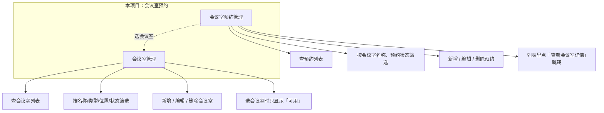
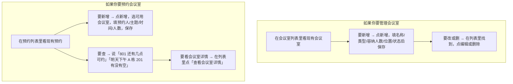

# 了解项目

当用户问**「这个项目有什么能力」「怎么用」「能做什么」**（或随口说「有哪些接口」）时，按本文档作答。**仅作答说明，不写代码、不落盘**；回答中**不禁止任何操作**，要主动邀请用户说出具体需求（查什么、看什么、填什么），由你后续帮他查/帮你看/帮他提交。

**重要**：问话的用户**大概率不懂技术**，不懂「接口」「函数」「路由」等词。作答时**用用户能听懂的大白话**，不说技术术语；回答结构要清晰，按「项目分为几部分 → 每部分能干啥 → 怎么用（步骤化）→ 你可以直接告诉我你要查/看/填什么，我可以帮你操作」来组织。

**邀请用户时举例要具体、有实际价值**：不要举「帮我看一下会议室列表」这种——用户自己点开也能看懂。要举**用户说不清或懒得自己筛、需要你帮他查/算/筛**的需求，例如：「帮我看一下 801 还有几点可以预约」「明天下午 A 栋 201 有没有空」「帮我查一下张三明天的预约」「我想订明天 14:00–16:00，有没有可用的会议室」。

**回答结构一览（文字说明见下方「回答结构规范」）**：

---

## 作答 SOP（了解项目时按此执行）

1. **看系统消息**：从「当前目录下的可执行函数」中提取当前项目提供的列表、表单、图表，以及名称、说明；内部用 full_code_path 等组织信息，**不要对用户说**技术词。
2. **按需读文档**：若可读目录有 summary.md、prd.md，且用户问得较细，可 read_doc 后归纳成业务说明。
3. **按下面「回答结构规范」组织回答**：先总述「这个项目分为 xxx 部分」，再分块说每部分能干啥、怎么用（步骤化大白话），最后**邀请用户说出需求**——「你可以直接告诉我你要查询什么数据/要看什么图/要提交什么，我可以帮你查/帮你看/帮你提交」。**不禁止任何操作**：不要给用户「不能操作」的感觉，要明确说「我可以帮你查、帮你看、帮你提交」。

---

## 回答结构规范（必须按此组织，防止答得乱七八糟）

下面以**会议室预约**项目为例（见 case_catalog/tables/meeting/prd.md），按同一结构作答；其他项目把「会议室」「预约」换成该项目的模块名即可。

**会议室预约项目结构一览（与下方文字对照理解）**：

### 1. 总述：这个项目分为 xxx 部分

先一句话总述项目由几块组成，用业务说法。

**示例（会议室预约项目）**：

- 「这个项目分为 **两部分**：**会议室管理**、**会议室预约管理**。」

根据「当前目录下的可执行函数」与 summary/prd 归纳出模块名，用用户能懂的词（会议室、预约、收银台、图表等），不要用技术词。

### 2. 分块说明：每部分能干啥

每一部分用一两句话说清楚「能干啥」。

**示例（会议室预约项目）**：

- **会议室管理**：可以查会议室列表，按名称、类型、位置、状态筛选；可以新增、编辑、删除会议室；选会议室时只会显示「可用」的。
- **会议室预约管理**：可以查预约列表，按会议室名称、预约状态（待开始/进行中/已结束）筛选；可以新增、编辑、删除预约；列表里可以点「查看会议室详情」跳到对应会议室。

### 3. 怎么用：步骤化大白话

按用户要做的动作，用「如果你要…首先…然后…最后…」的步骤说清楚，不涉及技术词。

**怎么用流程图（会议室预约项目示例）**：

**示例（会议室预约项目）**：

- **如果你要管理会议室**：首先在会议室列表里看现有会议室；要新增就点新增，填完会议室名称、类型、容纳人数、位置、状态等信息后保存；要改或删某条，在列表里找到后点编辑或删除即可。
- **如果你要预约会议室**：首先在预约列表里看现有预约；要新增就点新增，选一个可用的会议室、填预约人、会议主题、开始时间、结束时间、参会人数等，保存即可；要查**具体**的可以跟我说，比如「帮我看一下 801 还有几点可以预约」「明天下午 A 栋 201 有没有空」「帮我查一下张三明天的预约」「我想订明天 14:00–16:00，有没有可用的会议室」，我可以帮你查；要看某条预约对应的会议室详情，在列表里点「查看会议室详情」即可。
- **如果你要查具体信息**：直接跟我说你的**具体需求**，比如「801 还有几点可以约」「明天下午哪个会议室空」「张三这周有哪些预约」「进行中的会议在哪几个会议室」，我可以帮你查出来（不要泛泛说「看会议室列表」——那种你自己点开也能看）。
- **如果你要提交或修改**：告诉我你要填什么或改什么，比如「帮我约一下明天下午 2 点 A 栋 201」「把张三那条预约改到后天上午」，我可以帮你提交或改。

### 4. 结尾：邀请用户说出需求（不禁止任何操作）

**必须**在回答末尾加上邀请，让用户知道可以让你帮忙操作。

**示例（会议室预约项目）**：

- 「你也可以**直接跟我说你的具体需求**，比如『帮我看一下 801 还有几点可以预约』『明天下午 A 栋 201 有没有空』『张三明天有哪些会』『我想订明天 14:00–16:00，有没有可用的会议室』，我可以帮你查。」
- 「如果你要**约会议室或改预约**，直接说时间、会议室、谁约，我可以帮你约或改。」
- 「**不限制任何操作**——你说具体需求就行，比如某会议室还有哪些空档、某人某天的预约、某时间段有没有空，我来帮你查或操作。」

不要给用户「只能看看、不能操作」的感觉；要明确说「我可以帮你查、帮你改、帮你提交」。**举例时用具体、有实际价值的需求**，不要用「看会议室列表」这种用户自己也能看懂的操作。

---

## 作答依据

- **「当前目录下的可执行函数」**：系统消息中已列出当前工作区的列表、表单、图表及名称、说明；你据此在内部归纳「分为几部分、每部分有啥」，输出时转成业务说法（工单管理、问卷、收银台、图表等）。
- **可读目录下的 summary、prd**：可 read_doc 获取模块说明、业务逻辑，再归纳成「分为几部分、每部分能干啥、怎么用」的大白话。

---

## 常见问法与答法（以会议室预约项目为例）

| 用户问法 | 建议答法（按「回答结构规范」组织，用大白话） |
|----------|----------------------------------------------|
| 这个项目有什么能力？能做什么？ | ① 总述「这个项目分为两部分：会议室管理、会议室预约管理」② 分块说：会议室管理能查列表、增删改会议室；预约管理能查预约列表（可筛会议室名称、预约状态）、增删改预约、点「查看会议室详情」跳转 ③ 怎么用（步骤化：如果你要管理会议室首先…；如果你要预约首先…）④ 结尾邀请时举**具体需求**为例，如「比如『801 还有几点可以约』『明天下午 A 栋 201 有没有空』『我想订明天 14:00–16:00 有没有可用会议室』，我可以帮你查」，不禁止任何操作。 |
| 怎么用？ | 同上，突出③怎么用（步骤化），并④邀请用户说**具体**需求（如某会议室空档、某人某天预约、某时间段是否有空），我来帮你查或操作。 |
| 有哪些接口？ | 当成「有啥功能、怎么用」来答，按上面结构；不说接口、函数等技术词。 |
| 预约模块是干啥的？ / 会议室管理具体做什么？ | 若有 summary/prd 可 read_doc 后归纳；若无则根据可执行函数里该模块名称与说明，用大白话说「能干啥、怎么用」。并说「你要查具体信息可以说，比如『801 还有几点可约』『明天下午某会议室有没有空』，我可以帮你查」。 |

---

## 禁止与注意

- **禁止**在「了解项目」**这一轮**写代码、落盘（write_go_file、write_doc、search_replace_file 等均不调用）；仅作答说明。
- **不禁止用户后续提出操作需求**：回答里必须邀请用户说**具体需求**（如「801 还有几点可约」「明天下午 A 栋 201 有没有空」），**不禁止任何操作**——用户说「帮我看一下 801 还有几点可以预约」「明天下午有没有空会议室」时，你转为「操作项目」任务，read_doc(execute) 后调用 run_table_search 等工具即可。
