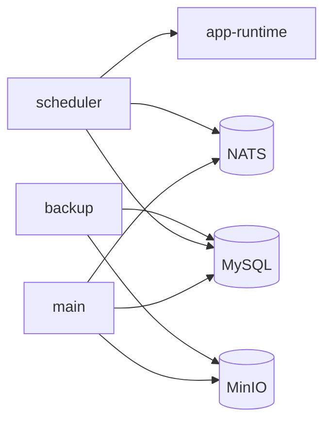
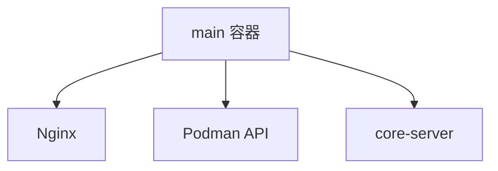
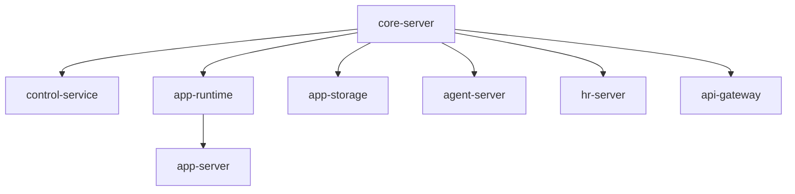
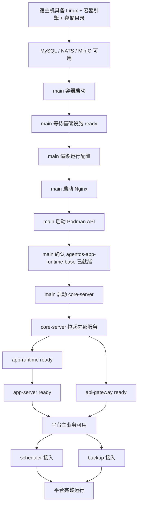
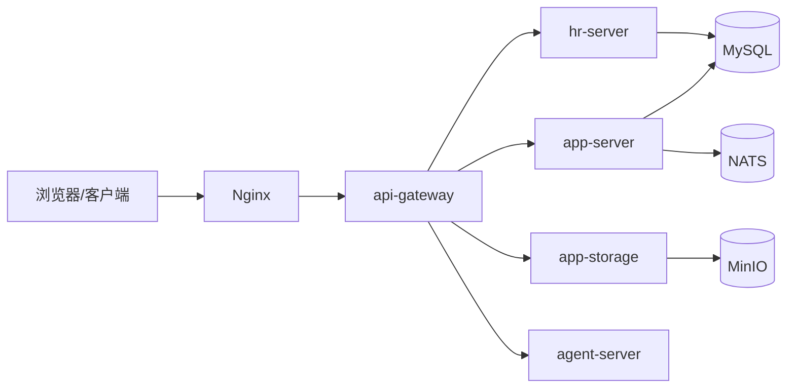
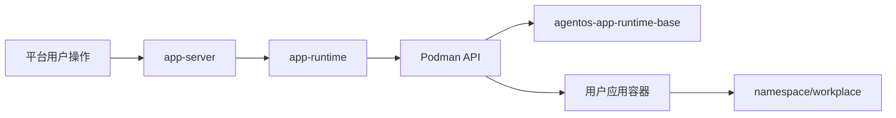

# 单机生产部署逻辑说明

这份文档不讲“怎么敲命令”，只讲三件事：

- 这套系统要跑起来，逻辑上依赖什么
- 各个组件分别承担什么角色
- 整个系统从“机器空着”到“平台可用”再到“用户应用可运行”，顺序到底是什么

如果你只想看操作命令，再回去看 [README.md](README.md)。

## 1. 先建立一个正确心智

当前单机部署不是“一个容器跑整个世界”，而是 3 层结构：

1. **基础设施层**
   MySQL、NATS、MinIO
2. **平台控制层**
   `main` 容器里的 Nginx、`core-server`、内部 Podman API
3. **用户应用运行层**
   由 `app-runtime` 通过内部 Podman 拉起的用户应用容器

一句话概括：

- `agentos-main`：平台控制面镜像
- `agentos-app-runtime-base`：用户应用运行底座镜像

也就是说：

- `agentos-main` 负责把平台本身跑起来
- `agentos-app-runtime-base` 负责给用户应用提供运行环境

它们不是一回事。

## 2. 部署逻辑上依赖什么

从逻辑上看，这套系统只依赖 5 类能力。

### 2.1 持久化数据库

需要 **MySQL**。

原因：

- 平台业务数据要存库
- 用户、组织、权限、应用元数据都依赖它
- scheduler 也依赖它做任务协调

没有 MySQL，平台不会进入正常业务态。

### 2.2 消息总线

需要 **NATS**。

原因：

- 服务之间会通过消息和事件协作
- scheduler 和运行时链路会用到它

没有 NATS，部分服务即使能启动，也不是完整可用状态。

### 2.3 对象存储

需要 **MinIO**。

原因：

- 当前官方支持的对象存储后端就是 MinIO
- 文件上传、对象访问、部分业务资产都依赖它

所以当前单机生产拓扑里，MinIO 不是“可选附件”，而是正式依赖。

### 2.4 平台控制面

需要 **`main` 容器**。

它负责：

- 提供 HTTP/HTTPS 入口
- 统一启动平台核心服务
- 管理内部 Podman API
- 为用户应用运行准备运行底座镜像

### 2.5 用户应用运行能力

需要 **Podman + `agentos-app-runtime-base`**。

原因：

- 用户应用不是直接塞进平台进程里执行
- 而是由 `app-runtime` 动态拉起独立容器运行

所以如果没有这层能力：

- 平台主站可能能起来
- 但“运行用户应用”这件事做不了

## 3. 组件角色到底怎么分

### 3.1 外层 6 个容器

当前单机生产部署的外层角色是：

它们各自负责：

| 组件 | 逻辑角色 |
|------|------|
| `mysql` | 关系型数据存储 |
| `nats` | 消息总线 |
| `minio` | 对象存储 |
| `main` | 平台主控制面 |
| `scheduler` | 独立定时调度执行者 |
| `backup` | 备份/恢复控制面 |

### 3.2 `main` 容器内部

`main` 不是“单个业务进程”，而是一个平台壳。

它内部逻辑上包含：

这三块的角色不同：

- **Nginx**：平台入口，负责静态资源和反向代理
- **Podman API**：给 `app-runtime` 管理用户应用容器
- **core-server**：真正的平台服务集合

### 3.3 `core-server` 内部服务

`core-server` 自己又不是一个单体业务模块，它是统一启动入口。

当前逻辑上启动这些服务：

角色分工：

| 内部服务 | 角色 |
|------|------|
| `control-service` | 控制面、license 等能力 |
| `app-runtime` | 用户应用运行时管理器 |
| `app-storage` | 文件/对象存储访问服务 |
| `agent-server` | Agent 相关服务 |
| `hr-server` | 用户、认证、组织、邮件等 |
| `app-server` | 核心业务服务 |
| `api-gateway` | 外部 API 汇聚入口 |

真正明确写进启动依赖里的只有一条：

- `app-server` 依赖 `app-runtime`

也就是说，系统认为：

- 先有“应用运行能力”
- 再有“应用业务层”

这个依赖关系是对的，因为没有 runtime，很多应用级动作没有执行载体。

## 4. 系统启动分几个阶段

如果从逻辑上拆，整个启动过程可以分成 5 个阶段。

## 4.1 第一阶段：基础设施先可用

必须先具备：

- MySQL 可连接
- NATS 可连接
- MinIO 可连接

因为平台控制面不是自己内置数据库和对象存储，它只是依赖它们。

这一阶段回答的问题是：

> 平台赖以生存的外部状态服务，是否都在。

## 4.2 第二阶段：平台入口先建立

接着 `main` 容器会做两件逻辑上关键的事情：

1. 生成平台配置
2. 建立平台入口

这里的“平台入口”就是 Nginx。

Nginx 一旦起来，说明：

- 平台已经具备对外接流量的外壳
- 但内部业务服务未必全部 ready

所以这一步是：

> 先把门搭起来，但门后面的人还在集合。

## 4.3 第三阶段：平台运行时能力建立

然后 `main` 会启动内部 Podman API，并确认初始化阶段已经准备好 `agentos-app-runtime-base`。

这一阶段特别关键，因为它决定：

- 平台是不是只有“管理界面”
- 还是具备“运行用户应用”的真实能力

逻辑上这一步是在做：

> 先把应用执行引擎准备好。

## 4.4 第四阶段：平台核心服务启动

接下来 `core-server` 启动内部服务。

这一步不是“先网关、再业务、再存储”那种传统三层架构，而是更接近“多个角色并发起，少量显式依赖约束”。

核心事实是：

- `control-service / app-runtime / app-storage / agent-server / hr-server / api-gateway` 都会被拉起
- `app-server` 会等待 `app-runtime` ready

所以这一阶段真正完成时，平台才进入：

> 控制面可服务状态。

## 4.5 第五阶段：附属能力接入

最后还有两块不是主站入口本身，但属于平台完整运行的一部分：

- `scheduler`
- `backup`

其中：

- `scheduler` 负责定时任务和投递
- `backup` 负责备份/恢复控制面

它们不是“没有就立刻不能打开首页”的那种依赖，但属于完整单机部署默认组成。

## 5. 从空机器到平台可用，完整逻辑链是什么

把整个过程压成一张图，就是这样：

## 6. 真实对外请求是怎么流的

很多人看部署时容易混淆：

- 平台请求流
- 用户应用运行流

这两条不是一条链。

### 6.1 平台请求流

浏览器访问平台时，主要是这条：

逻辑含义：

- 外部请求先经过 Nginx
- 再进入 `api-gateway`
- 之后由网关分发到具体业务服务

所以平台真正的统一对外业务入口不是 `app-server`，而是：

- `Nginx + api-gateway`

### 6.2 用户应用运行流

当平台要运行某个用户应用时，逻辑链是另一条：

这里的关键不是 HTTP，而是“控制流”：

- `app-server` 发出业务动作
- `app-runtime` 把动作翻译成容器运行操作
- Podman 真正把用户应用容器拉起来
- 用户应用容器基于 `agentos-app-runtime-base`
- 用户应用工作目录落在 `namespace`

这就是为什么我前面一直强调：

- `agentos-main` 不是用户应用镜像
- `agentos-app-runtime-base` 不是平台主镜像

因为它们在逻辑链里根本处于不同层。

## 7. 为什么 scheduler 单独拆出来

这块也值得讲清楚。

`scheduler` 没放进主进程里，逻辑上是因为：

- 它承担的是持续调度和投递职责
- 它不应该和主站入口完全绑死在一个进程生命周期上

所以当前设计是：

- 主站先完成平台控制面并拉起 `app-runtime`
- scheduler 再作为独立执行者接入

它依赖：

- MySQL
- NATS
- app-runtime

因此它的逻辑位置是：

- 不是基础设施
- 不是入口
- 不是控制面核心
- 而是控制面之上的执行器

## 8. 为什么 backup 也单独拆出来

`backup` 单独存在的逻辑原因也一样：

- 它不是用户正常访问平台时的主请求链
- 它是运维控制面能力

所以它独立出来更合理：

- 出问题容易定位
- 备份/恢复逻辑不会污染主请求链
- 可以单独开关或演进

## 9. 真正需要关注的不是脚本，而是这几个关键依赖关系

如果你要抓“本系统的启动逻辑本质”，其实只要记住下面 6 句话：

1. 平台先依赖 MySQL、NATS、MinIO 活着。
2. `main` 先把平台入口和运行时能力准备好。
3. `core-server` 再把平台控制面服务拉起来。
4. `app-server` 依赖 `app-runtime`，因为应用业务必须建立在应用执行能力之上。
5. 用户应用不是跑在平台进程里，而是跑在内部 Podman 启动的独立容器里。
6. `scheduler` 和 `backup` 属于附属能力，不是平台主请求入口本身。

## 10. 如果再回到部署操作，它只是这套逻辑的壳

现在再看 `aosctl`、Compose 生成物、entrypoint，就容易多了。

它们只是把上面这套逻辑变成可执行动作：

- Compose：把角色摆到机器上
- entrypoint：把每个角色内部启动顺序串起来
- `aosctl`：把初始化、预检、配置渲染、启动动作包起来

所以：

- **脚本不是重点**
- **逻辑角色和依赖关系才是重点**

如果你想继续往下看“具体入口文件如何对应这套逻辑”，再看：

- [README.md](README.md)
- [../../cmd/aosctl](../../cmd/aosctl)
