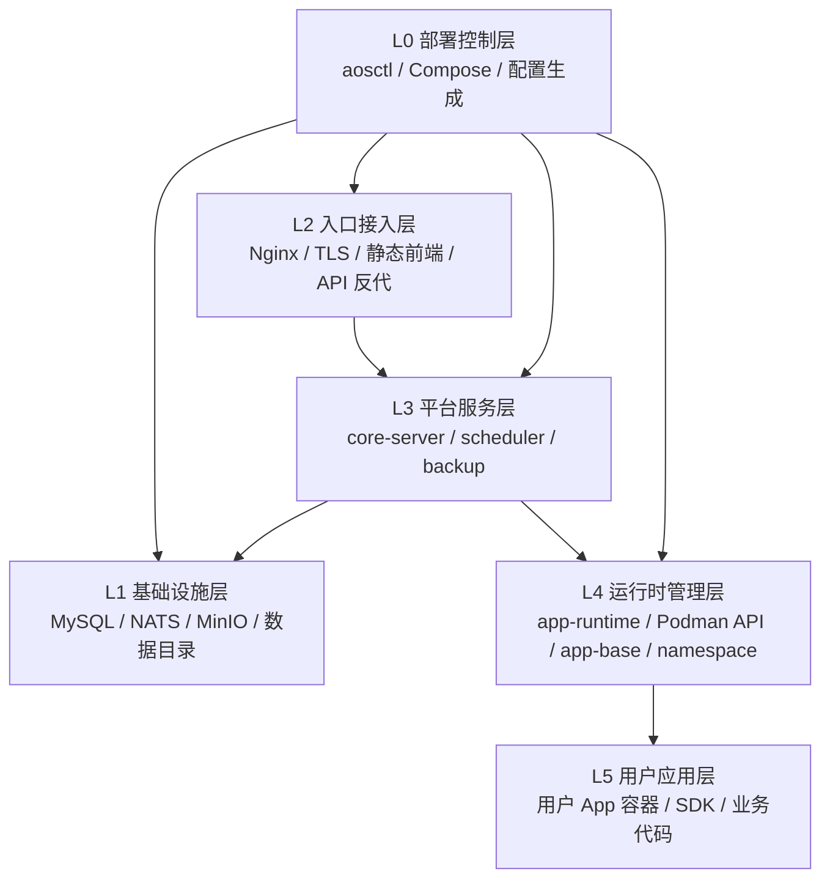

# 生产单机一键部署（Compose：宿主机 Docker 或 Podman）

> 官方生产入口：`deploy/prod/`

如果你只想一眼看懂并直接部署，直接看：

- [QUICK_START.md](QUICK_START.md)

如果你还想看一分钟版本，再看：

- [DEPLOY_TUTORIAL.md](DEPLOY_TUTORIAL.md)

如果你要看启动顺序和依赖链，再看：

- [DEPLOYMENT_FLOW.md](DEPLOYMENT_FLOW.md)

**范围**：主站 + 独立定时任务调度器 + 中间件（MySQL / NATS / MinIO）+ 内置 Nginx（默认 80，可选 443）+ **容器内 Podman**（跑用户应用）。**不包含 Hub**。

## 部署分层

生产部署按 6 层理解和排障，完整定义见 [部署分层模型](../../docs/deployment-layers.md)。



当前物理拓扑仍由 Compose 承载：

```text
Compose
  ├─ mysql / nats / minio（bundled 时启用）
  ├─ main 容器（network_mode: host）
  │    ├─ Nginx :80 / :443
  │    ├─ core-server
  │    └─ Podman API
  ├─ scheduler 容器
  │    └─ timer-scheduler
  └─ backup 容器
       └─ backup-service
```

`main` 使用 `network_mode: host`，容器内 Nginx 默认直接监听宿主机 80 端口；开启 HTTPS 后会额外监听 443。`scheduler` 也使用 `network_mode: host`，独立运行 `timer-scheduler`，自身在 `http://127.0.0.1:9108/health` 暴露健康检查。业务服务通过 SDK 连接 `http://127.0.0.1:9108/timer/api/v1` 创建任务，并通过 NATS 消费触发事件。中间件容器通过 `127.0.0.1` 暴露端口供 `main` / `scheduler` 访问，无需额外宿主机 Nginx。中心调度默认使用独立的 `timer-scheduler` database。

`main` 容器的 Compose healthcheck 仍使用 `/app/health/main.sh` 聚合检查；实际子探针已经按层拆分为 `/app/health/edge.sh`、`/app/health/platform.sh`、`/app/health/runtime.sh`，`aosctl verify` 会按 L2/L3/L4 分层调用。

## 前置

- Linux 宿主机。
- 已安装 `podman compose` 或 `docker compose`。
- `/data` 可写；`aosctl up` 会创建 `/data/ai-agent-os` 下的运行目录。
- `main` 服务 **`privileged: true`**。
- 如果是普通用户运行 rootless `podman compose`，需要保证 `net.ipv4.ip_unprivileged_port_start <= 80`，否则容器内 Nginx 无法绑定宿主机 `80` 端口。
- 宿主机 **80 端口未被占用**；如果开启 HTTPS，**443 端口也必须空闲**。

## 一分钟部署

```bash
go run ./cmd/aosctl bootstrap --base-url http://your-ip-or-domain
```

默认数据目录固定是 `/data/ai-agent-os`。  
`aosctl bootstrap` 会在缺少 `deploy/prod/aos.yaml` 时生成私有配置，然后执行 `aosctl up` 的完整分层部署流程：预检、渲染 Compose/config、准备运行目录、准备主镜像和用户应用基础镜像、启动服务，并等待分层健康检查通过。

最小 `aos.yaml` 配置：

```yaml
site:
  base_url: "http://your-ip-or-domain"
  tls_mode: "http"
```

如果前面已有 LB / CDN 做 HTTPS：

```yaml
site:
  base_url: "https://your-domain"
  tls_mode: "external"
```

如果容器自己做 HTTPS：

```yaml
site:
  base_url: "https://your-domain"
  tls_mode: "redirect"
  certs_host_dir: "./certs"
  cert_file: "/app/tls/fullchain.pem"
  key_file: "/app/tls/privkey.pem"
```

改配置：

- 编辑 `deploy/prod/aos.yaml` 后重新执行 `go run ./cmd/aosctl up --config deploy/prod/aos.yaml`
- 改了 `images.main` 且使用发布镜像：执行 `go run ./cmd/aosctl up --config deploy/prod/aos.yaml --image`

## Go 部署器 aosctl

`aosctl` 是生产部署唯一控制入口，负责把部署参数渲染为 Compose、运行时配置和中间件配置；底层仍然使用 Compose 执行容器操作。

```bash
# 在仓库根目录执行
go run ./cmd/aosctl init --base-url http://your-ip-or-domain
go run ./cmd/aosctl bootstrap --base-url http://your-ip-or-domain
go run ./cmd/aosctl doctor --config deploy/prod/aos.yaml
go run ./cmd/aosctl up --config deploy/prod/aos.yaml
go run ./cmd/aosctl verify --config deploy/prod/aos.yaml
```

生成物说明：

- `deploy/prod/aos.yaml` 是本机私有部署配置，包含数据库密码、JWT 密钥、system 初始密码、备份口令等敏感信息，默认不入库。
- `deploy/prod/.generated/` 是渲染后的 Compose、运行时配置和中间件配置，默认不入库。
- `deploy/prod/aos.example.yaml` 是无密钥示例；真实部署建议用 `aosctl init` 生成随机密钥后再编辑。
- `mysql.mode` / `nats.mode` / `minio.mode` 支持 `bundled` 和 `external`。`bundled` 会由 Compose 拉起中间件，`external` 则连接你填写的外部服务。
- 常用操作：`aosctl up/down/status/logs/verify`。Compose 只是底层执行器，用户不需要直接编辑生成后的 Compose 文件。

## HTTP / HTTPS 模式

默认模式是 **HTTP**，只填 `site.base_url` 就能启动。

```yaml
site:
  base_url: "http://your-domain-or-ip"
  tls_mode: "http"
```

如需启用容器内 HTTPS，补齐证书目录并切到对应模式：

```yaml
site:
  base_url: "https://your-domain"
  tls_mode: "redirect"
  certs_host_dir: "./certs"
  cert_file: "/app/tls/fullchain.pem"
  key_file: "/app/tls/privkey.pem"
```

四种模式：

- `site.tls_mode=http`：仅监听 `80`，保持当前 HTTP 部署方式。
- `site.tls_mode=https`：同时监听 `80` 和 `443`，HTTP / HTTPS 都可访问。
- `site.tls_mode=redirect`：`80` 统一 `301 -> 443`，`443` 提供 HTTPS。
- `site.tls_mode=external`：容器只跑 `80`，由外部 LB / CDN / 网关终止 TLS。

证书路径说明：

- `site.certs_host_dir` 是宿主机证书目录，会整体挂载到容器内 `/app/tls`。
- `site.certs_host_dir` 支持绝对路径；如果写相对路径，则相对 `deploy/prod/` 目录解析。
- `site.cert_file` / `site.key_file` 必须是容器内路径，且位于 `/app/tls/` 下。
- `site.tls_mode=https` / `redirect` 时证书文件必须真实存在；缺文件会导致容器启动失败。

如果你是云厂商 LB / CDN 做 TLS 终止，直接使用 `site.tls_mode=external` 即可；这时 `site.base_url` 通常写成 `https://`。

生产配置说明：

- 版本库中的官方模板源在 `deploy/prod/config/template/`
- 容器启动后会渲染到 `deploy/prod/config/runtime/`
- 定时任务固定由独立 `scheduler` 容器内的 `timer-scheduler` 服务触发；`main` 只运行业务执行器 worker

> 构建 Go 依赖默认使用 `GOPROXY=https://goproxy.cn,direct` 与 `GOSUMDB=sum.golang.google.cn`；如需覆盖，可在构建时传 `--build-arg GOPROXY=... --build-arg GOSUMDB=...`。

## 常用命令

```bash
go run ./cmd/aosctl init --base-url http://your-ip-or-domain
go run ./cmd/aosctl doctor --config deploy/prod/aos.yaml
go run ./cmd/aosctl layers --config deploy/prod/aos.yaml
go run ./cmd/aosctl up --config deploy/prod/aos.yaml
go run ./cmd/aosctl up --config deploy/prod/aos.yaml --image
go run ./cmd/aosctl up --config deploy/prod/aos.yaml --wait-timeout 10m
go run ./cmd/aosctl verify --config deploy/prod/aos.yaml
go run ./cmd/aosctl verify --config deploy/prod/aos.yaml --json
go run ./cmd/aosctl status --config deploy/prod/aos.yaml
go run ./cmd/aosctl status --config deploy/prod/aos.yaml --json
go run ./cmd/aosctl logs --config deploy/prod/aos.yaml --layer L3
go run ./cmd/aosctl logs --config deploy/prod/aos.yaml main
go run ./cmd/aosctl down --config deploy/prod/aos.yaml
go run ./cmd/aosctl uninstall --config deploy/prod/aos.yaml --dry-run
go run ./cmd/aosctl uninstall --config deploy/prod/aos.yaml
go run ./cmd/aosctl uninstall --config deploy/prod/aos.yaml --purge-data --force
```

推荐升级路径：

- 首次部署：`aosctl bootstrap --base-url http://your-ip-or-domain`
- 手工分步部署：`aosctl init` -> `aosctl doctor` -> `aosctl up`
- 已发布固定镜像部署：在 `aos.yaml` 配好 `images.main` 后执行 `aosctl up --image`
- 慢机器首次启动：执行 `aosctl up --wait-timeout 10m`
- 改了站点、TLS、中间件或密钥配置：编辑 `aos.yaml` 后重新执行 `aosctl up`
- 查看分层拓扑：`aosctl layers`
- 查看运行状态：`aosctl status`
- 机器读取状态/诊断：`aosctl status --json`、`aosctl verify --json`
- 查看平台层日志：`aosctl logs --layer L3`
- 查看指定服务日志：`aosctl logs main`
- 普通停止：`aosctl down`，只执行 Compose down，不清生成物和数据。
- 测试卸载：`aosctl uninstall`，移除 Compose 栈和 `.generated/`，保留 `aos.yaml`、`/data/ai-agent-os` 和镜像。
- 重置业务数据但保留用户应用基础镜像：`aosctl uninstall --purge-data --force`，会删除 MySQL / MinIO / namespace / app data / logs，但保留 `/data/ai-agent-os/podman_storage`，下次 `up` 不会因为这个操作重建 app-base。
- 彻底慢清理：只有确定要重新构建基础镜像时才加 `--purge-podman-storage`；只有确定要清宿主机 Compose 镜像时才加 `--purge-images`。

## 安全默认值

- 生产模板里的内部 Go 服务现在默认监听 **`127.0.0.1`**，不再直接绑宿主机所有网卡。
- 生产模板里的 **`pprof`** 默认关闭；如需临时排障，必须显式在对应服务配置里把 `enable_pprof` 打开。
- 公网入口仍然只应通过容器内 Nginx 暴露；生产 Nginx 不再转发 `/swagger/`。
- `aosctl` 会校验：`site.base_url` 必须以 `http://` 或 `https://` 开头、`secrets.jwt_secret` 至少 32 字符、`secrets.control_enc_key` 必须正好 32 字符、`secrets.backup_basic_auth_password` 至少 16 字符。
- `deploy/prod/aos.yaml` 和 `deploy/prod/.generated/` 都是本机敏感配置/生成物，默认不应入库。
- NATS 生产默认开启账号密码认证；`aosctl init` 会自动生成 `nats.password`。
- 基础设施镜像（MySQL / NATS / MinIO）已经固定写死；普通部署只在确实需要时才覆盖 `images.main` / `images.app_base` 或 SMTP 行为。
- 如果 `site.tls_mode=redirect`，`site.base_url` 必须是 `https://`。

## 构建加速（依赖与源，默认偏国内）

`Dockerfile` 已内置（可按需关闭或覆盖）：

| 环节 | 默认行为 | 关闭 / 覆盖 |
|------|----------|-------------|
| **Debian APT**（Go 阶段、运行阶段） | `APT_USE_MIRROR=1` 时把官方源换成 **阿里云**（**`http://`**，避免 `bookworm-slim` 首包 `ca-certificates` 未就绪时 HTTPS 校验失败） | 海外构建：`--build-arg APT_USE_MIRROR=0` |
| **Go 模块** | `GOPROXY` / `GOSUMDB` 见上文 | `--build-arg GOPROXY=direct` 等 |
| **npm**（前端 `npm ci`） | `NPM_REGISTRY=https://registry.npmmirror.com` | 官方源：`--build-arg NPM_REGISTRY=https://registry.npmjs.org` |

示例（仅重建 `main`）：

```bash
podman compose build --build-arg APT_USE_MIRROR=0 --build-arg NPM_REGISTRY=https://registry.npmjs.org main
```

**说明**：拉取 **`golang` / `node` / `debian` 层镜像**仍走宿主机配置的容器 registry（可在 **`/etc/containers/registries.conf.d/`** 为 `docker.io` 配镜像加速，与 Dockerfile 无关）。

**容器内 `podman build` 拉 `ubuntu:22.04`（docker.io）超时**：胖镜像默认安装 **`deploy/prod/containers/registries.conf.d/000-docker-io-mirror.conf`**，为 `docker.io` 配置 **DaoCloud 镜像**（`docker.m.daocloud.io`）。海外构建：`podman compose build --build-arg USE_CN_REGISTRY_MIRROR=0 main`。

## 存储与公网地址

- **`site.base_url`**（写在 `deploy/prod/aos.yaml`）为唯一主站真值。
- `cdn_domain` 空时由进程用该 URL 补全；Nginx **`www` → 裸域 301** 与真值 scheme 一致。

### 持久卷（勿误删）

生产环境统一使用 **`/data/ai-agent-os` 宿主机固定目录挂载**，避免核心数据落在容器层。

| 宿主机目录 | 容器挂载点 | 用途 |
|------|--------|------|
| `/data/ai-agent-os/mysql` | `/var/lib/mysql` | MySQL 数据目录 |
| `/data/ai-agent-os/minio` | `/data` | MinIO 数据目录 |
| `/data/ai-agent-os/namespace` | `/app/namespace` | **用户应用空间**（`namespace/{user}/{app}/...` 等工作区；`app-runtime` 默认固定使用这里作为工作区根目录） |
| `/data/ai-agent-os/data` | `/app/data` | 应用侧其他本地数据目录（当前已用于 `app-runtime` SQLite、License、backup repo/state/tmp） |
| `/data/ai-agent-os/logs` | `/app/logs` | 主站与 backup-service 日志 |
| `/data/ai-agent-os/podman_storage` | `/var/lib/containers` | 容器内 Podman 存储 |

`aosctl up` 会自动创建以下目录结构：

- `/data/ai-agent-os/mysql`
- `/data/ai-agent-os/minio`
- `/data/ai-agent-os/podman_storage`
- `/data/ai-agent-os/logs`
- `/data/ai-agent-os/namespace`
- `/data/ai-agent-os/data`

`/app/data` 当前推荐子目录：

- `/app/data/runtime/app-runtime/app_runtime.db`
- `/app/data/license/license.json`
- `/app/data/license/license.key`
- `/app/data/backup/repo`
- `/app/data/backup/state`
- `/app/data/backup/staging`
- `/app/data/tmp`

**备份 / 升级**：

- 直接备份 `/data/ai-agent-os` 下对应目录即可。
- 切勿对 `/data/ai-agent-os` 做 `rm -rf` 或未经验证的清理。
- `backup` 服务默认监听 `127.0.0.1:19088`，作为后续恢复控制面的独立入口。

### Backup 控制面

当前 `backup-service` 已经是独立控制面，不依赖主站 MySQL：

- 本地控制台：`http://127.0.0.1:19088/backup`
- 服务说明：见 `core/backup-service/README.md`
- 值班清单：见 `RECOVERY_CHECKLIST.md`
- 恢复操作手册：见 `RECOVERY.md`
- 健康检查：`GET /health`
- 状态总览：`GET /backup/api/v1/status`
- 最近任务：`GET /backup/api/v1/tasks`
- 单任务详情：`GET /backup/api/v1/tasks/:id`
- 快照列表：`GET /backup/api/v1/snapshots?resource_type=namespace`
- 单快照详情：`GET /backup/api/v1/snapshots/:id`
- 手工预检：`POST /backup/api/v1/precheck`
- 维护模式：`POST /backup/api/v1/maintenance`
- 创建 namespace 快照：`POST /backup/api/v1/namespace/snapshots`
- 基于快照恢复 namespace：`POST /backup/api/v1/namespace/restore`
- 创建 MySQL 快照：`POST /backup/api/v1/mysql/snapshots`
- 基于快照恢复 MySQL：`POST /backup/api/v1/mysql/restore`
- 创建 MinIO 快照：`POST /backup/api/v1/minio/snapshots`
- 基于快照恢复 MinIO：`POST /backup/api/v1/minio/restore`

当前阶段已落地：

- SQLite 状态库存放在 `/app/data/backup/state/backup-service.db`
- 维护模式状态持久化，并同步生成 `/app/data/backup/state/maintenance.flag` 与 `/app/data/backup/state/maintenance.html`
- 预检任务持久化与历史查询
- `namespace` 本地快照归档与快照列表查询
- `namespace` 基于快照的恢复能力，恢复前自动创建 `pre-restore` 快照
- `MySQL` 逻辑全量快照归档与快照列表查询
- `MySQL` 基于快照的整库恢复能力，恢复前自动创建 `pre-restore` dump
- `MinIO` 对象级快照归档与快照列表查询
- `MinIO` 基于快照的整仓恢复能力，恢复前自动创建 `pre-restore` 对象快照
- 对 `namespace / data / mysql / minio / podman_storage` 的路径、MySQL/MinIO 连通性和工具链预检

注意：

- `namespace` / `MySQL` / `MinIO` 恢复目前都要求先开启维护模式。
- 开启维护模式后，主站 Nginx 会自动对外返回 `503` 维护页，入口页内容来自 `/app/data/backup/state/maintenance.html`。
- 如果你是在宿主机本地直接启动 `backup-service`，请显式提供对应生产配置或环境变量；标准生产入口仍然是 `aosctl up`。
- 当前 `namespace` 快照仓库存放在 `/app/data/backup/repo/namespace/`。
- 当前 `MySQL` 快照仓库存放在 `/app/data/backup/repo/mysql/`。
- 当前 `MinIO` 快照仓库存放在 `/app/data/backup/repo/minio/`。

后续再在此基础上接真正的备份执行器与恢复编排。

## 文件说明

| 文件 | 说明 |
|------|------|
| `cmd/aosctl` | Go 部署控制入口，负责生成配置、调用 Compose、启停和验证 |
| `aos.example.yaml` | 无密钥示例配置 |
| `aos.yaml` | 本机私有配置，包含密钥，默认不入库 |
| `.generated/` | `aosctl` 渲染出的 Compose、配置和中间件文件，默认不入库 |
| `RECOVERY_CHECKLIST.md` | 值班恢复速查清单 |
| `RECOVERY.md` | 误删数据后的恢复操作手册 |
| `Dockerfile` / `entrypoint-common.sh` / `entrypoint-main.sh` / `entrypoint-scheduler.sh` / `entrypoint-backup.sh` / `nginx/` / `config/template/` | 镜像与内置模板 |

补充：

- `images.main` 是主镜像 tag；`aosctl up` 默认本机构建，`aosctl up --image` 直接拉取。
- `images.app_base` 是用户应用基础镜像 tag；`aosctl up` 会在启动主服务前显式准备。
- 生成后的 Compose 文件位于 `deploy/prod/.generated/docker-compose.yaml`，不建议手改。

## 升级

```bash
git pull --ff-only
go run ./cmd/aosctl up --config deploy/prod/aos.yaml
go run ./cmd/aosctl verify --config deploy/prod/aos.yaml
```

## 构建说明（避免踩坑）

- 用户应用基础镜像的 canonical 构建资源已迁到 **`deploy/base/images/app-base/`**；若本地构建报启动脚本找不到，请先确认 **`deploy/base/images/app-base/start.sh`** 存在且最新。
- **Podman `runroot must be set`**：镜像内 **`/etc/containers/storage.conf`** 已写 `runroot` / `graphroot`；**`entrypoint-main.sh`** 会创建 **`/run/containers/storage`**。生产 Compose 预检走 **Compose 路径**由镜像内空标记文件 **`/etc/ai-agent-os/prod-compose-bundle`** 自动识别，**线上无需为此设环境变量**。
- **本机开发**：`APP_ENV=dev` 时启动预检默认按本地 compose 基础设施处理，无需额外 `AI_AGENT_OS_DEV_SKIP_EMBEDDING_INFRA`。

## 故障排查

### `panic: nats: no servers available for connection`

`app_db` 里 **`nats` 表** 的 **`host`** 须能被 `main` 容器解析。由于 `main` 使用 `network_mode: host`，中间件端口通过 `127.0.0.1` 暴露，进程会在连接前把仍为 **`localhost` / `nats`** 的行自动改为 **`127.0.0.1`**，**无需额外配置环境变量**。

**本机开发**：连本机 NATS 时请设 **`APP_ENV=dev`**（与 `deploy/dev/config` 约定一致）。

若仍异常，可手工：

```sql
USE app_db;
UPDATE nats SET host = '127.0.0.1' WHERE host IN ('localhost', 'nats');
```

### 外网无法访问

`main` 容器使用 `network_mode: host`，容器内 Nginx 直接绑定宿主机 80 端口；开启 HTTPS 后也会绑定 443，不依赖 Podman/Docker 的端口映射。如果仍无法访问：

1. 确认宿主机 80 端口无其他进程占用：`ss -tlnp | grep :80`
2. 如果开启 HTTPS，再检查 443：`ss -tlnp | grep :443`
3. 确认云平台安全组 / 防火墙允许 TCP 80/443 入站
4. 如果手动启动了其他 HTTP / HTTPS 服务，请先关闭后再执行 `aosctl up`

## 已知限制

- 如果你挂的是 Let’s Encrypt `live/` 目录，里面通常包含符号链接；请确认挂载目录内能解析到真实证书文件，否则容器内会校验失败。
- `www` 到裸域的 HTTPS 跳转会复用同一张证书；如果证书不覆盖 `www`，浏览器会在握手阶段先报证书不匹配。
