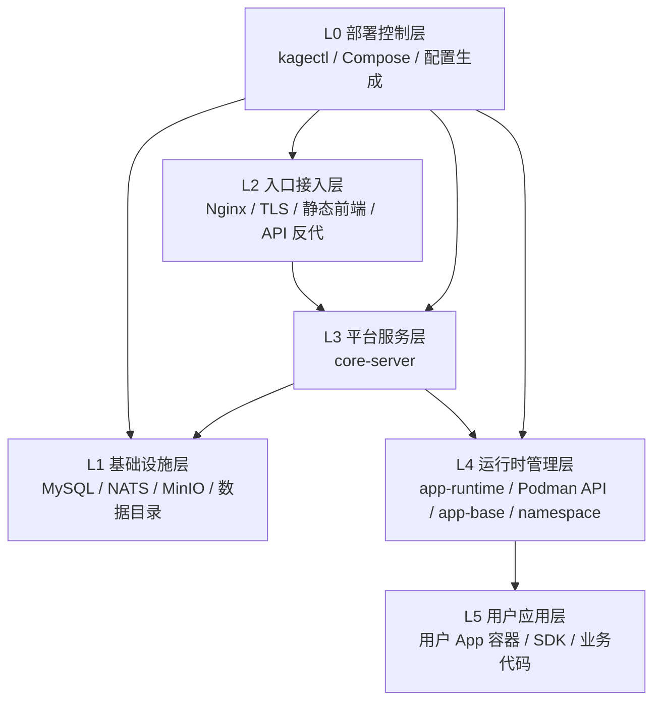

# 生产单机部署

> 官方生产入口：`deploy/prod/`

Kageos 的生产部署由 `kagectl` 统一控制。Compose 仍是底层容器执行器，但用户不需要手工维护生成后的 Compose 文件。

快速入口：

- [QUICK_START.md](QUICK_START.md)
- [DEPLOY_TUTORIAL.md](DEPLOY_TUTORIAL.md)

**范围**：主站、中间件（MySQL / NATS / MinIO）、内置 Nginx、容器内 Podman 用户应用运行时。不包含企业 License、控制面、消息中心或备份控制面。

## 部署分层

完整定义见 [部署分层模型](../../docs/deployment-layers.md)。



当前物理拓扑：

```text
Compose
  ├─ mysql / nats / minio（bundled 时启用）
  └─ main 容器（network_mode: host）
       ├─ Nginx :80 / :443
       ├─ core-server
       └─ Podman API
```

## 前置条件

- Linux 宿主机。
- 已安装 `podman compose` 或 `docker compose`。
- `/data` 可写；`kagectl up` 会创建 `/data/kageos`。
- `main` 服务需要 `privileged: true`。
- 宿主机 80 端口未被占用；如果启用容器内 HTTPS，443 端口也必须空闲。

## 一分钟部署

```bash
go run ./cmd/kagectl bootstrap --base-url http://your-ip-or-domain
```

最小 `kage.yaml`：

```yaml
site:
  base_url: "http://your-ip-or-domain"
  tls_mode: "http"
```

前面已有 LB / CDN 做 HTTPS：

```yaml
site:
  base_url: "https://your-domain"
  tls_mode: "external"
```

容器自己做 HTTPS：

```yaml
site:
  base_url: "https://your-domain"
  tls_mode: "redirect"
  cert_file: "/app/tls/fullchain.pem"
  key_file: "/app/tls/privkey.pem"
  tls_cert_pem_b64: "base64-fullchain-pem"
  tls_key_pem_b64: "base64-privkey-pem"
```

也可以不写入 YAML，直接用环境变量传入，`kagectl` 会渲染到 `.kageos/prod/generated/tls/`：

```bash
KAGEOS_TLS_CERT_PEM_B64="$(base64 < fullchain.pem | tr -d '\n')" \
KAGEOS_TLS_KEY_PEM_B64="$(base64 < privkey.pem | tr -d '\n')" \
go run ./cmd/kagectl up --config .kageos/prod/kage.yaml
```

渲染后证书会落到 `.kageos/prod/generated/tls/`，最终注入容器的环境变量会落到 `.kageos/prod/generated/env/kageos.env`，便于后续运维查看和备份。

## 常用命令

```bash
go run ./cmd/kagectl init --base-url http://your-ip-or-domain
go run ./cmd/kagectl doctor --config .kageos/prod/kage.yaml
go run ./cmd/kagectl up --config .kageos/prod/kage.yaml
go run ./cmd/kagectl verify --config .kageos/prod/kage.yaml
go run ./cmd/kagectl status --config .kageos/prod/kage.yaml
go run ./cmd/kagectl logs --config .kageos/prod/kage.yaml --layer L3
go run ./cmd/kagectl down --config .kageos/prod/kage.yaml
go run ./cmd/kagectl uninstall --config .kageos/prod/kage.yaml --dry-run
go run ./cmd/kagectl uninstall --config .kageos/prod/kage.yaml --purge-data --force
```

后台启动脚本：

```bash
./prod-up.sh
tail -f .kageos/prod/kagectl-up.log
./prod-stop.sh
```

## 安全默认值

- 内部 Go 服务默认监听 `127.0.0.1`。
- 生产 `pprof` 默认关闭。
- 公网入口只通过容器内 Nginx 暴露；生产 Nginx 不转发 `/swagger/`。
- `.kageos/prod/kage.yaml` 和 `.kageos/prod/generated/` 是本机敏感配置/生成物，默认不应入库。
- NATS 生产默认开启账号密码认证；`kagectl init` 会自动生成 `nats.password`。
- 如果 `site.tls_mode=redirect`，`site.base_url` 必须是 `https://`。

## 持久卷

生产环境统一使用 `/data/kageos` 宿主机固定目录挂载。

| 宿主机目录 | 容器挂载点 | 用途 |
|------|--------|------|
| `/data/kageos/mysql` | `/var/lib/mysql` | MySQL 数据目录 |
| `/data/kageos/minio` | `/data` | MinIO 数据目录 |
| `/data/kageos/namespace` | `/app/namespace` | 用户应用空间 |
| `/data/kageos/data` | `/app/data` | 应用侧本地数据目录 |
| `/data/kageos/logs` | `/app/logs` | 平台日志 |
| `/data/kageos/podman_storage` | `/var/lib/containers` | 容器内 Podman 存储 |

备份时直接备份 `/data/kageos` 下对应目录。不要对该目录做未经验证的清理。

## 文件说明

| 文件 | 说明 |
|------|------|
| `cmd/kagectl` | Go 部署控制入口，负责生成配置、调用 Compose、启停和验证 |
| `kage.example.yaml` | 无密钥示例配置 |
| `.kageos/prod/kage.yaml` | 本机私有配置，包含密钥，默认不入库 |
| `.kageos/prod/generated/` | `kagectl` 渲染出的 Compose、配置和中间件文件，默认不入库 |
| `Dockerfile` / `entrypoint-common.sh` / `entrypoint-main.sh` / `nginx/` / `config/template/` | 镜像与内置模板 |

## 升级

```bash
git pull --ff-only
go run ./cmd/kagectl up --config .kageos/prod/kage.yaml
go run ./cmd/kagectl verify --config .kageos/prod/kage.yaml
```
