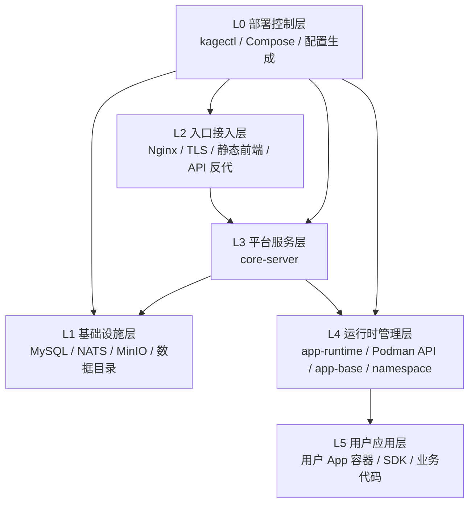

# 生产单机部署

> 官方生产入口：`deploy/prod/`

Kageos 的生产部署由 `kagectl` 统一控制。Compose 仍是底层容器执行器，但用户不需要手工维护生成后的 Compose 文件。

快速入口：

- [QUICK_START.md](QUICK_START.md)
- [DEPLOY_TUTORIAL.md](DEPLOY_TUTORIAL.md)

**范围**：主站、中间件（MySQL / NATS / MinIO）、内置 Nginx、容器内 Podman 用户应用运行时。不包含企业 License、控制面、消息中心或备份控制面。

## 部署分层

当前单机生产部署分层如下。



当前物理拓扑：

```text
Compose
  ├─ mysql / nats / minio（bundled 时启用）
  ├─ app-base-builder（profile: build，一次性构建 kagebase）
  └─ main 容器（network_mode: host）
       ├─ Nginx（默认 :80 / :443，可配置）
       ├─ core-server
       └─ Podman API
```

`kagectl up` 的启动顺序是：生成配置 -> 启动并等待基础设施 -> 运行 `app-base-builder` 准备 `kagebase` -> 最后构建/拉取并启动 `main`。

## 前置条件

- Linux 宿主机。
- 已安装 `podman compose` 或 `docker compose`。
- 默认数据目录 `~/.kageos/storage/prod` 可写；也可以在 `.kageos/prod/kage.yaml` 中把 `storage.root` 改成其他绝对路径。
- `main` 服务需要 `privileged: true`。
- 默认需要宿主机 80 端口未被占用；如果该端口不可用，可以配置 `site.http_port` 或安装时传 `--http-port`。如果启用容器内 HTTPS，对应的 `site.https_port` 也必须空闲，默认 443。
- bundled MinIO 默认只绑定宿主机 `127.0.0.1:9000`；生产用户 App 容器由 `main` 内的 Podman 以 host network 启动，因此 SDK/server 下载地址也使用 `127.0.0.1:9000`。

## 一分钟部署

```bash
sudo ./install.sh --base-url http://your-ip-or-domain
tail -f .kageos/prod/kagectl-up.log
```

宿主机 80 端口不可用时：

```bash
sudo ./install.sh --base-url http://your-ip-or-domain:8080 --http-port 8080
```

`install.sh` 会选择 sudo 调用者作为部署用户，自动处理 rootless Podman 生产环境需要的 linger；如果 `.kageos/prod/kage.yaml` 不存在，会先执行 `kagectl init` 创建生产配置，然后通过 `prod-up.sh` 后台启动部署。

执行 `kagectl init` 时会自动生成 MySQL、NATS、MinIO、JWT、system 初始密码，并在终端打印英文表格。生产默认 `auth.registration_mode=admin_only`：先用 `system` 登录后台，在 `System settings` 配置并测试 SMTP 后，再开启 `email_code` 自助注册。

最小 `kage.yaml`：

```yaml
site:
  base_url: "http://your-ip-or-domain"
  tls_mode: "http"
```

如果宿主机 80 端口不可用，可以直接把公网访问地址和监听端口改成同一个端口：

```yaml
site:
  base_url: "http://your-ip-or-domain:8080"
  tls_mode: "http"
  http_port: 8080
```

`http_port` 不填时默认 80；如果 `base_url` 已显式带端口，比如 `:8080`，也会自动按该端口监听。

前面已有 LB / CDN 做 HTTPS：

```yaml
site:
  base_url: "https://your-domain"
  tls_mode: "external"
```

容器自己做 HTTPS：

```yaml
site:
  base_url: "https://your-domain"
  tls_mode: "redirect"
  cert_file: "/app/tls/fullchain.pem"
  key_file: "/app/tls/privkey.pem"
  tls_cert_pem_b64: "base64-fullchain-pem"
  tls_key_pem_b64: "base64-privkey-pem"
```

也可以不写入 YAML，直接用环境变量传入，`kagectl` 会渲染到 `.kageos/prod/generated/tls/`：

```bash
KAGEOS_TLS_CERT_PEM_B64="$(base64 < fullchain.pem | tr -d '\n')" \
KAGEOS_TLS_KEY_PEM_B64="$(base64 < privkey.pem | tr -d '\n')" \
go run ./cmd/kagectl up
```

渲染后证书会落到 `.kageos/prod/generated/tls/`，最终注入容器的环境变量会落到 `.kageos/prod/generated/env/kageos.env`，便于后续运维查看和备份。

## 常用命令

```bash
./prod-up.sh
tail -f .kageos/prod/kagectl-up.log
go run ./cmd/kagectl status
go run ./cmd/kagectl verify
go run ./cmd/kagectl logs --layer L3
./prod-stop.sh
go run ./cmd/kagectl uninstall --dry-run
go run ./cmd/kagectl uninstall --purge-data --force
```

可选后台 wrapper：

```bash
./prod-up.sh
tail -f .kageos/prod/kagectl-up.log
./prod-stop.sh
```

## 安全默认值

- 内部 Go 服务默认监听 `127.0.0.1`。
- 生产 `pprof` 默认关闭。
- 公网入口只通过容器内 Nginx 暴露；生产 Nginx 不转发 `/swagger/`。
- `.kageos/prod/kage.yaml` 和 `.kageos/prod/generated/` 是本机敏感配置/生成物，默认不应入库。
- NATS 生产默认开启账号密码认证；`kagectl init` 会自动生成 `nats.password`。
- 自助注册生产默认关闭；公网开放注册前必须在 system 后台配置 SMTP 并开启邮箱验证码注册。
- 如果 `site.tls_mode=redirect`，`site.base_url` 必须是 `https://`。

## 持久卷

生产环境默认使用当前部署用户家目录下的 `~/.kageos/storage/prod` 作为宿主机持久化根目录。若使用独立数据盘，可在 `.kageos/prod/kage.yaml` 中把 `storage.root` 改为 `/srv/kageos`、`/data/kageos` 等由部署用户可写的绝对路径。

| 宿主机目录 | 容器挂载点 | 用途 |
|------|--------|------|
| `<storage.root>/mysql` | `/var/lib/mysql` | MySQL 数据目录 |
| `<storage.root>/minio` | `/data` | MinIO 数据目录 |
| `<storage.root>/namespace` | `/app/namespace` | 用户应用空间 |
| `<storage.root>/data` | `/app/data` | 应用侧本地数据目录 |
| `<storage.root>/logs` | `/app/logs` | 平台日志 |
| `<storage.root>/podman_storage` | `/var/lib/containers` | 容器内 Podman 存储 |
| `<storage.root>/go.mod`、`sdk/`、`pkg/`、`dto/`、`core/hr-server/model/` | 不挂载，宿主机源码快照 | 方便在宿主机从 `storage.root` 直接 `go build ./namespace/.../cmd/app` |

源码快照由 `kagectl render/up` 从当前仓库自动刷新，是可再生内容；业务数据仍以 `mysql`、`minio`、`namespace`、`data`、`logs` 为准。备份时直接备份 `storage.root` 下对应目录。不要对该目录做未经验证的清理。

## 文件说明

| 文件 | 说明 |
|------|------|
| `cmd/kagectl` | Go 部署控制入口，负责生成配置、调用 Compose、启停和验证 |
| `kage.example.yaml` | 无密钥示例配置 |
| `.kageos/prod/kage.yaml` | 本机私有配置，包含密钥，默认不入库 |
| `.kageos/prod/generated/` | `kagectl` 渲染出的 Compose、配置和中间件文件，默认不入库 |
| `Dockerfile` / `entrypoint-common.sh` / `entrypoint-main.sh` / `nginx/` / `config/template/` | 镜像与内置模板 |

## 升级

```bash
git pull --ff-only
go run ./cmd/kagectl up
go run ./cmd/kagectl verify
```
