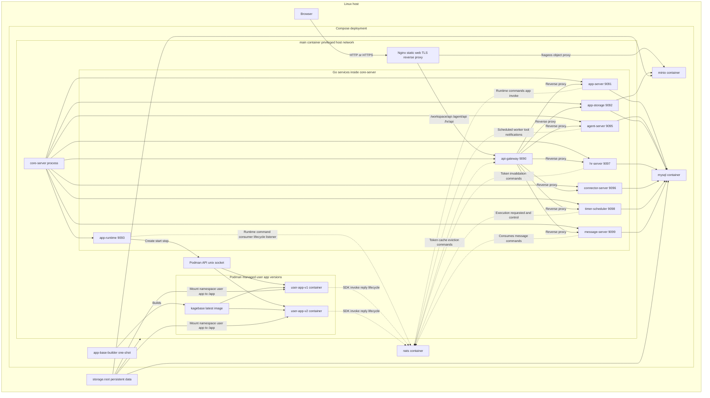
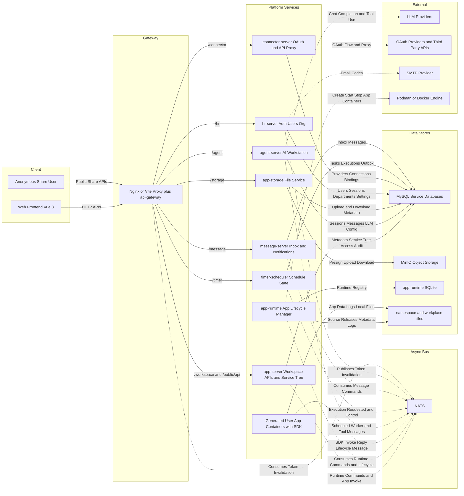
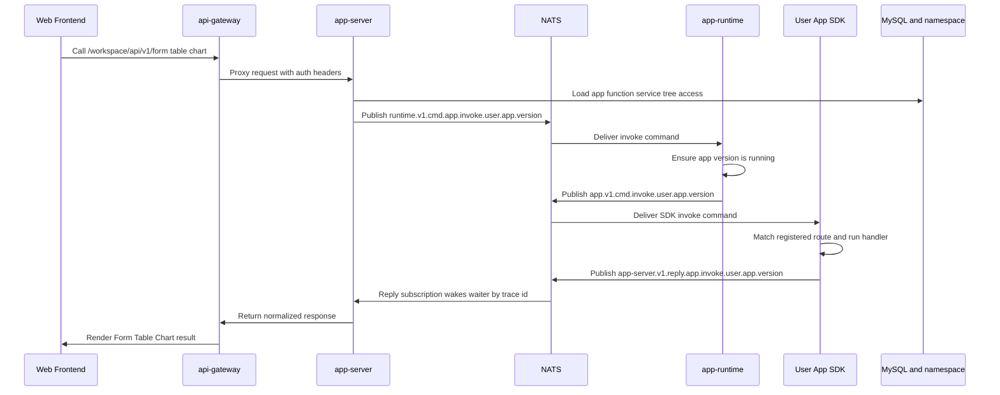
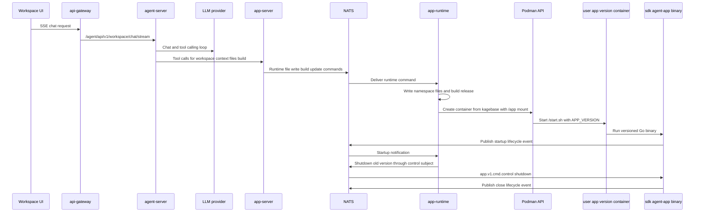
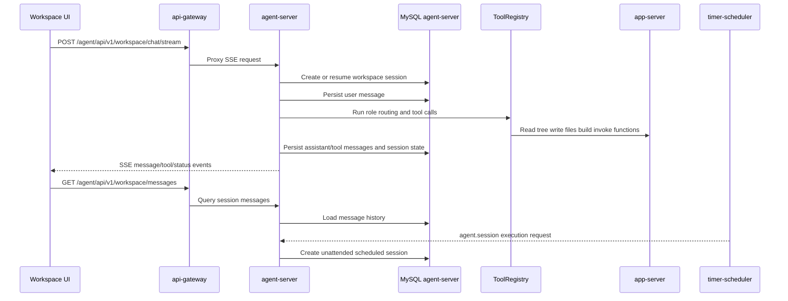
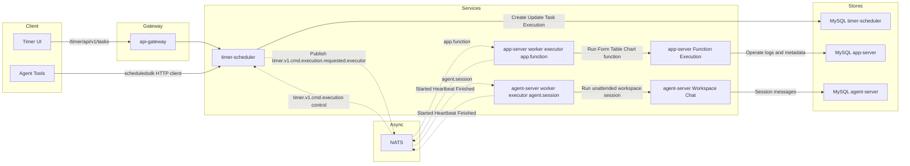
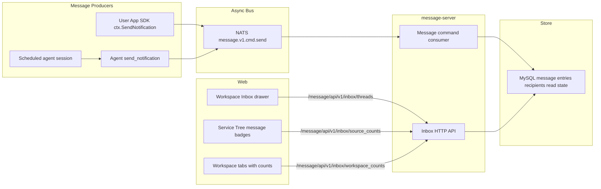

# kageos 当前架构图

本文基于当前仓库代码、`README`、部署文档和开发配置整理，目标是描述现阶段真实运行的 kageos 平台架构。

## 一句话总览

kageos 是一个 Vue 前端加 Go 平台服务群的轻应用工作台。平台通过 `api-gateway` 统一入口，通过 MySQL 保存平台元数据，通过 NATS 连接 `app-server`、`app-runtime` 和用户 App 容器，通过 MinIO 管文件对象，通过 `Service Tree` 把 Form、Table、Chart、Docs、Function 等能力组织成可治理、可调用、可分发的目录资源。

## 一张全景总图

这张图把生产部署边界、平台服务、Agent 工作台、App Runtime、用户 App 版本容器、NATS subject 家族、数据存储和外部依赖放在同一张图里。阅读顺序建议从左到右、从上到下：入口层 -> `main` 容器与 `core-server` -> 平台服务 -> NATS 与数据层 -> 用户 App 容器。

```mermaid
flowchart TB
  subgraph users ["Users and Operators"]
    browser["Browser Web UI"]
    publicUser["Anonymous Share User"]
    operator["Operator using kagectl"]
  end

  subgraph host ["Linux host or local dev machine"]
    subgraph infra ["Infrastructure containers or local services"]
      mysql["MySQL service databases"]
      nats["NATS message bus"]
      minio["MinIO object storage"]
    end

    subgraph persisted ["Persistent storage root"]
      mysqlData["mysql data"]
      minioData["minio data"]
      namespaceFs["namespace user app source workplace metadata logs"]
      runtimeData["data runtime app-runtime SQLite"]
      platformLogs["platform logs"]
      podmanStore["podman image and container storage"]
    end

    subgraph mainRuntime ["Production main container or dev host process"]
      nginx["Nginx static web TLS reverse proxy"]
      coreServer["core-server process unified launcher"]
      podmanAPI["Podman API unix socket"]
      appBaseImage["kagebase latest user app base image"]

      subgraph platform ["Platform services started inside core-server"]
        apiGateway["api-gateway HTTP router token validation cache"]
        appServer["app-server Service Tree access logs appcall"]
        agentServer["agent-server workspace chat ToolRegistry LLM"]
        appRuntime["app-runtime build deploy lifecycle"]
        appStorage["app-storage upload download presign"]
        hrServer["hr-server auth users departments settings"]
        connectorServer["connector-server OAuth bindings proxy"]
        timerScheduler["timer-scheduler tasks executions outbox"]
        messageServer["message-server inbox notifications"]
      end

      subgraph runtimeDetail ["App runtime internals"]
        workspaceWriter["workspace file writer package scaffold"]
        goBuilder["Go builder release binary"]
        versionMetadata["workplace metadata current app version index"]
        appVersionSpec["AppVersionSpec image mount command env"]
        discovery["App discovery startup close registry"]
        cleanup["old version shutdown cleanup"]
      end

      subgraph userContainers ["Podman managed user app version containers"]
        appV1["user app version container v1"]
        appV2["user app version container v2"]
        startScript["/start.sh reads APP_VERSION current_app"]
        appBinary["versioned Go binary"]
        sdkRuntime["kageos-sdk/agent-app NATS runtime"]
        sdkRoutes["registered Form Table Chart Callback routes"]
        appLocalData["app workplace data logs uploads outputs"]
      end
    end
  end

  subgraph subjectFamilies ["NATS subject families"]
    runtimeSubjects["runtime.v1.cmd.app create update delete invoke"]
    appSubjects["app.v1.cmd.invoke app.v1.cmd.control app-server.v1.reply"]
    lifecycleSubjects["runtime.v1.event.lifecycle"]
    timerSubjects["timer.v1.cmd.execution requested started heartbeat finished"]
    messageSubjects["message.v1.cmd.send"]
    gatewaySubjects["gateway.v1.cmd.token.invalidate and openapi-token.revoked"]
  end

  subgraph external ["External dependencies"]
    llmProviders["LLM providers"]
    oauthProviders["OAuth and third party APIs"]
    smtpProvider["SMTP provider"]
  end

  operator -->|"init render up verify"| coreServer
  operator -->|"ensure or rebuild"| appBaseImage
  browser -->|"SPA and API over HTTP or HTTPS"| nginx
  publicUser -->|"public share pages and submit"| nginx

  nginx -->|"static files"| browser
  nginx -->|"/workspace/api /agent/api /hr/api /storage/api /timer/api /message/api"| apiGateway
  nginx -->|"/kageos object proxy"| minio

  coreServer -->|"starts and supervises"| appRuntime
  coreServer -->|"starts and supervises"| appStorage
  coreServer -->|"starts and supervises"| hrServer
  coreServer -->|"starts and supervises"| agentServer
  coreServer -->|"starts and supervises"| connectorServer
  coreServer -->|"starts and supervises"| timerScheduler
  coreServer -->|"starts and supervises"| messageServer
  coreServer -->|"starts and supervises"| appServer
  coreServer -->|"starts last"| apiGateway

  apiGateway -->|"/workspace and /public/api"| appServer
  apiGateway -->|"/agent"| agentServer
  apiGateway -->|"/storage"| appStorage
  apiGateway -->|"/hr"| hrServer
  apiGateway -->|"/connector"| connectorServer
  apiGateway -->|"/timer"| timerScheduler
  apiGateway -->|"/message"| messageServer

  appServer -->|"apps service tree functions docs access operate logs public share"| mysql
  agentServer -->|"chat sessions messages LLM config runtime state records"| mysql
  appStorage -->|"file upload download metadata"| mysql
  hrServer -->|"users sessions companies departments settings tokens"| mysql
  connectorServer -->|"providers connections directory bindings"| mysql
  timerScheduler -->|"timer tasks executions outbox leases"| mysql
  messageServer -->|"inbox messages threads read state"| mysql
  appRuntime -->|"runtime registry"| runtimeData

  appStorage -->|"presigned upload download objects"| minio
  browser -->|"PUT presigned object URL through /kageos proxy"| nginx
  appServer -->|"workspace app metadata and NATS host records"| mysql

  agentServer -.->|"chat completion tool loop"| llmProviders
  connectorServer -.->|"OAuth authorize callback proxy"| oauthProviders
  hrServer -.->|"email verification codes"| smtpProvider

  agentServer -->|"tool calls read write build run functions"| appServer
  appServer -->|"create update delete app and service tree runtime commands"| runtimeSubjects
  appServer -->|"invoke Form Table Chart through appcall"| runtimeSubjects
  runtimeSubjects -.-> nats
  nats -.->|"delivers runtime commands"| appRuntime

  appRuntime --> workspaceWriter
  workspaceWriter -->|"write code api files init imports"| namespaceFs
  workspaceWriter --> goBuilder
  goBuilder -->|"release binary under workplace bin releases"| namespaceFs
  goBuilder --> versionMetadata
  versionMetadata --> namespaceFs
  appRuntime --> appVersionSpec
  appVersionSpec -->|"image kagebase mount namespace to /app command /start.sh env NATS_URL GATEWAY_URL APP_VERSION"| podmanAPI
  appBaseImage -->|"base image for every app version"| podmanAPI
  podmanAPI -->|"create start stop"| appV1
  podmanAPI -->|"create start stop"| appV2
  podmanStore --> podmanAPI
  namespaceFs -->|"mounted as /app"| appV1
  namespaceFs -->|"mounted as /app"| appV2

  appV1 --> startScript
  appV2 --> startScript
  startScript --> appBinary
  appBinary --> sdkRuntime
  sdkRuntime --> sdkRoutes
  sdkRoutes --> appLocalData
  appLocalData --> namespaceFs

  appRuntime --> discovery
  appRuntime --> cleanup
  discovery -.-> lifecycleSubjects
  cleanup -.-> appSubjects
  sdkRuntime -.->|"subscribe invoke and control"| appSubjects
  sdkRuntime -.->|"publish reply and lifecycle"| appSubjects
  sdkRuntime -.-> lifecycleSubjects
  appSubjects -.-> nats
  lifecycleSubjects -.-> nats
  nats -.->|"runtime invoke command"| appRuntime
  appRuntime -.->|"forwards app.v1.cmd.invoke"| nats
  nats -.->|"delivers app invoke"| sdkRuntime
  nats -.->|"reply wakes app-server waiter by trace id"| appServer
  nats -.->|"startup close discovery updates runtime registry"| appRuntime

  timerScheduler -->|"due scanner lease recover outbox"| timerSubjects
  timerSubjects -.-> nats
  nats -.->|"agent.session executor"| agentServer
  nats -.->|"app.function executor"| appServer
  agentServer -.->|"started heartbeat finished"| timerSubjects
  appServer -.->|"started heartbeat finished"| timerSubjects

  sdkRuntime -.->|"send notification command"| messageSubjects
  agentServer -.->|"send notification tool"| messageSubjects
  messageSubjects -.-> nats
  nats -.->|"consume message command"| messageServer
  hrServer -.->|"logout session revoke"| gatewaySubjects
  gatewaySubjects -.-> nats
  nats -.->|"token cache eviction"| apiGateway

  mysqlData --> mysql
  minioData --> minio
  platformLogs --> coreServer
```

## 先看容器边界

当前生产部署不是每个 Go 服务一个容器。生产单机部署里，Compose 主要拉起基础设施容器和一个 `main` 容器：

- `mysql`、`nats`、`minio` 是基础设施容器。
- `app-base-builder` 是一次性构建任务，用来准备用户 App 基础镜像 `kagebase:latest`。
- `main` 容器里同时运行 Nginx、`core-server` 和 Podman API。
- `core-server` 是一个进程，它会在进程内启动 `app-runtime`、`app-storage`、`hr-server`、`agent-server`、`connector-server`、`timer-scheduler`、`message-server`、`app-server`、`api-gateway`。
- 用户生成的 App 才是按版本独立启动的运行时容器，例如 `{user}-{app}-{version}`。这些容器由 `app-runtime` 通过 Podman API 创建，基于 `kagebase:latest`，挂载 `namespace/{user}/{app}` 到容器内 `/app`。
- `agent-server` 不是单独的 agent 容器；它是 `core-server` 进程内的一个平台服务。真正会被动态拉起的容器是用户 App 版本容器。

开发环境的边界略不同：`core-server` 通常直接跑在宿主机进程里，MySQL/NATS/MinIO 由本地 Compose 启动，用户 App 容器由本机 Podman 或 Docker 承载。

## 生产容器拓扑

## 平台服务拓扑

## 核心函数调用链

用户打开 Form、Table、Chart 或公共分享页面时，前端请求先进入 `api-gateway`，再由 `app-server` 校验权限、查找函数元数据，并通过 NATS 请求 `app-runtime`。`app-runtime` 确保目标 App 版本容器在运行，再把请求转发给用户 App SDK。SDK 执行业务 handler 后把响应发回 `app-server` 的 reply subject。

## App Runtime 容器生命周期

`app-runtime` 管的是“应用版本”，不是泛泛的容器。每次发布会生成一个新版本容器；旧版本会通过 SDK 控制主题优雅关闭，运行中请求完成后再停容器。

```mermaid
flowchart LR
  source["namespace user app code api"]
  build["Go build release binary"]
  metadata["workplace metadata version files"]
  spec["AppVersionSpec image mount command env"]
  podman["Podman API"]
  container["user-app-version container"]
  start["/start.sh"]
  binary["versioned app binary"]
  bus["NATS"]
  runtime["app-runtime"]

  runtime -->|"Write source files"| source
  source -->|"Compile"| build
  build -->|"Place in workplace bin releases"| metadata
  runtime -->|"Build spec with kagebase APP_VERSION NATS_URL GATEWAY_URL"| spec
  spec -->|"podman run -v namespace user app:/app /start.sh"| podman
  podman --> container
  container --> start
  start -->|"Read APP_VERSION and current_app"| binary

  binary -.->|"Subscribe app.v1.cmd.invoke.user.app.version"| bus
  binary -.->|"Publish app-server.v1.reply.app.invoke.user.app.version"| bus
  binary -.->|"Publish runtime.v1.event.lifecycle.user.app.version"| bus
  runtime -.->|"Publish app.v1.cmd.control.user.app.version shutdown"| bus
  bus -.->|"Startup close discovery events"| runtime
```

## AI 工作台生成和发布链路

`agent-server` 负责工作台会话、LLM 编排和工具调用。代码生成或修复完成后，工具会通过平台 API 和 NATS 链路写入工作区源码、构建并发布 App 版本。`app-runtime` 负责源码文件、版本元数据、容器启动、生命周期发现和旧版本清理。

## 工作台会话链路

工作台会话是 `agent-server` 的持久化能力，不只是一次临时 SSE 请求。前端发起 `/agent/api/v1/workspace/chat/stream` 后，`agent-server` 会保存 session、message、工具调用状态、pending interaction、运行中/已完成状态和阶段交接记录。普通用户对话、代码生成修复、Agent 任务执行，都会落在这套 session/message 模型上。

## 定时任务链路

定时能力是独立平台横切层。`timer-scheduler` 是唯一调度状态源，负责 `timer_task`、`timer_execution`、租约、超时恢复和 outbox。业务执行由 executor 所属服务完成：`agent-server` 消费 `agent.session`，`app-server` 消费 `app.function`。

同一任务默认使用 `overlap_policy=forbid`；平台也支持 `queue_latest` 有界合并，以及带 `max_parallelism` 上限的 `allow`。等待补跑使用持久化 `waiting` execution，不依赖进程内存队列。

## 消息和站内信链路

消息能力由 `message-server` 统一承载。生成应用通过 SDK `ctx.SendNotification` 发布通知命令，Agent 通过 `send_notification` 工具发布通知命令，二者最终都进入 `message.v1.cmd.send`。`message-server` 消费后落库为站内信，并提供 inbox、thread、source counts、workspace counts 和 unread count 给前端抽屉和 Service Tree 使用。通知可携带平台文件引用；站内信和移动处理页展示完整附件，飞书、企业微信、钉钉等外部 webhook 卡片只展示附件摘要并跳回 kageos 详情。

## 开发环境端口

| 组件 | 端口 | 说明 |
| --- | ---: | --- |
| `api-gateway` | 9090 | 统一 HTTP 入口 |
| `app-server` | 9091 | Workspace、Service Tree、Form/Table/Chart、Docs |
| `app-storage` | 9092 | 文件上传、下载、元数据 |
| `app-runtime` | 9093 | 运行时健康检查和 NATS handler |
| `agent-server` | 9095 | AI 工作台、LLM、工具调用 |
| `connector-server` | 9096 | OAuth、连接器、外部 API proxy |
| `hr-server` | 9097 | 登录、用户、组织、系统设置 |
| `timer-scheduler` | 9098 | 定时任务 API 和调度循环 |
| `message-server` | 9099 | 站内信、通知 inbox |
| MySQL | 3318 | 本地开发平台数据库 |
| NATS | 4222 | 平台和用户 App 消息总线 |
| MinIO | 9000, 9001 | 对象存储和控制台 |

## 关键边界

| 边界 | 当前职责 |
| --- | --- |
| `api-gateway` | HTTP 反向代理、Trace、鉴权头透传、HR 会话校验短缓存、token 失效 NATS 订阅、Swagger 聚合 |
| `app-server` | 工作区 API、Service Tree、能力包安装导出、权限、操作日志、函数元数据、用户 App 调用编排 |
| `agent-server` | 工作台会话、会话消息、LLM 配置、ToolRegistry、PRD/代码生成、通知工具和 Agent 任务 worker |
| `app-runtime` | App 创建/更新/删除、源码文件和版本元数据、容器生命周期、NATS runtime handler、App discovery |
| `github.com/kageos/kageos-sdk/agent-app` | 生成 App 的运行时 SDK，注册 Form/Table/Chart/Callback 路由并通过 NATS 接收调用 |
| `timer-scheduler` | 唯一调度状态源，业务 payload 不解析，只按 executor_key 投递 |
| `message-server` | 站内信持久化、线程、已读状态、source/workspace 统计和 `message.v1.cmd.send` 消费 |
| `app-storage` | MinIO 预签名上传下载、文件元数据和公开分享文件解析 |
| `connector-server` | OAuth provider、connection、directory binding 和外部 API proxy |

## 主要事实来源

- `README.md`
- `docs/product-thinking-ai-era-application-governance.md`
- `docs/platform-capabilities.md`
- `docs/scheduled-tasks-architecture-design.md`
- `deploy/dev/README.md`
- `deploy/prod/README.md`
- `core/cmd/main/main.go`
- `core/api-gateway/server/*.go`
- `core/app-server/server/*.go`
- `core/app-runtime/server/*.go`
- `core/app-runtime/service/README.md`
- `core/agent-server/server/*.go`
- `core/app-storage/README.md`
- `core/timer-scheduler/server/*.go`
- `pkg/subjects/README.md`
- `pkg/scheduledsdk/worker.go`
- `github.com/kageos/kageos-sdk/agent-app/app`
- `web/vite.config.ts`
