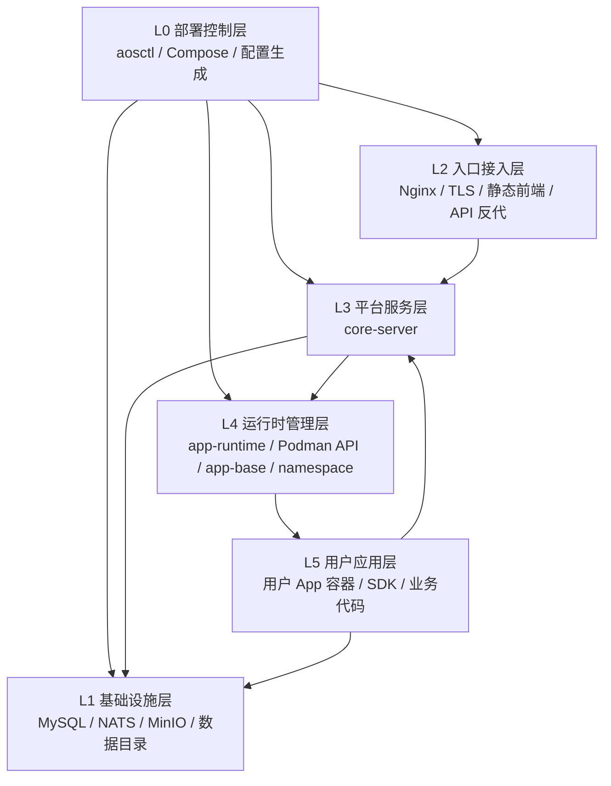

# Kageos 部署分层模型

> 状态：执行口径
> 更新时间：2026-05-17
> 负责人窗口：事项 5 / codex/local-dev-onboarding

这份文档定义生产部署的官方心智模型。后续排障、文档、`aosctl status`、`aosctl verify` 都按这套分层表达，不再只按容器名平铺描述。

常用入口：

- `aosctl layers`：查看 L0-L5 拓扑。
- `aosctl status`：查看分层拓扑、层到 Compose 服务的映射、Compose 状态。
- `aosctl verify`：按 L0-L5 执行诊断。
- `aosctl logs --layer L3`：查看某一层对应的 Compose 服务日志。
- `aosctl layers/status/doctor/verify --json`：输出机器可读的分层结果，供 UI、CI 和远程诊断消费。
- `aosctl up`：默认执行分层预检、启动 Compose、等待分层健康检查通过；慢机器可用 `--wait-timeout 10m`。
- `aosctl bootstrap --base-url URL`：首次部署的一步式入口，缺配置时先生成 `aos.yaml`，再执行完整 `up` 流程。

## L0 部署控制层

职责：把生产环境部署起来，并提供统一的运维入口。

当前组件：

- `aosctl`
- `deploy/prod/aos.yaml`
- `deploy/prod/.generated/`
- Compose 执行器
- 镜像准备、目录准备、配置渲染、`up/status/verify/logs/down`

这一层不承载业务。用户应该只需要使用 `aosctl`，不直接编辑生成后的 Compose 文件。

## L1 基础设施层

职责：提供平台通用底座。

当前组件：

- MySQL
- NATS
- MinIO
- `/data/ai-agent-os`
- 密钥和证书目录

MySQL / NATS / MinIO 支持 `bundled` 和 `external`。`bundled` 由 Compose 启动，`external` 由 `aosctl` 校验连接。

## L2 入口接入层

职责：处理外部流量入口。

当前组件：

- Nginx
- HTTP / HTTPS / external TLS 模式
- Web 静态资源
- API 反代
- 维护页

当前物理实现中，Nginx 运行在 `main` 容器内，并通过 `network_mode: host` 监听宿主机 80/443。逻辑职责仍然属于 L2。

健康探针：

- `deploy/prod/health/edge.sh`
- `aosctl verify` 的 L2 检查

## L3 平台服务层

职责：提供平台自身的业务能力。

当前组件：

- `core-server`
  - `api-gateway`
  - `app-server`
  - `agent-server`
  - `app-storage`
  - `hr-server`

健康探针：

- `deploy/prod/health/platform.sh`
- `aosctl verify` 的 L3 检查

## L4 运行时管理层

职责：管理用户 App 的生命周期。

当前组件：

- `app-runtime`
- Podman API
- `agentos-app-runtime-base`
- namespace 工作目录
- 用户 App 镜像构建、启动、停止、更新

这是 Kageos 和普通 SaaS 最大的差异：平台不仅提供业务 API，还负责动态运行用户生成的应用。

健康探针：

- `deploy/prod/health/runtime.sh`
- `aosctl verify` 的 L4 检查

## L5 用户应用层

职责：运行用户真实业务代码。

当前组件：

- 用户 App 容器
- SDK
- 用户 App 源码和运行进程

用户 App 只能通过公开协议访问平台能力：

- SDK 注入配置
- NATS subject
- API Gateway
- MinIO / 预签名 URL

生产 bundled 拓扑下，用户 App 容器访问平台内部能力必须使用容器可达地址，例如 `host.containers.internal`，不能使用 `127.0.0.1` 指向平台主进程。

## 排障归类

| 现象 | 优先归属 |
|---|---|
| `aosctl` 配置、渲染、Compose 调用失败 | L0 部署控制层 |
| MySQL / NATS / MinIO 连不上 | L1 基础设施层 |
| 域名、80/443、HTTPS、静态页面、维护页异常 | L2 入口接入层 |
| API、登录、文件元数据、应用构建或 Table 更新日志异常 | L3 平台服务层 |
| 用户 App 创建、构建、容器启动失败 | L4 运行时管理层 |
| 用户业务代码报错、SDK 调用失败 | L5 用户应用层 |
