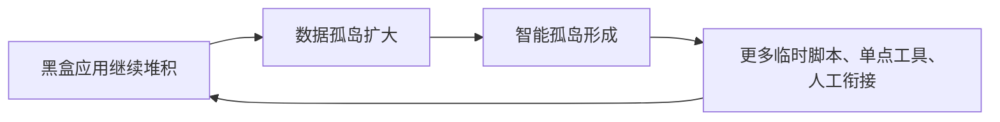
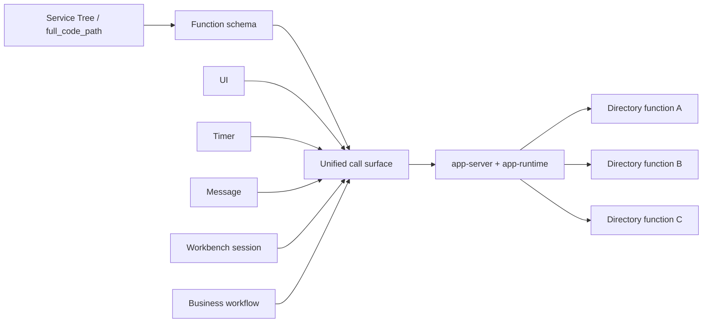
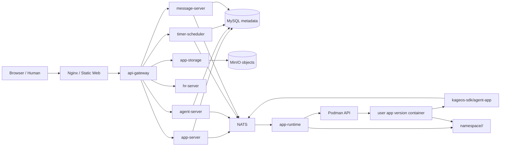
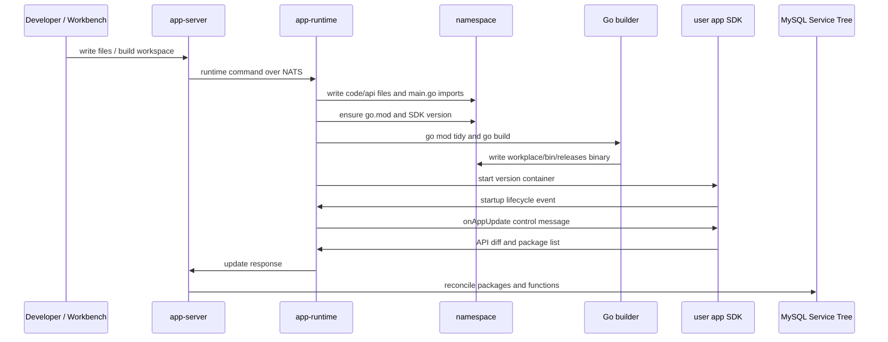

# kageos Blueprint

这是一份放在仓库里的项目蓝图，给维护者、产品和工程同学对齐项目心智用。它不替代详细架构文档，而是回答一个问题：只看一份文件时，应该怎样理解 kageos 的愿景、运行方式、代码组织和开发边界。

## 总览

- 项目名称写作 `kageos`。Go 包、路径、域名使用小写 `kageos`，环境变量使用 `KAGEOS_*`。
- kageos 不是低价造应用工具，也不是要替代 Linux、macOS 这类传统操作系统。它更像业务能力的统一操作层：提供资源路径、运行时、权限、日志、任务、安装和分发。
- 核心对象是目录：目录可以被人打开使用，可以被工作台按 schema 调用，可以被平台权限、审计、日志、定时、消息和版本治理。
- 当前阶段重点是 namespace 场景包生态：把可运行、可试用、可安装、可派生、可发布的服务目录做扎实。
- 工作台增强能力只是目录的一种使用方式。它可以加速生成、改造、巡检和编排；没有它时，人仍然可以通过 UI 使用同一套目录能力。
- 新能力优先复用现有平台横切层：Service Tree、权限、操作日志、站内信、定时任务、文件服务、app-runtime、agent-app SDK。不要为了单个场景自造一套通用平台能力。

## 一句话

kageos 把业务能力组织成可运行的 Service Tree 目录：用户从 Hub 安装成熟目录，放进自己的私有 namespace，用自己的数据运行，必要时通过工作台改造，再把稳定能力发布回生态。

## 核心世界观

kageos 的关键不是“低价造应用”，而是“业务能力沉淀为目录资产”。

```text
Hub directory -> private namespace -> governed Service Tree -> human UI
                                                        -> callable function
                                                        -> scheduled automation
                                                        -> publishable capability
```

目录不是静态模板，也不是一段说明文案。一个目录可以包含：

- Form、Table、Chart、Docs、Function 等工作台资源。
- Go SDK 代码、数据表结构、文件处理逻辑和可调用 schema。
- 权限、操作日志、运行记录、消息来源、定时任务和版本信息。
- 供工作台理解、修改、调用和测试的上下文。

## 为什么这件事重要

过去很多企业的软件建设，表面上是在持续数字化，实际上是在不断堆积黑盒应用。一个部门缺系统，就买一个；一个流程跑不动，就外包一个；一个报表临时要，就写一个脚本；一个团队想提效，就接一个自动化工具。每个选择在当下都合理，但几年之后，企业会得到一组彼此不认识的系统：各自有账号、权限、表结构、接口、页面、日志、审批流和运维方式。

黑盒应用越多，企业越不像拥有软件资产，反而像背着越来越重的软件债务。真正贵的也不再是“写出第一版代码”，而是后面的理解成本、使用成本、迁移成本、集成成本、治理成本和信任成本。

典型后果包括：

- 数据散在不同应用里，字段含义不一致，权限口径不一致，导出格式不一致。
- 不同软件的导航、表单、表格、详情、图表、审批和消息组织方式差异很大，员工每换一个系统就要重新学习一套操作语言。
- 业务流程被切成很多段，中间靠人复制、粘贴、截图、导表和发消息衔接。
- 自动化只能停留在单点提效，离开当前应用就失去上下文。
- 新人理解业务要在多个系统之间来回猜，老员工离职后很多流程变成口口相传。
- 项目一旦变成某个外包团队、某个离职开发者、某个历史负责人脑子里的东西，就很容易失传；代码还在，系统还跑着，但没人真正理解它。
- 管理者看到的是越来越多软件采购、集成项目和运维工单，而不是一张越来越清晰的能力地图。
- 安全、审计、合规、版本和权限散在各处，企业越大，越难回答“谁在什么时候用什么能力处理了什么数据”。

这就是很多企业的顽疾：软件越多，能力没有自然复利，治理负担却持续复利。到最后，软件使用、维护、理解和治理的成本，远远高于当初开发或采购软件的成本。

## 孤岛的恶性循环

数据孤岛和智能孤岛不是两个独立问题，它们会互相喂养。



数据孤岛先出现：客户、订单、合同、库存、审批、文件、日志散在不同系统里。每个系统都有自己的数据模型和权限边界，别的系统很难稳定理解它，更难安全地使用它。

数据孤岛继续往前走，就会变成智能孤岛。一个自动化、一个问答助手、一个流程机器人，如果只能看见当前应用里的数据，不能发现企业已有能力，不能按 schema 调用能力，不能留下统一审计记录，它就只能成为另一个局部工具。它越聪明，越容易把局部最优做得更快，却不能让企业整体变得更通。

智能孤岛又会反过来加剧数据孤岛。因为单点工具解决不了跨系统流程，团队会继续补脚本、补导入导出、补中间表、补聊天窗口里的人工判断。于是企业获得了更多黑盒，更多隐形依赖，更多没人敢删也没人敢改的流程。

kageos 要切断的正是这条循环。

## kageos 怎么破局

kageos 不把应用当作一座座封闭城堡，而是把业务能力拆成挂在 Service Tree 上的目录和函数。目录有路径，函数有 schema，执行有 runtime，数据访问有 SDK 边界，权限、日志、消息、定时、版本和审计都回到平台。

只要能力进入平台，它就不是一个藏在黑盒里的按钮，而是一段有坐标、有接口、有记录、可安装、可调用、可编排、可治理的业务资产。

在 kageos 里，目录之间的衔接不是靠人记住“去哪个系统点哪个按钮”，也不是靠临时脚本猜测别人的数据库结构。能力之间通过几个稳定层面通信：

- 通过 `full_code_path` 找到能力，例如 `/sales/crm/customer/create.form`。
- 通过函数 schema 知道需要什么输入、会返回什么输出、字段如何展示和校验。
- 通过 `app-server` 和 `app-runtime` 调用对应 app 的当前版本，不直接穿透别人的内部表结构。
- 通过 SDK 访问数据库、文件、消息和平台上下文，把资源使用收在统一边界里。
- 通过权限、操作日志、运行记录和版本信息回答“谁调用了什么、为什么调用、调用了哪个版本、结果是什么”。



这样，目录函数天然可以被 UI 使用、被定时任务执行、被消息触发、被工作台会话调用，也可以被别的业务流程编排。它们不需要共享同一个巨大的单体应用，也不需要互相复制代码；它们共享的是平台坐标、schema、运行时和治理模型。

函数到函数的衔接也应该走这条公共面：看见公开 schema，发起受权限约束的调用，拿到结构化响应，留下运行记录。调用者不需要知道对方内部用了哪张表、哪个文件、哪个第三方连接器；被调用者也不需要把自己的实现泄漏给所有人。这样才能让“直接通信”不变成新的耦合灾难。

这才是 kageos 的性感之处：它不是让企业更快生产更多孤立软件，而是让每一次新增能力都长在同一张网里。新目录装进来，旧目录能发现它；新函数发布后，流程可以编排它；某个目录被派生到另一个企业或团队，仍然保留标准结构；企业的软件资产越多，不是越乱，而是越像一张越来越密、越来越有用的业务神经网络。

## 统一的不只是接口

kageos 里的统一不只发生在后端。企业软件的学习成本，很大一部分来自体验层割裂：每套系统都有自己的菜单、列表、筛选、表单、详情页、图表、消息和审批逻辑。员工不是在学习业务，而是在反复适应不同软件的脾气。

kageos 把体验层也收进同一套资源模型里。Form、Table、Chart、Docs、Function 不是各自随便长出来的页面，而是由 SDK schema、Widget 配置和平台组件共同渲染。目录挂在同一棵 Service Tree 上，表单遵守同一套字段描述和校验逻辑，表格遵守同一套查询、编辑和展示协议，图表遵守同一套数据结构，消息和定时任务也回到同一套平台入口。

这意味着企业新增一个服务目录时，用户不需要重新学习一个新软件的世界观。它在熟悉的位置出现，用熟悉的组件呈现，按熟悉的权限和日志规则运行。对使用者来说，这是降低学习成本；对管理者来说，这是降低培训、运维和治理成本；对平台来说，这是让能力持续积累而不是持续分裂。

更重要的是，kageos 不把项目理解押在某个开发者个人身上。传统黑盒项目常常在开发者离职后变成遗迹：能跑，但没人敢改；有代码，但没人知道为什么这么写；有数据，但没人知道字段到底代表什么。kageos 要把理解沉淀在目录结构、函数 schema、packageContext、文档、运行记录、版本 diff 和 Service Tree 里。

在智能原生企业里，工作台会话可以沿着这些结构读取应用：它知道目录在哪里，函数如何注册，字段如何校验，数据如何访问，最近改了什么，运行失败在哪里。它不是靠猜，也不是靠某个人留下的口头说明，而是沿着平台提供的标准坐标理解业务能力。

随着模型能力升级，这种结构化资产的价值会继续放大。同一份目录、schema、日志和版本历史，会被更强的工作台理解得更深、修复得更稳、编排得更自然。企业不用害怕某个人离开导致业务中断，因为真正的知识不再只藏在人的脑子里，而是沉淀在平台可读取、可验证、可治理的服务目录中。

## 产品价值观

kageos 希望把软件资产从“散落的页面、脚本、接口和聊天记录”收束成可以长期治理的业务能力网络。它的产品价值观不是多做一个编辑器，而是让能力本身具备统一坐标、标准接口和可分发形态。

| 特性 | 在 kageos 里的含义 |
| --- | --- |
| 统一化 | 所有能力进入同一套 `full_code_path`、Service Tree、函数 schema、UI 组件、运行时和权限模型 |
| 标准化 | 工作空间是 Go module，目录是 Go package，函数用 SDK template 注册，发布走同一条 build/update 链路 |
| 原子化 | Form、Table、Chart、Docs、Function 都是可以独立理解、运行、审计和组合的节点 |
| 可插拔 | 一个目录可以从 Hub 安装，也可以在私有 namespace 派生、替换、删除和重新发布 |
| 可发现 | 目录、函数、文档、运行记录和 schema 都挂在 Service Tree 上，能搜索、能授权、能追踪来源 |
| 可编排 | 标准输入输出、定时任务、消息、工作台会话和跨目录调用，让能力可以被流程串起来 |
| 可治理 | 权限、审计、日志、版本、运行记录、消息来源和连接器依赖都在平台层收口 |
| 可分发 | 稳定目录可以打包发布到 Hub，安装到任意使用 kageos 的工作空间 |

未来的软件会越来越像编排工作：先从已有目录里找到合适的能力，把它们组合成流程；缺少某个原子能力时，再补充代码。编程仍然重要，但它不应该让企业重新回到一堆孤立项目、一堆临时脚本、一堆没人敢改的系统里。

所以 kageos 创造的不是一次性应用，而是一块块可以迁移、复制、组合和治理的业务积木。它们可以跟随一家企业成长：软件资产越多，能力网络越强，而不是系统越多，权限、数据、流程和知识越难管理。

这也是 kageos 和传统企业应用平台的区别：它不是再造一批互不相干的软件，而是给智能原生应用提供从创建、测试、部署、分发、治理到操作的一体化底座。个人可以用它安装一个开箱即用目录；团队可以基于它沉淀业务包；大型企业可以用它把越来越多的软件资产纳入同一套治理模型。

## 运行架构

kageos 是 Vue 前端加 Go 平台服务群，加用户 App 容器运行时。



生产 AIO 镜像里，外层只运行一个 kageos 容器；容器内部用 Podman 拉起 MySQL、NATS、MinIO 和用户 App 版本容器。开发环境通常在宿主机跑 `core-server`，用 Compose 跑基础设施。

详细图见 [kageos 当前架构图](current-architecture.md)。

## 仓库地图

| 路径 | 作用 | 说明 |
| --- | --- | --- |
| `core/cmd/main` | 平台统一启动入口，启动各 Go 服务 | 生产/开发主进程入口，不是用户 App 入口 |
| `core/api-gateway` | HTTP 统一入口、鉴权转发、短期 token 校验缓存 | 前端 API 先到这里，持久化会话状态以 HR 数据库为准 |
| `core/app-server` | 工作区 API、Service Tree、权限、操作日志、函数元数据、App 调用编排 | 目录治理和函数调用的中枢 |
| `core/app-runtime` | namespace 文件写入、Go 构建、版本元数据、用户 App 容器生命周期 | 负责真实落盘和启动 App |
| `core/agent-server` | 工作台会话、角色、工具、内嵌 prompt、LLM 编排 | 目录改造和工具编排的控制面 |
| `core/app-storage` | 文件上传、下载、预签名和对象元数据 | 业务文件走这里，不要自己拼对象 URL |
| `core/hr-server` | 登录、用户、组织、系统设置 | 鉴权和基础用户域 |
| `core/connector-server` | OAuth 和第三方连接器代理 | 外部 API 连接的统一入口 |
| `core/timer-scheduler` | 定时任务、执行记录、租约、outbox | 函数任务和 Agent 任务都走这里 |
| `core/message-server` | 站内信、线程、未读、通知命令消费 | SDK `ctx.SendNotification` 最终落这里 |
| `pkg` | 平台内部共享库 | 工作空间应用不要导入主仓 `pkg`，要用公开 SDK |
| `web/src/architecture` | Vue 前端主架构 | 遵守 domain/application/infrastructure/presentation 分层 |
| `deploy` | dev/prod/aio/base 镜像和部署材料 | 运行部署问题先看这里 |
| `docs` | 架构、产品、SOP 文档 | 蓝图和详细资料入口 |
| `namespace` | 工作空间应用源码、构建产物、运行元数据 | 这是运行态/示例应用区，不是平台普通源码目录 |
| `scripts` | 检查、发布、本地辅助脚本 | 发布和治理检查优先用这里 |

公开 SDK 位于独立 Go module：`github.com/kageos/kageos-sdk`。工作空间应用应依赖这个 module，不应依赖 `github.com/kageos/kageos` 主仓内部实现。

## namespace 模型

用户说的工作台路径不是磁盘绝对路径，而是 `full_code_path`。

```text
/<user>/<app>/<package>/<child>
```

它对应本地运行态目录：

```text
namespace/<user>/<app>/
├── go.mod
├── code/
│   ├── cmd/app/main.go
│   └── api/
│       └── <package>/<child>/
│           ├── init_.go
│           └── *.go
└── workplace/
    ├── bin/releases/
    ├── metadata/
    ├── logs/
    └── data/
```

常见映射：

| 工作台路径 | 磁盘含义 | 代码含义 |
| --- | --- | --- |
| `/<user>/<app>` | `namespace/<user>/<app>` | 一个独立 Go module 和工作空间应用 |
| `/<user>/<app>/<package>` | `code/api/<package>` | 一个服务目录 package |
| `/<user>/<app>/<package>/<child>` | `code/api/<package>/<child>` | 嵌套服务目录 package |
| `/<user>/<app>/<package>/xxx.form` | SDK 注册的 Form 函数 | UI 可提交，工作台可调用 |
| `/<user>/<app>/<package>/xxx.table` | SDK 注册的 Table 函数 | UI 可查表，工作台可查询/写入 |
| `/<user>/<app>/<package>/xxx.chart` | SDK 注册的 Chart 函数 | UI 可看图，工作台可查询数据 |

`namespace/<user>/<app>` 里的 `go.mod` 会固定依赖 `github.com/kageos/kageos-sdk`。平台构建时会确保 SDK 不低于主仓当前版本，但不会把用户已经手动使用的更高版本降级。

## 工作空间生命周期

kageos 的工作空间不是一个纯前端概念。它在平台元数据、运行时文件系统、Go module、用户 App 容器之间都有对应实体。

### 创建工作空间

用户创建工作空间时，`app-server` 先做租户和应用英文标识校验，选择一个可用 runtime host，然后通过 NATS 调用 `app-runtime`。

`app-runtime` 会在 `namespace/<user>/<app>` 下创建一个独立 Go 项目：

```text
namespace/<user>/<app>/
├── go.mod
├── code/
│   ├── cmd/app/main.go
│   └── api/
└── workplace/
    ├── bin/
    ├── metadata/
    ├── logs/
    └── data/
```

其中 `go.mod` 的 module path 是 `github.com/kageos/kageos/namespace/<user>/<app>`，并依赖当前平台内置的 `github.com/kageos/kageos-sdk` 版本。`code/cmd/app/main.go` 只做一件事：导入 SDK app 包并执行 `app.Run()`。

runtime 落盘成功后，`app-server` 写入 app 元数据，并创建根 Service Tree 节点 `/<user>/<app>`。创建阶段不会立即编译，也不会启动用户 App 容器，第一次真正发布发生在后续 build/update。

### 创建目录

创建目录时，前端或工作台传入的是 `full_code_path`，例如：

```text
/alice/crm/customer
```

`app-server` 会校验路径必须属于目标用户和工作空间，并且每一段目录 code 都是合法 Go package 名。随后它调用 `app-runtime` 的目录脚手架能力。

runtime 做三件事：

- 在 `code/api/customer` 创建 Go package 目录。
- 生成 `init_.go`，写入 `packageContext`、目录名、描述和 `RouterGroup`。
- 在 `code/cmd/app/main.go` 增加该 package 的 blank import，让 Go 启动时执行目录里的 `init()`。

如果创建的是嵌套目录，比如 `/alice/crm/customer/profile`，磁盘上会对应 `code/api/customer/profile`，也是一个独立 Go package。目录创建后，`app-server` 会补齐对应的 Service Tree package 节点。

空目录只是一个 package 外壳。它能被看到、能继续写文件，但只有当目录内注册了 Form/Table/Chart 等函数，并完成 build/update 后，函数节点才会进入 Service Tree。

### 新增和编辑文件

文件写入走 `app-runtime` 的 workspace file service。它会解析目标目录，校验源码边界，自动处理 Go import，并用原子写入落盘。

普通写文件的目标通常长这样：

```text
namespace/<user>/<app>/code/api/<package>/xxx.go
```

源码校验会阻止几个常见风险：

- 应用代码导入主仓 `github.com/kageos/kageos` 内部包。
- 绕过 SDK 直接操作不该暴露的底层数据库能力。
- 修改脚手架生成的 `init_.go`。
- 引入会和 SDK 全局注册冲突的 driver 或包。

批量写文件和目录替换会继续触发编译、版本元数据写入和 diff 对账。单纯的 write-only 修改只改变源码，不会刷新运行态函数列表。

### 替换目录

替换目录用于“同名目录整体重做”。runtime 会先把旧目录移出编译路径，移除旧 package 的 blank import，再创建新目录脚手架、写入新文件并编译。

如果编译失败，旧目录会回滚回来，避免线上工作空间因为一次替换失败而丢失可用代码。编译成功后，新目录才会成为新的工作空间版本。

### 删除目录

删除 package 节点时，`app-server` 先按目录 `full_code_path` 级联删除绑定到该节点及子节点的定时任务；调度服务不可用或任务删除失败时，目录删除会失败并保留 Service Tree，不能静默留下继续触发的孤儿任务。任务清理成功后，`app-server` 找到节点所属 app，再调用 runtime 删除磁盘脚手架。runtime 会删除对应 `code/api/<package>` 目录，并从 `main.go` 移除该 package 的 blank import。

随后 `app-server` 删除 Service Tree 节点及子树。build/update 对账发现函数已从新版本移除时，也会先删除该函数绑定的定时任务，再删除函数节点。删除源码和删除元数据是两件事：源码被移除后，还需要通过 build/update 让运行中的新版本彻底不再包含这批函数；否则旧版本容器仍可能保留上一版已经编译进去的能力。

app-server 启动后会先做一次孤儿定时任务对账，并在每天本地时间 04:30 再执行一次：`function/app.function` 任务必须指向真实 function 节点，`workspace_directory/agent.session` 任务必须指向真实 package 节点；路径不存在或节点类型不匹配的任务会直接删除。未知的资源范围和执行器不参与该对账，避免误删其他平台任务。

删除整个工作空间时，runtime 会停止并移除该 app 的版本容器，删除 `namespace/<user>/<app>`，再清理 runtime app/version 记录；`app-server` 负责清理平台侧 app 和 Service Tree 元数据。

### 编译和更新工作空间

build/update 是工作空间从“源码”变成“可运行目录能力”的关键步骤。共同链路如下：

1. runtime 确认 `go.mod` 存在，并把 `github.com/kageos/kageos-sdk` 升到平台要求的最低版本；如果用户已经使用更高版本，不会降级。
2. builder 在 module 根目录执行 `go mod tidy`，确保依赖闭合。
3. builder 以 `code/cmd/app` 为入口执行 `go build`，产物写入 `workplace/bin/releases`。
4. runtime 写入 `workplace/metadata/version.json`、`current_version.txt`、`runtime-manifest.json` 等版本元数据，并记录一次本地 git commit。
5. runtime 基于 `KAGEOS_APP_BASE_IMAGE` 启动这个版本的用户 App 容器，把整个 app 目录挂载进去，并注入 NATS、Gateway、版本号、二进制名等环境变量。
6. 容器启动后，SDK app 发送 startup 通知。runtime 再发送 `onAppUpdate` 控制消息。
7. SDK app 汇报 package list 和 API diff。runtime 把 diff 返回给 `app-server`。
8. `app-server` 根据 diff 对账 Service Tree 和函数元数据，更新 app 当前版本。

不同入口的差异在最后一步：

- 完整 `UpdateApp` 会让新版本容器成为当前运行版本，再对旧版本执行优雅关闭；清理任务会保留最近版本并回收多余容器。
- 批量写文件和替换目录会启动临时版本容器拿 diff，完成对账后停止临时容器；它们更像“源码变更加编译校验加元数据收敛”的工作区操作。

这条链路解释了很多排查问题的入口：如果代码写了但 UI 没有函数，先看是否有 blank import、是否注册函数、是否真正 build/update、SDK diff 是否返回，以及 app-server 是否完成元数据对账。

## Service Tree

Service Tree 是平台理解目录的共同坐标。它把应用、目录、函数、文档等资源挂成树，并给这些资源提供治理能力。

核心字段包括：

- `full_code_path`: 全局资源路径，例如 `/system/tools/archive/create_zip.form`。
- `type`: `package`、`function`、`docs` 等节点类型。
- `template_type`: 函数类型，例如 `form`、`table`、`chart`。
- `ref_id`: 函数节点指向真实 function 元数据。
- `app_id`: 归属应用。
- `version` / `version_num`: 目录和函数的版本视图。

只要能力进入 Service Tree，就能被统一搜索、授权、审计、记录运行次数、定位消息来源、创建定时任务，并被工作台读取和调用。这就是项目里的“挂树即治理”。

## SDK 开发模型

每个服务目录 package 都通过 `packageContext` 声明目录元数据：

```go
package sample

import "github.com/kageos/kageos-sdk/agent-app/app"

var packageContext = &app.PackageContext{
	RouterGroup: "/sample",
	Name:        "示例目录",
	Desc:        "示例业务能力集合。",
}
```

函数通过 `GET`、`POST`、`PUT`、`DELETE` 注册：

```go
func init() {
	packageContext.POST("submit.form", Submit, &app.FormTemplate{
		BaseConfig: app.BaseConfig{
			Name:     "提交",
			Desc:     "提交一条业务记录。",
			Request:  &SubmitReq{},
			Response: &SubmitResp{},
		},
	})
}
```

新增 package 后必须在 `code/cmd/app/main.go` blank import：

```go
import (
	"github.com/kageos/kageos-sdk/agent-app/app"
	_ "github.com/kageos/kageos/namespace/<user>/<app>/code/api/<package>"
)
```

如果忘记 blank import，Go 可能能编译，但 `init()` 不执行，函数不会注册，目录也不会上报。

SDK 开发的基本规则：

- Form 使用 `app.FormTemplate`，请求和响应结构体通过 `json`、`widget`、`validate` tag 生成 schema。
- Table 使用 `app.TableTemplate`，可编辑表必须明确 `AutoCrudTable`，真实迁移表放在 `CreateTables`。
- Chart 使用 `app.ChartTemplate` 和 SDK chart 结构，不要手写前端图表协议。
- 数据库用 `ctx.GetGormDB()`，文件用 `ctx.GetFS()`，通知用 `ctx.SendNotification(...)`。
- 字段说明写在 `BaseConfig.Desc`、`widget` 的 `placeholder`、`desc`、`options` 中。Go 注释不会展示给用户。
- `render_default` 是前端初始渲染值，不是后端强制默认值。

## 自动对账链路

kageos 支持“代码即目录结构”。通常不需要先去页面或数据库里创建目录。



目录自动对账成立条件：

- package 有 `packageContext`。
- package 至少注册了一个函数。
- package 被 `main.go` blank import。
- 执行了真正的 build/update。
- 新版本启动并完成 SDK `onAppUpdate`。

不成立的情况：

- 只写文件但不 build。
- write-only 修改没有触发 update callback。
- 空 package 没有任何函数。
- 手动改数据库或前端状态试图伪造目录。

## 工作台会话

`agent-server` 是工作台会话与工具编排服务。它负责：

- 持久化 workspace session 和 message。
- 根据当前 `full_code_path` 注入目录、函数、文件、文档上下文。
- 通过角色系统分配 product manager、app developer、build engineer、qa engineer、app operator 等职责。
- 通过工具读写文件、读取文档、搜索函数、运行 Form/Table/Chart、触发 build/update。

内嵌文档路径以 `/system/prompt` 开头，完整阅读用 `read_doc`，不要把它当真实 Go 文件路径。例如：

- `/system/prompt/sdk/agent-app-sdk-readme`
- `/system/prompt/sdk/reference/build-validation`
- `/system/prompt/case_catalog`
- `/system/prompt/platform-capability-boundaries`
- `/system/prompt/roles/app-developer`

开发工作空间应用时，优先确认目标 `full_code_path`、读取目标 `go.mod`、`code/cmd/app/main.go`、目标目录 `init_.go` 和相邻函数，再动手。

## 前端架构

前端主入口是 `web/src/architecture`，采用四层组织：

| 层 | 路径 | 职责 |
| --- | --- | --- |
| Presentation | `web/src/architecture/presentation` | 页面、组件、路由、Widget 展示 |
| Application | `web/src/architecture/application` | 业务流程编排，协调 domain service |
| Domain | `web/src/architecture/domain` | 领域模型、业务规则、接口、类型 |
| Infrastructure | `web/src/architecture/infrastructure` | API client、Pinia、上传、缓存、事件总线实现 |

改 UI 时不要把 API 调用、领域规则和展示状态随手混在组件里。优先沿已有分层找入口。详细说明见 [前端 architecture README](../web/src/architecture/README.md)。

## 部署和发布入口

本地开发：

```bash
go run ./cmd/kagectl bootstrap --dev
npm --prefix web run dev
```

生产自托管：

```bash
sudo ./install.sh --base-url https://app.example.com
```

生命周期入口：

- 本地/源码部署用 `kagectl`，见 [kageos 生命周期 SOP](kagectl-lifecycle-sop.md)。
- AIO 镜像部署见 [deploy/aio README](../deploy/aio/README.md)。
- 生产单机部署见 [deploy/prod README](../deploy/prod/README.md)。

正式发版：

- SDK 改动先发 `kageos-sdk` tag。
- 主仓升级 SDK 依赖后再打 `kageos` tag。
- Docker Hub、R2 release archive、阿里 ACR 同步由 GitHub Actions 完成。

详细流程见 [kageos 发布 SOP](release-sop.md)。

## 开发守则

开始前先判断你改的是哪一层：

- 平台后端：看 `core/*` 和 `pkg/*`。
- 工作空间应用：看 `namespace/<user>/<app>`。
- 前端 UI：看 `web/src/architecture`。
- 部署发布：看 `deploy/*`、`.github/workflows/*`、`scripts/*`。
- 文档和产品定位：看 `docs/*`。

必须遵守：

- 不要把 `/<user>/<app>/...` 当宿主机绝对路径，它是工作台 `full_code_path`。
- 不要让工作空间应用导入主仓内部包，应用只依赖 `github.com/kageos/kageos-sdk`。
- 不要手动改数据库来“创建目录”。目录应该由 SDK package 和 build/update 自动对账。
- 不要只写 `packageContext` 而不注册函数。
- 不要新增未被 `main.go` blank import 的 package。
- 不要绕过 `build_workspace` 或平台 update 流程期待 UI 自动刷新函数列表。
- 不要为单个业务场景新增平台级横切系统，优先复用已有消息、定时、权限、文件、日志和 Service Tree。
- 不要提交真实 `.env`、生产 `kage.yaml`、用户数据、`namespace` 私有运行数据、`data`、`logs`、构建产物。

## 继续阅读

| 想了解 | 文档 |
| --- | --- |
| 项目愿景和定位 | [kageos 项目说明](product-thinking-ai-era-application-governance.md) |
| 完整运行架构图 | [kageos 当前架构图](current-architecture.md) |
| 平台横切能力 | [kageos 平台能力总览](platform-capabilities.md) |
| 定时任务设计 | [kageos 定时能力架构设计](scheduled-tasks-architecture-design.md) |
| 生命周期命令 | [kageos 生命周期 SOP](kagectl-lifecycle-sop.md) |
| 正式发版流程 | [kageos 发布 SOP](release-sop.md) |
| 生产部署 | [生产单机部署](../deploy/prod/README.md) |
| AIO 镜像 | [kageos All-in-One Image](../deploy/aio/README.md) |
| 前端架构 | [architecture 目录](../web/src/architecture/README.md) |
| 目录与 Skills 的差异 | [目录 vs Skills](directory-vs-skills-certainty-architecture.md) |
