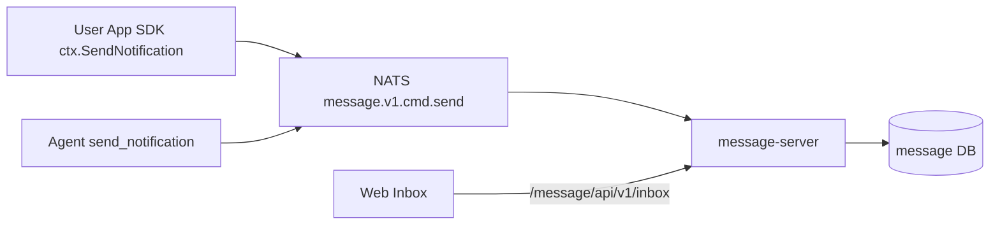

# Kageos 平台能力总览

本文描述当前代码里已经接回主线的平台横切能力，重点是工作台会话、消息/站内信和定时任务。它们不是某个业务应用私有实现，而是挂在 Service Tree 和平台运行时上的共享能力。

## 当前上线范围

本文只把已经接入主线的能力写成“当前能力”。下面这些词在其他路线文档里也会出现，但状态不同：

| 状态 | 能力 |
| --- | --- |
| 已上线 | Service Tree、权限/操作日志、AI 工作台会话、Form/Table/Chart/Docs、站内信、函数任务 `app.function`、Agent 任务 `agent.session`。 |
| 未上线/架构预留 | workflow 图、`workflow.run`、通用流程审批、讨论区、点赞/评论/评分、外部通知渠道、备份控制面。 |
| 建设中/商业路线 | Hub 目录市场、公共试用实例、企业私有 Hub、SSO/SLA 等托管 SaaS 增强能力。 |

## 能力版图

| 能力 | 归属服务 | 当前作用 |
| --- | --- | --- |
| Service Tree | `app-server` | 组织工作空间、目录、函数、文档和能力包，是权限、操作日志、消息定位、定时任务定位的共同资源坐标。 |
| 工作台会话 | `agent-server` | 持久化 AI 工作台 session/message，支持 SSE 对话、工具调用、阶段交接、运行中/已结束任务查询和取消。 |
| 消息/站内信 | `message-server` | 消费消息命令，落库收件箱、线程、已读状态、节点统计和工作空间统计。 |
| 定时任务 | `timer-scheduler` | 统一保存调度状态、执行记录、租约、超时恢复和 outbox 投递。 |
| 应用运行时 | `app-server` + `app-runtime` + `kageos-sdk/agent-app` | 调用 Form/Table/Chart/Callback，启动用户 App 版本容器，并把操作日志、trace、source 信息带回平台。 |

## 工作台会话

`agent-server` 负责工作台会话生命周期。前端通过 `/agent/api/v1/workspace/chat/stream` 发起 SSE 对话，服务端保存 session 和 message，并在同一会话里执行工具调用、写 PRD、写代码、构建、运行函数和处理 pending interaction。

主要入口：

- `GET /agent/api/v1/workspace/sessions`：按 `full_code_path` 查询历史会话。
- `GET /agent/api/v1/workspace/messages`：查询指定 session 的消息。
- `GET /agent/api/v1/workspace/sessions/running`：查询执行中的会话。
- `GET /agent/api/v1/workspace/sessions/finished`：查询最近结束的会话。
- `POST /agent/api/v1/workspace/sessions/handoff`：创建阶段交接会话。
- `POST /agent/api/v1/workspace/chat/cancel`：取消正在运行的会话。

Agent 任务也是工作台会话的一种执行形态。`timer-scheduler` 到点后投递 `executor_key=agent.session`，`agent-server` worker 创建无人值守工作台会话，并把任务 `message` 当作执行说明交给 Agent。Agent 任务运行时用户不在线，所以执行说明必须写清执行步骤、可用工具、风险边界、失败处理和通知规则。

## 消息和站内信

消息能力由 `message-server` 统一承载。业务应用通过 SDK 的 `ctx.SendNotification` 发布异步通知命令，Agent 工具通过 `send_notification` 发布通知命令，最终都进入 NATS subject `message.v1.cmd.send`。

当前站内信支持：

- inbox 列表、线程列表、单条消息详情、未读数、全部已读和单条已读。
- 按来源节点统计 `source_counts`，用于 Service Tree 上显示未读或历史消息标识。
- 按工作空间统计 `workspace_counts`，用于站内信抽屉顶部显示有消息的工作空间并支持切换。
- `source_path`、`source_parent_path`、`full_code_path`、`workspace_session_id`、`scheduled_task_id`、`scheduled_execution_id` 等来源信息，支撑跳转、归档和排障。

主要入口：

- `GET /message/api/v1/inbox`
- `GET /message/api/v1/inbox/threads`
- `GET /message/api/v1/inbox/source_counts`
- `GET /message/api/v1/inbox/workspace_counts`
- `GET /message/api/v1/inbox/unread_count`
- `PATCH /message/api/v1/inbox/:id/read`
- `PATCH /message/api/v1/inbox/read_all`

当前 MVP 只保证站内信落库和展示；邮件、飞书、企业微信等外部渠道应该作为后续 channel provider 扩展，不应写进业务应用。

## 定时任务

定时能力由 `timer-scheduler` 统一承载。它是唯一调度状态源，保存 `timer_task`、`timer_execution`、租约、执行次数、下次执行时间、超时恢复和 outbox。业务服务只负责执行，不计算调度状态。

当前 executor：

- `app.function`：到点后由 `app-server` 调用已确认的 Form/Table/Chart。适合固定函数路径和固定 body，例如每天提交表单、每小时扫描表格、每周查询图表。
- `agent.session`：到点后由 `agent-server` 启动无人值守工作台会话。适合巡检、分析、总结、跨目录/跨工作空间组合工具和需要判断的长期任务。
- `workflow.run`：未上线，仅作为后续 workflow 图能力的架构预留；当前没有主线 worker 或用户入口。

主要入口：

- `POST /timer/api/v1/tasks`
- `GET /timer/api/v1/tasks`
- `PUT /timer/api/v1/tasks/:id`
- `POST /timer/api/v1/tasks/:id/pause`
- `POST /timer/api/v1/tasks/:id/resume`
- `POST /timer/api/v1/tasks/:id/cancel`
- `POST /timer/api/v1/tasks/:id/run_now`
- `GET /timer/api/v1/tasks/:id/executions`

生成应用里的默认定时任务可以通过 `FormTemplate.Schedules` 声明，发布后由平台幂等同步到 `timer-scheduler`。普通业务代码不要自造 cron、调度表或后台 goroutine。

## 开发边界

- 业务应用发通知时使用 `ctx.SendNotification`，不要直接写 `message-server` 的表，也不要绑定具体外部渠道。
- `to_users` 推荐显式填写；通知当前请求用户时可省略，由 message-service 兜底到真实请求用户。没有真实请求用户时必须显式填写。
- `message`/`Message` 和 `files`/`Files` 至少填写一个；附件使用平台文件引用 `bucket/object_key`，多个用逗号分隔。
- Agent 后台任务发通知时使用 `send_notification`。Agent 任务和后台上下文优先显式写 `to_users`；通知创建人/当前用户时可依赖默认通知对象。
- 业务应用需要默认定时执行时使用 `FormTemplate.Schedules`；临时或运营型自动化由自动执行配置创建 `timer-scheduler` 任务。
- Service Tree 路径、`full_code_path`、`source_path`、trace 和操作日志是平台排障与跳转的共同索引，新增能力时应完整传递，不要在前端用临时 URL 状态替代持久来源信息。
- 权限是当前平台能力；审批、评论、收藏、外部通知渠道和备份控制面目前未上线，不应由单个业务 App 自造通用版本。
