# KageOS 定时能力架构设计

> 当前主线已上线 `agent.session` 定时会话和 `app.function` 定时函数。`workflow.run`、`workflow-server` 和 `/workflow/api/v1/scheduled_workflows` 只表示未来预留设计，当前未上线、没有主线用户入口。

## 目标

定时能力要作为 KageOS 的平台横切层，而不是 app-server 里的一个 cron 插件。它应该让目录树上的能力都能被时间触发：

- `agent.session`：在未来某个时间主动发起一轮工作台会话。
- `app.function`：定时执行 Form、Table、Chart 等标准函数。
- `workflow.run`：未上线，未来用于定时触发稳定的 workflow 图。

第一版目标是恢复并重做历史能力里的正确部分：独立调度器、执行器模型、执行记录、取消、一次性和周期性调度。第一版也要明确吸取旧实现的教训，避免 scheduler、app-server、agent-server 各自维护一份运行状态。

## 历史实现结论

历史分支 `origin/codex/workflow-mvp` 已经实现过一套较完整的能力：

- 通用调度器：`core/timer-scheduler`
- SDK：`pkg/scheduledsdk`
- app 执行器：`executor_key = app.function`
- agent 执行器：`executor_key = agent.session`
- app 业务表：`scheduled_task`、`scheduled_task_execution`
- agent 业务表：`scheduled_agent_task`、`scheduled_agent_execution`
- Agent 工具：`create_scheduled_task`、`create_scheduled_agent_task`、列表、取消、执行记录查询

旧实现方向是对的，但有一个核心问题：**状态双写**。`timer_task/timer_execution` 和业务侧的 `scheduled_task/scheduled_task_execution`、`scheduled_agent_task/scheduled_agent_execution` 都在记录状态、次数和下次执行时间，容易出现一边成功一边失败的漂移。

新实现要保留独立 scheduler 和 executor 模型，调整状态归属。

## 设计原则

1. `timer-scheduler` 是唯一调度状态源。
   `next_run_at`、`run_count`、任务状态、执行状态、租约、超时恢复都归 scheduler。

2. executor 只负责执行。
   `app-server` 不计算下一次执行时间，`agent-server` 也不计算。它们只把一次执行结果回报给 scheduler。

3. `executor_payload` 是业务和 executor 的私有协议。
   业务可以 inline 传小参数，也可以传 `binding_id/business_ref`，还可以传外部引用；scheduler 不解析、不校验业务字段、不负责改业务配置。

4. scheduler 只做通用调度和投递约束。
   它可以限制 JSON 合法性、payload 大小、幂等键、鉴权元信息和投递状态，但不判断 payload 里的业务参数是否合适。

5. 创建、取消、执行必须可幂等。
   网络失败、重复点击、NATS 重投递都不能导致重复任务或重复副作用。

6. 执行身份要明确。
   定时任务不是匿名系统任务，而是由用户授权的 delegated run。执行时需要重新校验权限。

7. 先接价值最高且耦合较小的链路。
   当前主线已接 `agent.session` 和 `app.function`；`workflow.run` 是后续阶段，未上线。

## 总体架构

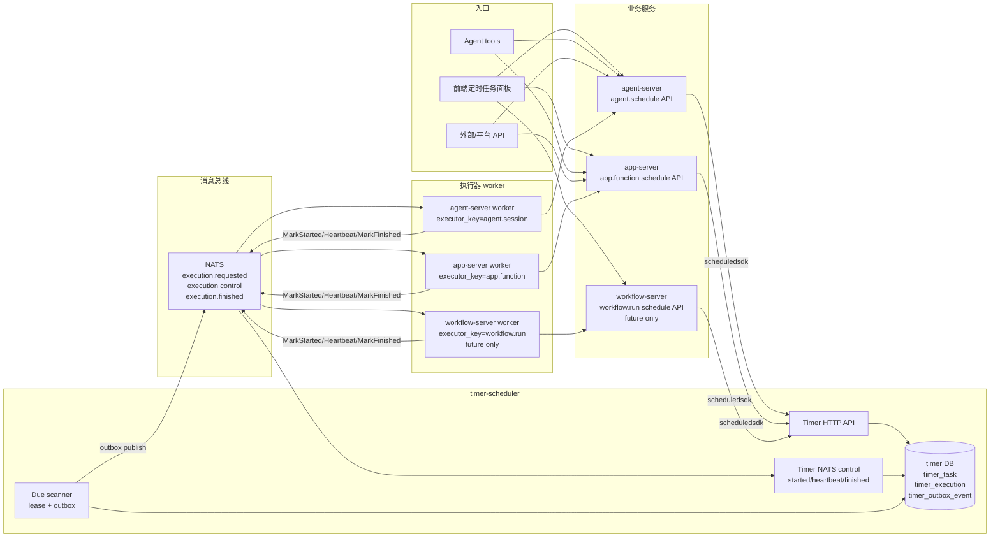

## 组件依赖关系

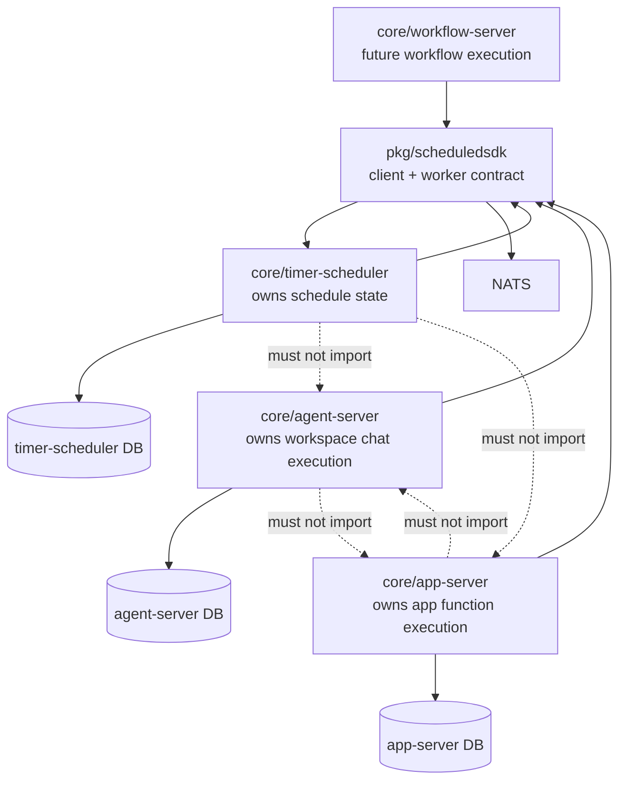

依赖边界：

| 模块 | 可以知道 | 不应该知道 |
| --- | --- | --- |
| `timer-scheduler` | 时间规则、执行器 key、opaque `executor_payload`、执行状态 | app 函数 schema、工作台 session、workflow 节点 |
| `agent-server` | 定时会话配置、WorkspaceChatService、执行摘要 | scheduler 的 next_run_at 计算细节 |
| `app-server` | 函数路径、schema、权限、RequestApp、操作日志 | scheduler 内部租约和 due scan 细节 |
| `workflow-server` | 未上线；未来负责 workflow 定义、输入映射、运行记录 | app/agent 的内部执行细节 |
| `scheduledsdk` | HTTP 控制面 client、NATS worker/状态回写协议、事件结构 | 任何业务模型 |

## 数据归属

新设计把 scheduler 状态和业务执行数据拆开。下面的业务配置表只是某类 executor 选择 binding 模式时的可选实现，不是 scheduler 的协议要求。

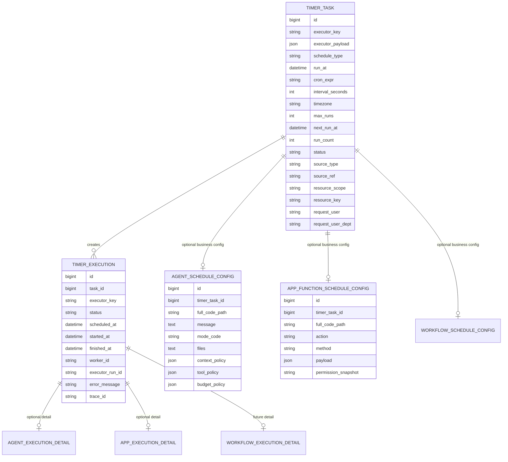

状态和业务数据归属规则：

| 数据 | 归属 | 说明 |
| --- | --- | --- |
| `next_run_at` | `timer_task` | 业务侧只读展示，不重复计算 |
| `run_count` | `timer_task` | 包含自动触发；是否包含 run_now 需明确 |
| 任务状态 | `timer_task` | `pending/paused/done/failed/cancelled` |
| 执行状态 | `timer_execution` | `queued/running/success/failed/timeout/cancelled` |
| `executor_payload` schema | executor 所属业务服务 | scheduler 只持久化和透传，字段语义由 executor 定义 |
| agent 目标 | `agent.session` executor | 可 inline，也可落 `agent_schedule_config` 后在 payload 里传引用 |
| app 函数入参 | `app.function` executor | 可 inline，也可落 `app_function_schedule_config` 后在 payload 里传引用 |
| session_id | 工作台会话业务表 + `timer_execution.executor_run_id` | timer 只保存业务运行 ID；会话消息、工具调用和操作日志走 agent-server 业务库 |
| app trace/request/response | app 业务表/操作日志 + `timer_execution.executor_run_id` | timer 只保存摘要和业务运行 ID；请求响应详情归业务服务 |

不建议继续让 `scheduled_agent_task` 和 `scheduled_task` 自己保存 `status/run_count/next_run_at`。如果前端需要列表聚合，可以通过查询 scheduler 或做只读缓存，但缓存不能参与执行判断。

## Payload 边界

`timer_task.executor_payload` 对 scheduler 是 opaque JSON。scheduler 不知道它是 binding、业务参数快照，还是外部引用；真正的 schema 由 `executor_key` 对应的 consumer 定义和维护。

| payload 形态 | 示例 | 谁决定 | 适合场景 |
| --- | --- | --- | --- |
| inline 参数 | `{"full_code_path":"...","action":"submit","payload":{...}}` | 业务 executor | 参数较小、希望创建后固定快照 |
| binding 引用 | `{"binding_type":"agent_schedule_config","binding_id":123}` | 业务 executor | 参数较大、敏感、需要业务侧独立管理 |
| 外部引用 | `{"ref_type":"artifact","ref_id":"..."}` | 业务 executor | 输入来自文件、对象存储、第三方系统 |

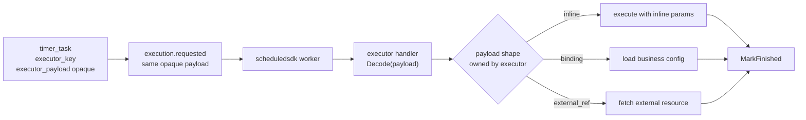

scheduler 可以做的校验只限通用层：payload 必须是合法 JSON、大小不超过平台限制、事件包含 `execution_id/task_id/executor_key/trace_id` 等投递元信息。它不判断 `message`、`full_code_path`、`action`、`payload` 是否合理，这些都由对应业务服务负责。

## 任务类型和资源隔离

后续接入更多任务类型时，scheduler 不新增业务判断分支，而是按通用维度隔离：

| 维度 | 字段/协议 | 说明 |
| --- | --- | --- |
| 任务类型 | `executor_key` | 当前主线为 `agent.session`、`app.function`；`workflow.run` 是未上线预留。这是 worker 路由和消费组隔离的主键 |
| 业务来源 | `source_type/source_ref` | 由创建方填写，用于列表聚合、审计、幂等 reconcile；scheduler 不解析业务含义 |
| 资源范围 | `resource_scope/resource_key` | 可选通用标签，例如 workspace、目录节点、租户、用户；用于限流、查询过滤、配额 |
| 消费隔离 | NATS subject/queue group | 按 `executor_key` 分 subject 或 metadata route，不同 executor 不抢同一类任务 |
| 配额隔离 | `executor_key + resource_scope + request_user` | 防止单个用户、目录节点或任务类型压垮系统 |

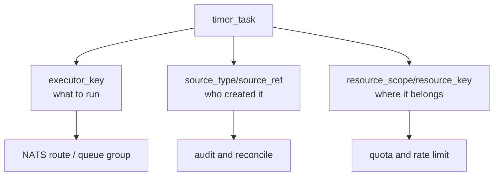

## 创建链路

### 定时会话创建

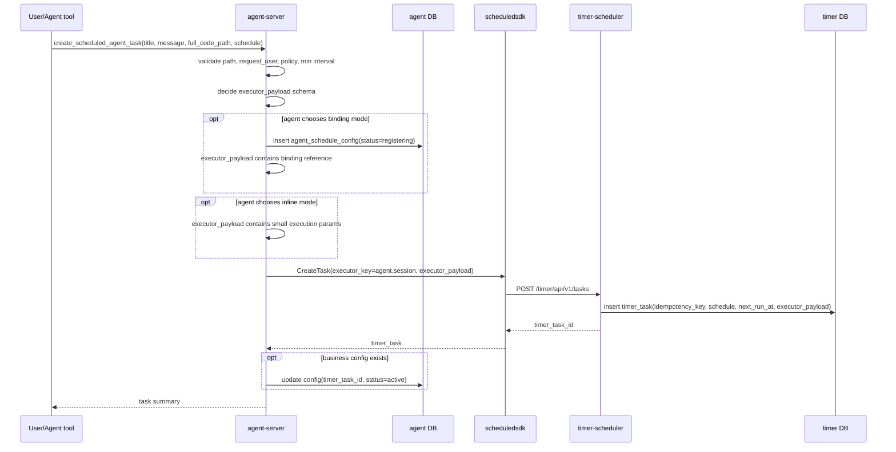

### 普通函数定时任务创建

当前前端 MVP 有两个入口：

1. **就地创建**：普通 Form 的「提交」旁、Table 新增弹窗的「确定」旁、Table 编辑抽屉的「保存」旁展示定时按钮。按钮所在组件负责复用当前表单校验，并把当前表单值构造成 `executor_payload.payload`。
2. **集中管理**：函数详情页的「定时函数」Tab 只负责查询、创建通用任务、暂停、恢复、取消、立即执行和查看执行记录。

就地创建链路如下：

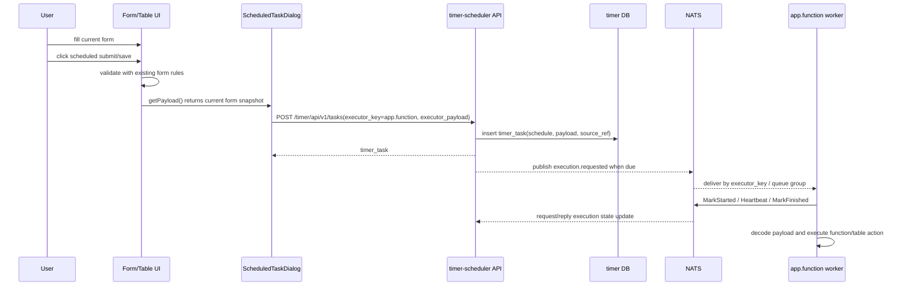

这个入口不要求 scheduler 理解表单字段，也不要求 app-server 参与调度状态。后续如果要把权限预校验、幂等 key 或业务配置落库放到 app-server，也可以保留同一个 `executor_payload` 契约，由业务 API 调用 `scheduledsdk` 创建 timer task。

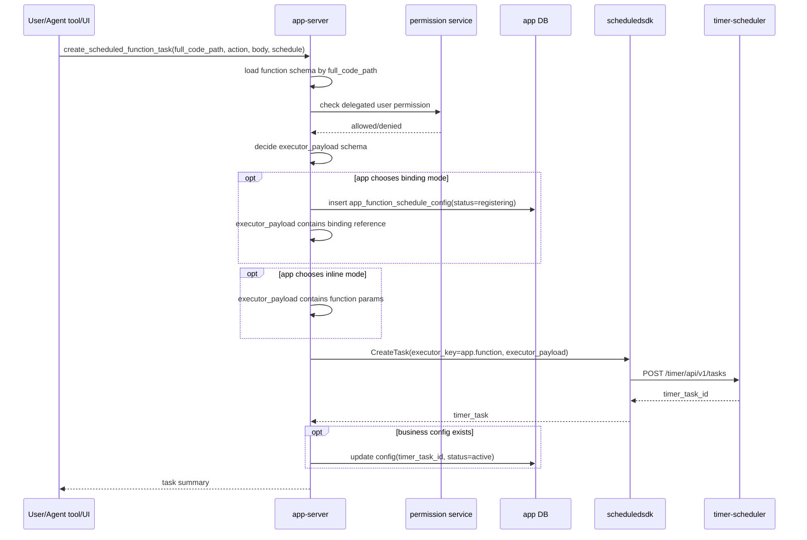

创建链路必须支持失败可恢复：

| 失败点 | 处理 |
| --- | --- |
| 业务侧 payload/config 准备失败 | 直接返回失败，不创建 timer task |
| Timer 创建失败 | 如果已写业务配置，配置保留 `register_failed` 或回滚，不能假装成功 |
| Timer 创建成功但回填失败 | 用 `idempotency_key/source_ref` 定期 reconcile |
| 用户重复提交 | 通过 `idempotency_key` 返回同一个 task 或明确报冲突 |

## 执行链路

### 通用调度派发

```mermaid
sequenceDiagram
  participant Loop as timer-scheduler loop
  participant TimerDB as timer DB
  participant Outbox as timer_outbox_event
  participant NATS as NATS
  participant Worker as executor worker
  participant TimerNATS as timer NATS control

  Loop->>TimerDB: find due timer_task where status=pending and no inflight
  Loop->>TimerDB: acquire dispatch lease
  Loop->>TimerDB: create timer_execution(status=queued)
  Loop->>Outbox: insert execution_requested event
  Loop->>NATS: publish pending outbox
  NATS-->>Worker: execution_requested(execution_id, executor_key, executor_payload)
  Worker->>NATS: MarkExecutionStarted request
  NATS->>TimerNATS: execution.started
  TimerNATS->>TimerDB: execution queued -> running, set lease
  Worker->>Worker: SDK routes to executor handler
  Worker->>Worker: handler decodes opaque payload by executor-owned schema
  Worker->>Worker: execute domain-specific handler
  Worker->>NATS: Heartbeat while running
  NATS->>TimerNATS: execution.heartbeat
  TimerNATS->>TimerDB: extend execution lease
  Worker->>NATS: MarkExecutionFinished(result)
  NATS->>TimerNATS: execution.finished
  TimerNATS->>TimerDB: finish execution, clear inflight, compute next_run_at
  TimerNATS->>Outbox: insert execution_finished event
```

默认恢复窗口：`queued` 执行 120 秒内未被 worker 标记 started 会重投，超过最大重投次数后记为 timeout；`running` 执行依赖 30 秒 SDK 心跳续租，默认 execution lease 为 180 秒，服务重启或 worker 崩溃后会在 lease 过期后被恢复为 timeout 并释放任务 inflight。

### `agent.session` 执行

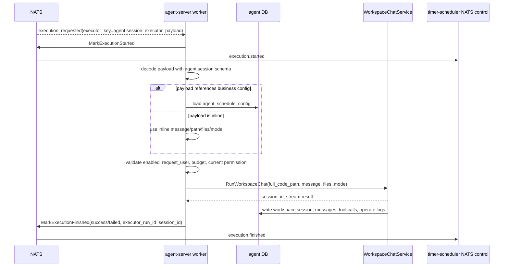

### `app.function` 执行

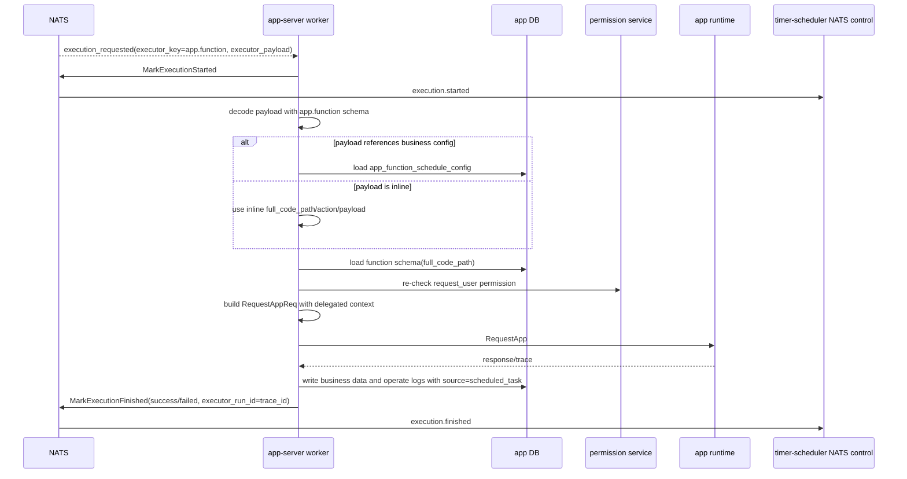

### Future `workflow.run` 执行（未上线）

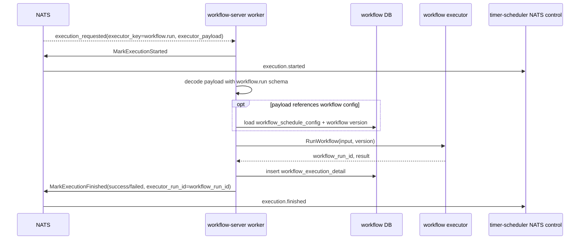

## SDK 消费约定

消费方建议通过 `pkg/scheduledsdk` 注册 worker，而不是每个业务服务自己手写 NATS 订阅和回报逻辑。SDK 是平台契约层，业务 handler 只关心自己能理解的 `executor_payload`。

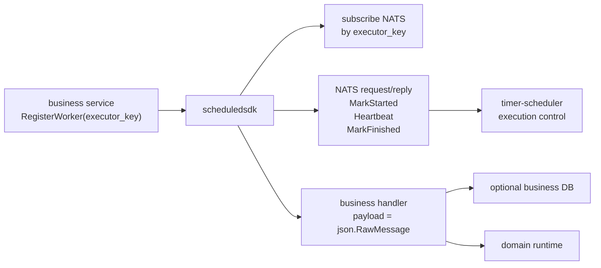

worker handler 的输入建议只包含通用执行上下文和 opaque payload：

| 字段 | 说明 |
| --- | --- |
| `task_id/execution_id` | scheduler 生成，用于幂等和回报 |
| `executor_key` | 当前 handler 注册的类型 |
| `executor_payload` | `json.RawMessage`，由 handler 自己 decode |
| `scheduled_at/trace_id` | 追踪和审计 |
| `source_type/source_ref/resource_scope/resource_key` | 通用查询、审计、限流标签 |
| `request_user/request_user_dept` | delegated run 身份上下文 |

SDK 负责 NATS queue group、重投递幂等、`MarkStarted`、heartbeat、`MarkFinished` 和错误转换。状态回写默认通过 NATS request/reply 进入 timer-scheduler 的 execution control 订阅，worker 不需要知道 timer HTTP 地址。业务服务可以保留逃生口直接消费 NATS，但默认接入方式应该是 SDK，这样不同 executor 的行为一致，scheduler 也不用耦合任何业务服务。

## Agent 工作台接入

工作台里新增专门的 `automation_operator`（自动化操作员）角色，负责创建和管理定时函数、定时会话以及执行记录。它是 `app_operator` 的后续角色之一：应用操作员负责“现在执行一次”，自动化操作员负责“以后自动执行”。

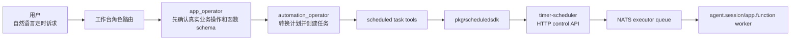

Agent 侧工具边界：

| 工具 | 用途 | 边界 |
| --- | --- | --- |
| `create_scheduled_function_task` | 创建 `executor_key=app.function` 的定时函数任务 | 只创建 timer 任务，不直接调用 `run_*`；创建前校验当前用户对 `full_code_path` 的 delegated 权限 |
| `create_scheduled_agent_task` | 创建 `executor_key=agent.session` 的定时会话任务 | 目标是工作台目录和自然语言 message，不修改代码、不 build |
| `list_scheduled_tasks` | 查询当前用户创建的任务 | 默认按当前 `execute_directory` 查询，可按 kind/status 过滤 |
| `manage_scheduled_task` | 暂停、恢复、取消、立即运行 | 只能管理当前用户创建或代执行的任务；可用 `resource_path` 二次校验归属 |
| `list_scheduled_task_executions` | 查询执行记录 | 先校验任务归属，再读执行记录 |

角色门禁要求自动化操作员不能直接调用 `run_table_*`、`run_form_submit`、`run_chart_query` 等业务执行工具。具体资源能否执行交给已有权限系统和对应业务工具判断，timer-scheduler 和工作台循环不再额外叠加目录门禁。这样 Agent 能帮用户创建自动化，但不会绕开现有应用操作、权限和审计边界。

## 状态机

### Task 状态

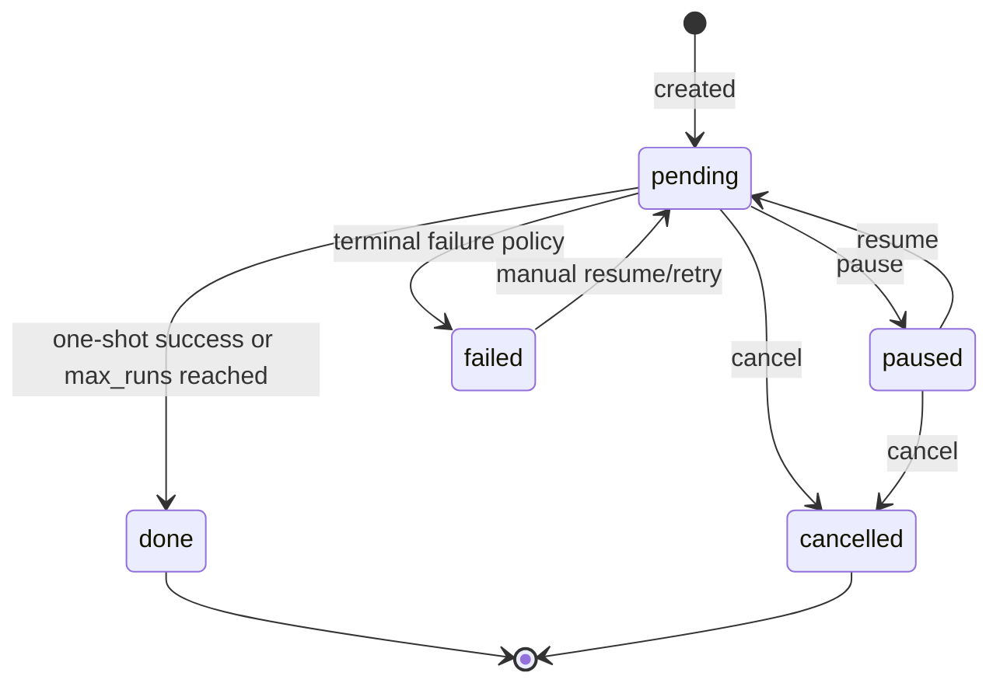

### Execution 状态

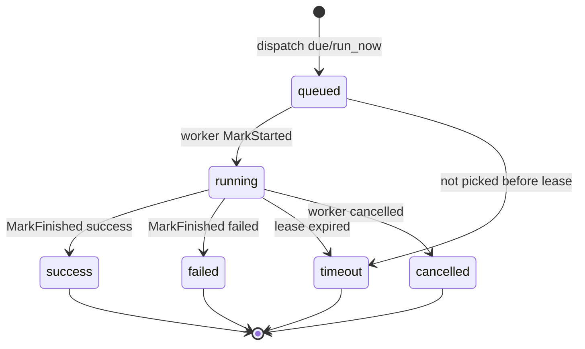

## 调度语义

| 类型 | 语义 | 注意 |
| --- | --- | --- |
| `atime` | 指定时间执行一次 | 成功后 `done`，失败后按策略 `failed` 或 retry |
| `cron` | cron 命中时触发 | 先支持 5 段 minute-level cron；时区必须明确 |
| `every` | 间隔秒触发 | 需要最小间隔限制，agent 建议不低于 60 秒 |
| `run_now` | 手动立即触发一次 | 是否计入 `run_count` 需要配置，默认建议计入 execution 但不影响 next_run_at |

并发策略第一版建议：同一个 `timer_task` 不允许并发。若上一次仍 running，下一次 due 可以按策略跳过并记录 `skipped`，或延迟到上一次结束后再算下一次。第一版建议跳过并记录，避免 Agent 会话堆积。

## 失败恢复

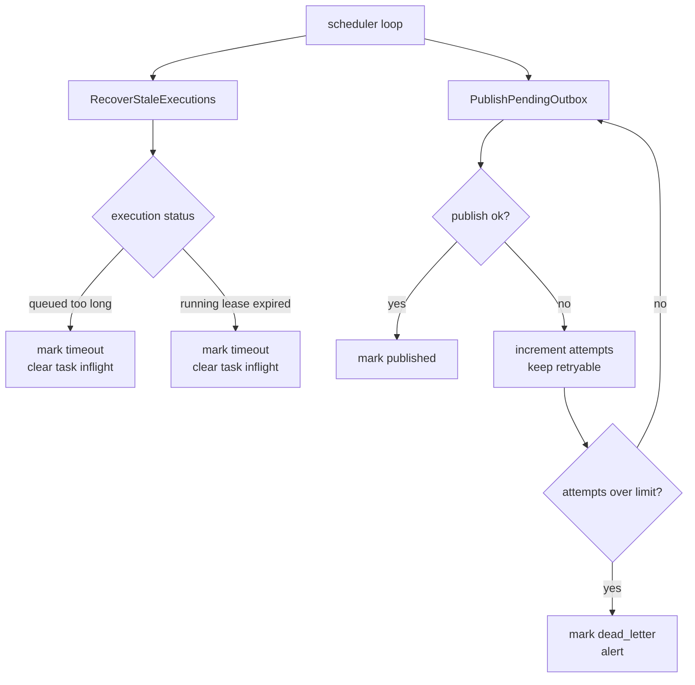

旧实现的问题是 publish 失败后会标 `failed`，主循环只取 `pending`，可能不会自动重试。新实现需要：

- outbox 状态：`pending/published/retry/dead_letter`
- retry backoff：例如 1s、5s、30s、5m
- dead letter 可在后台或 UI 中手动重放
- execution worker 需要 heartbeat 或足够保守的 lease

## 身份和权限

定时任务实际执行的是 delegated run。

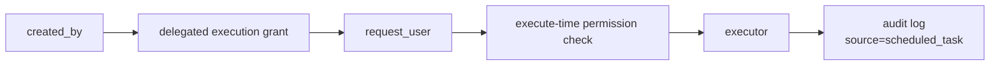

规则建议：

1. 创建时校验一次权限，避免创建无效任务。
2. 执行时重新校验权限，用户权限被收回后任务不能继续执行高风险动作。
3. `request_user` 默认等于创建人，除非有明确的代执行授权。
4. 所有执行上下文必须带 `client_source=scheduled_task`、`source_type=scheduled_task`、`source_ref=timer_task:<task_id>:execution:<execution_id>`、`trace_id`。
5. Table 写操作需要 idempotency key，避免 NATS 重投递造成重复新增。
6. 高风险动作未来应接审批策略，第一版先拒绝危险 action 或只允许白名单。

SDK Worker 在调用业务 handler 前会自动注入这组审计上下文；直接 HTTP 调用可以使用 `ExecutionRequestedEvent.ApplyAuditHeaders`。业务资源绑定仍然放在 `resource_scope/resource_key` 或 executor payload 中，不复用审计来源字段。

## API 草案

通用 scheduler API：

| 方法 | 路径 | 说明 |
| --- | --- | --- |
| `POST` | `/timer/api/v1/tasks` | 创建 timer task |
| `GET` | `/timer/api/v1/tasks` | 查询 task 列表 |
| `GET` | `/timer/api/v1/tasks/:id` | 查询 task |
| `PUT` | `/timer/api/v1/tasks/:id` | 更新调度配置 |
| `POST` | `/timer/api/v1/tasks/:id/pause` | 暂停 |
| `POST` | `/timer/api/v1/tasks/:id/resume` | 恢复 |
| `POST` | `/timer/api/v1/tasks/:id/cancel` | 取消 |
| `POST` | `/timer/api/v1/tasks/:id/run_now` | 立即执行 |
| `GET` | `/timer/api/v1/tasks/:id/executions` | 执行记录 |
| `POST` | `/timer/api/v1/executions/started` | 兼容/调试用：worker 标记开始 |
| `POST` | `/timer/api/v1/executions/heartbeat` | 兼容/调试用：worker 心跳 |
| `POST` | `/timer/api/v1/executions/finished` | 兼容/调试用：worker 标记结束 |

SDK worker 默认使用下面的 NATS request/reply subjects 回写执行状态：

| Subject | 说明 |
| --- | --- |
| `timer.v1.cmd.execution.started` | 标记 execution 已被 worker 捡起并开始执行 |
| `timer.v1.cmd.execution.heartbeat` | 执行中心跳，延长 execution lease |
| `timer.v1.cmd.execution.finished` | 标记 execution 成功、失败或超时结束，并写入摘要 |

`POST /timer/api/v1/tasks` 的核心请求字段：

| 字段 | 归属 | 说明 |
| --- | --- | --- |
| `executor_key` | scheduler 协议 | worker 路由键，例如 `agent.session` |
| `executor_payload` | 业务 executor | opaque JSON，scheduler 原样保存和投递 |
| `schedule_type/run_at/cron_expr/interval_seconds/timezone` | scheduler 协议 | 计算 `next_run_at` |
| `idempotency_key` | 创建方 | 避免重复创建 |
| `source_type/source_ref` | 创建方 | 业务来源和 reconcile 标识 |
| `resource_scope/resource_key` | 创建方 | 可选资源隔离、查询、配额标签 |
| `request_user/request_user_dept` | 创建方 | delegated run 身份上下文 |

当前主线入口：

- `timer-scheduler`: `/timer/api/v1/tasks`、`/timer/api/v1/tasks/:id/*`、`/timer/api/v1/tasks/:id/executions`
- Agent tools：`create_scheduled_agent_task`、`create_scheduled_function_task`、`list_scheduled_tasks`、`manage_scheduled_task`、`list_scheduled_task_executions`

旧业务聚合 API 不属于当前主线，不要按这些路径开发：

- `agent-server`: `/agent/api/v1/scheduled_agent_tasks`
- `app-server`: `/workspace/api/v1/scheduled_functions`

未来预留 API，当前未上线：

- `workflow-server`: `/workflow/api/v1/scheduled_workflows`

当前 Agent 工具：

| 工具 | 作用 |
| --- | --- |
| `create_scheduled_agent_task` | 创建定时会话 |
| `create_scheduled_function_task` | 创建定时函数任务 |
| `list_scheduled_tasks` | 按 kind/status/path 查询定时任务 |
| `manage_scheduled_task` | pause/resume/cancel/delete/run_now |
| `list_scheduled_task_executions` | 查询任务执行记录 |

## 前端入口

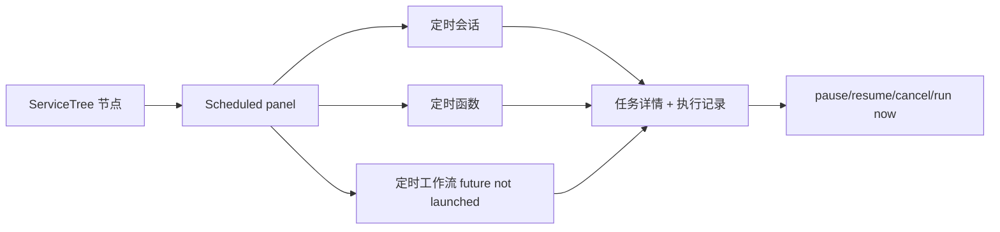

第一版前端可以先轻一点：

- ServiceTree 节点右侧面板展示该节点和子节点下的定时任务。
- MiniWorkstation/Agent 工具可创建定时会话。
- 详情页展示 scheduler task 状态和 execution 列表。
- 暂不做复杂可视化 cron 编辑器，先用表单字段。

## 实现阶段

### Phase 0: 设计和迁移准备

- 完成本设计文档。
- 对比旧实现文件，确认可复用代码。
- 定义新数据归属和迁移策略。

### Phase 1: 通用 timer-scheduler 骨架

- 恢复 `core/timer-scheduler`，但重做 outbox retry。
- 恢复 `pkg/scheduledsdk`，增加 heartbeat、idempotency key。
- 接入部署配置和健康检查。
- 不接业务 executor，先用测试 executor 验证 atime/cron/every。

### Phase 2: 定时会话 `agent.session`

- agent-server 定义 `agent.session` payload schema；如果选择 binding 模式，再新增 `agent_schedule_config`。
- 注册 `agent.session` worker。
- 接 `WorkspaceChatService.RunWorkspaceChat`。
- Agent 工具支持创建、查询、立即执行、取消。
- 前端先展示列表和执行记录。

### Phase 3: 定时函数 `app.function`

- app-server 定义 `app.function` payload schema；如果选择 binding 模式，再新增 `app_function_schedule_config`。
- 实现薄 executor：校验 schema、重新校验权限、构造 RequestApp。
- 支持 Form submit、Chart query、Table callback。
- 加操作日志和幂等 key。

### Phase 4: 定时 workflow `workflow.run`（未上线）

- workflow-server 实现运行 API 和 worker。
- payload schema 可以 inline workflow 输入，也可以引用 workflow version/config。
- workflow 稳定后可以由 scheduler 触发。

## 需要避免的旧坑

| 旧坑 | 新设计 |
| --- | --- |
| scheduler 和业务侧都算 `next_run_at` | 只由 scheduler 算 |
| outbox publish 失败后不自动重试 | retry/backoff/dead letter |
| 业务 execution 和 timer execution 双记录不清晰 | timer execution 是主记录，业务 detail 关联它 |
| scheduler 规定 payload 必须是 binding | `executor_payload` 对 scheduler opaque，业务自行选择 inline、binding 或外部引用 |
| executor 适配器太胖 | 拆薄为 decode/resolve payload、validate、execute、record detail |
| 执行身份容易模糊 | delegated run 模型，创建和执行都校验权限 |
| run_now 是否影响周期不清楚 | 第一版规定不改变原 `next_run_at`，但写 execution |
| NATS 重投递可能产生重复副作用 | execution_id/idempotency_key 传入业务执行 |
| 每秒 Agent 任务容易打爆系统 | 最小间隔、并发限制、预算策略 |

## 待定问题

1. `run_now` 是否计入 `run_count`？
   建议：计入 execution，不改变周期 `next_run_at`；`run_count` 可单独拆 `scheduled_run_count/manual_run_count`。

2. 失败后的周期任务是否继续？
   建议：cron/every 默认继续，但记录失败；连续失败超过阈值后暂停并通知。

3. `atime` 失败是否重试？
   建议：第一版不自动重试，后续通过 retry policy 开启。

4. 是否允许用户指定其他 `request_user`？
   建议：第一版不开放跨用户代执行，除非后续有明确授权模型。

5. 是否保留旧表名？
   建议：新表名表达 config/detail，避免继续暗示它们是状态源。

6. 是否先做 UI？
   建议：先 Agent 工具和 API，UI 跟随最小列表和详情。

## 第一版验收标准

- 能创建一个 `atime` 定时会话，到点自动产生 workspace session。
- 能查询 timer task 和 execution，看到 queued/running/success/failed。
- scheduler 重启后不会丢 due task。
- NATS 短暂失败后 outbox 能重试。
- 同一 task 不会并发执行。
- 用户取消任务后不再触发。
- 权限被收回后执行失败并记录原因。
- 所有业务执行都有 `trace_id`、`source=scheduled_task`、`source_ref=timer_task:<task_id>:execution:<execution_id>`。
