# KageOS 定时能力架构设计

## 目标

定时能力要作为 KageOS 的平台横切层，而不是 app-server 里的一个 cron 插件。它应该让目录树上的能力都能被时间触发：

- `agent.session`：在未来某个时间主动发起一轮工作台会话。
- `app.function`：定时执行 Form、Table、Chart 等标准函数。
- `workflow.run`：未来定时触发稳定的 workflow 图。

第一版目标是恢复并重做历史能力里的正确部分：独立调度器、执行器模型、执行记录、取消、一次性和周期性调度。第一版也要明确吸取旧实现的教训，避免 scheduler、app-server、agent-server 各自维护一份运行状态。

## 历史实现结论

历史分支 `origin/codex/workflow-mvp` 已经实现过一套较完整的能力：

- 通用调度器：`core/timer-scheduler`
- SDK：`pkg/scheduledsdk`
- app 执行器：`executor_key = app.function`
- agent 执行器：`executor_key = agent.session`
- app 业务表：`scheduled_task`、`scheduled_task_execution`
- agent 业务表：`scheduled_agent_task`、`scheduled_agent_execution`
- Agent 工具：`create_scheduled_task`、`create_scheduled_agent_task`、列表、取消、执行记录查询

旧实现方向是对的，但有一个核心问题：**状态双写**。`timer_task/timer_execution` 和业务侧的 `scheduled_task/scheduled_task_execution`、`scheduled_agent_task/scheduled_agent_execution` 都在记录状态、次数和下次执行时间，容易出现一边成功一边失败的漂移。

新实现要保留独立 scheduler 和 executor 模型，调整状态归属。

## 设计原则

1. `timer-scheduler` 是唯一调度状态源。
   `next_run_at`、`run_count`、任务状态、执行状态、租约、超时恢复都归 scheduler。

2. executor 只负责执行。
   `app-server` 不计算下一次执行时间，`agent-server` 也不计算。它们只把一次执行结果回报给 scheduler。

3. 业务侧只保存配置和业务摘要。
   比如 agent 的 `goal/mode/files`，app 的 `full_code_path/action/payload`，以及 execution 对应的 `session_id/trace_id/request/response`。

4. 调度事件只带引用，不塞大 payload。
   `timer_task.executor_payload` 只放 `binding_id` 或 `business_ref`，真实业务配置从对应服务读取。

5. 创建、取消、执行必须可幂等。
   网络失败、重复点击、NATS 重投递都不能导致重复任务或重复副作用。

6. 执行身份要明确。
   定时任务不是匿名系统任务，而是由用户授权的 delegated run。执行时需要重新校验权限。

7. 先接价值最高且耦合较小的链路。
   第一阶段优先 `agent.session`，第二阶段再接 `app.function`，第三阶段接 `workflow.run`。

## 总体架构

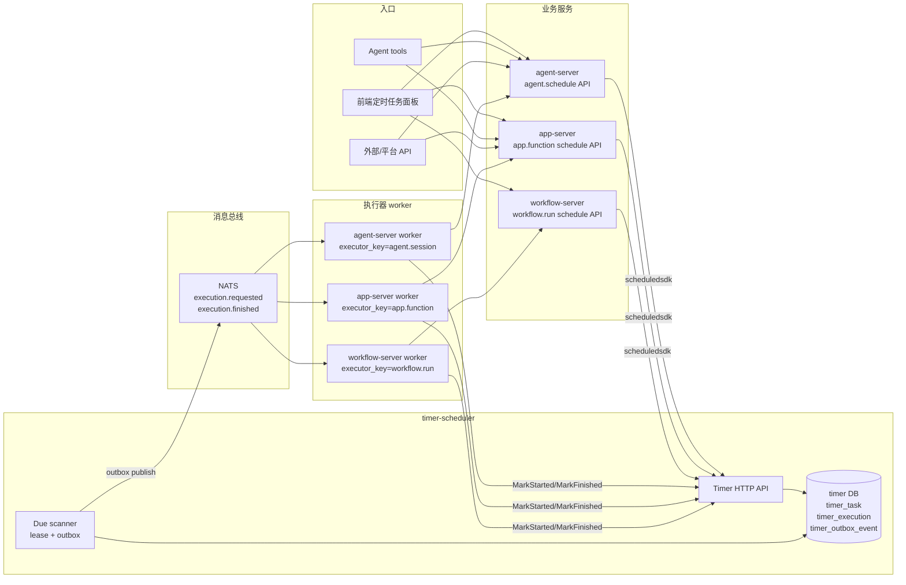

## 组件依赖关系

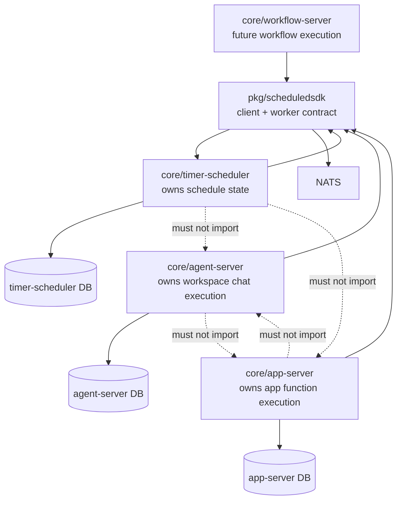

依赖边界：

| 模块 | 可以知道 | 不应该知道 |
| --- | --- | --- |
| `timer-scheduler` | 时间规则、执行器 key、payload 引用、执行状态 | app 函数 schema、工作台 session、workflow 节点 |
| `agent-server` | 定时会话配置、WorkspaceChatService、执行摘要 | scheduler 的 next_run_at 计算细节 |
| `app-server` | 函数路径、schema、权限、RequestApp、操作日志 | scheduler 内部租约和 due scan 细节 |
| `workflow-server` | workflow 定义、输入映射、运行记录 | app/agent 的内部执行细节 |
| `scheduledsdk` | HTTP API、NATS worker 协议、事件结构 | 任何业务模型 |

## 数据归属

新设计把 scheduler 状态和业务配置拆开。

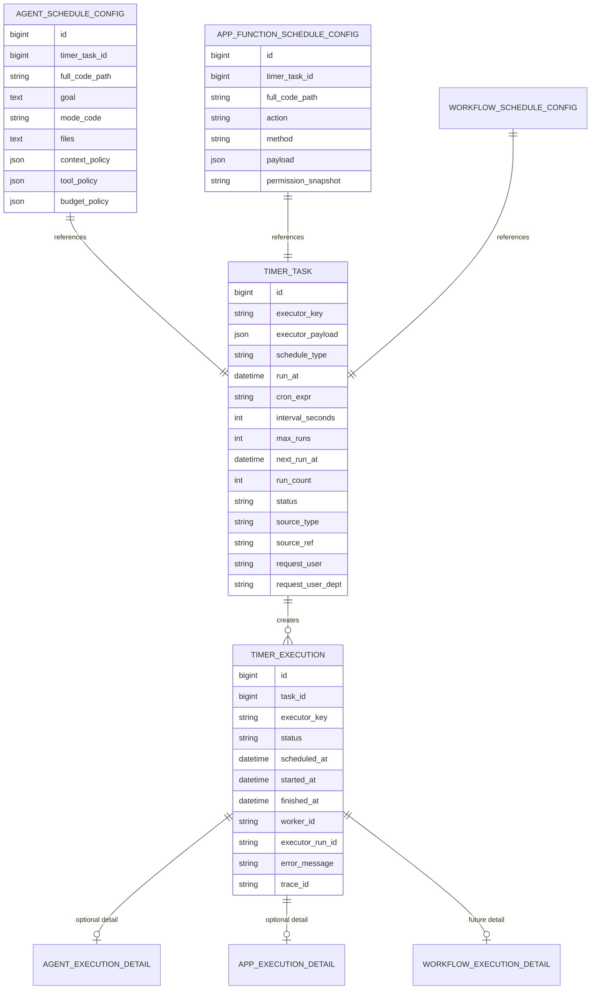

归属规则：

| 数据 | 唯一来源 | 说明 |
| --- | --- | --- |
| `next_run_at` | `timer_task` | 业务侧只读展示，不重复计算 |
| `run_count` | `timer_task` | 包含自动触发；是否包含 run_now 需明确 |
| 任务状态 | `timer_task` | `pending/paused/done/failed/cancelled` |
| 执行状态 | `timer_execution` | `queued/running/success/failed/timeout/cancelled` |
| agent 目标 | `agent_schedule_config` | `goal/mode/files/policies` |
| app 函数入参 | `app_function_schedule_config` | `payload/action/method` |
| session_id | `agent_execution_detail` | 以 `timer_execution_id` 关联 |
| app trace/request/response | `app_execution_detail` | 以 `timer_execution_id` 关联 |

不建议继续让 `scheduled_agent_task` 和 `scheduled_task` 自己保存 `status/run_count/next_run_at`。如果前端需要列表聚合，可以通过查询 scheduler 或做只读缓存，但缓存不能参与执行判断。

## 创建链路

### 定时会话创建

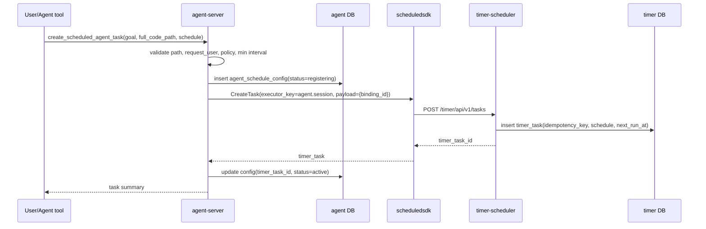

### 普通函数定时任务创建

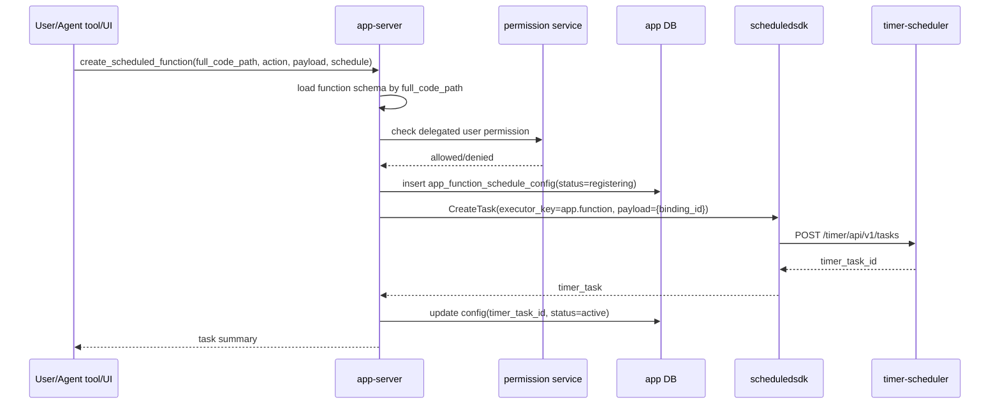

创建链路必须支持失败可恢复：

| 失败点 | 处理 |
| --- | --- |
| 业务配置写入失败 | 直接返回失败，不创建 timer task |
| Timer 创建失败 | 配置保留 `register_failed` 或回滚，不能假装成功 |
| Timer 创建成功但回填失败 | 用 `idempotency_key/source_ref` 定期 reconcile |
| 用户重复提交 | 通过 `idempotency_key` 返回同一个 task 或明确报冲突 |

## 执行链路

### 通用调度派发

```mermaid
sequenceDiagram
  participant Loop as timer-scheduler loop
  participant TimerDB as timer DB
  participant Outbox as timer_outbox_event
  participant NATS as NATS
  participant Worker as executor worker
  participant TimerAPI as timer API

  Loop->>TimerDB: find due timer_task where status=pending and no inflight
  Loop->>TimerDB: acquire dispatch lease
  Loop->>TimerDB: create timer_execution(status=queued)
  Loop->>Outbox: insert execution_requested event
  Loop->>NATS: publish pending outbox
  NATS-->>Worker: execution_requested
  Worker->>TimerAPI: MarkExecutionStarted
  TimerAPI->>TimerDB: execution queued -> running, set lease
  Worker->>Worker: execute domain-specific handler
  Worker->>TimerAPI: MarkExecutionFinished(result)
  TimerAPI->>TimerDB: finish execution, clear inflight, compute next_run_at
  TimerAPI->>Outbox: insert execution_finished event
```

### `agent.session` 执行

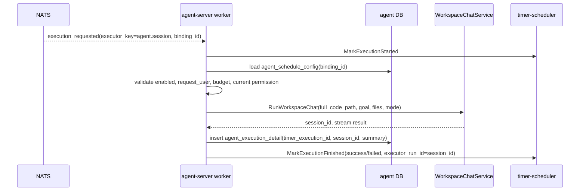

### `app.function` 执行

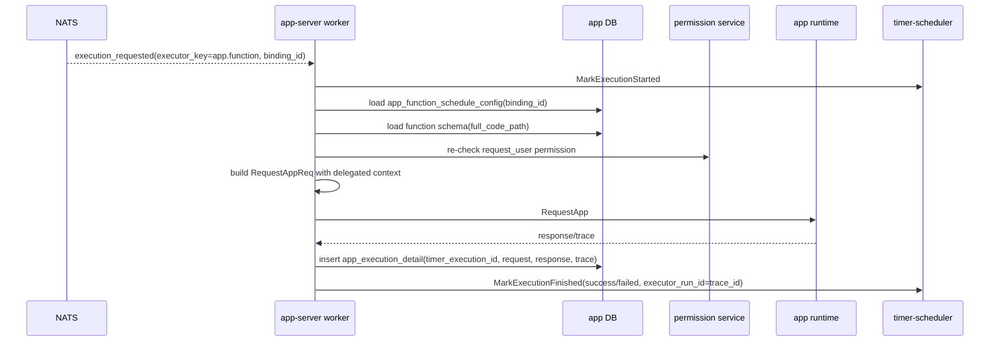

### Future `workflow.run` 执行

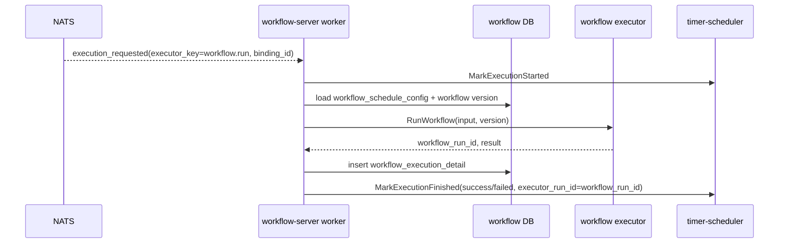

## 状态机

### Task 状态

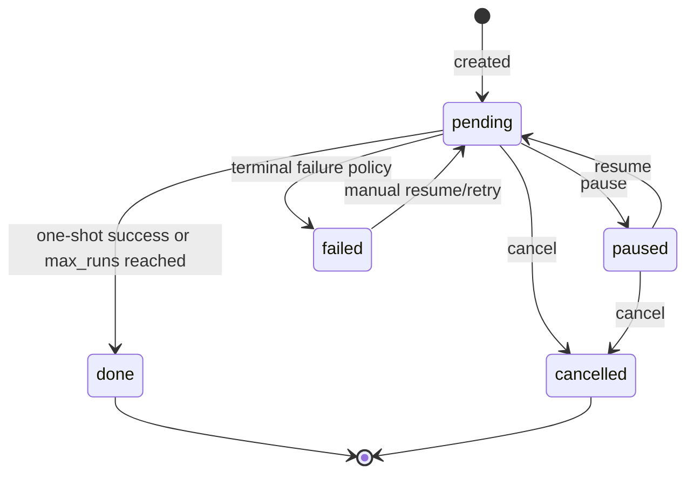

### Execution 状态

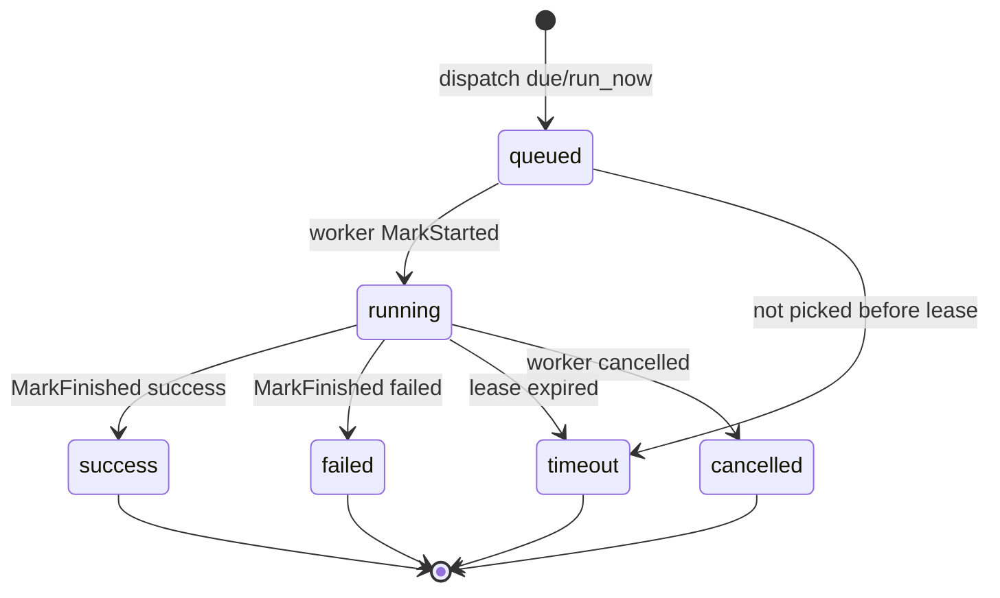

## 调度语义

| 类型 | 语义 | 注意 |
| --- | --- | --- |
| `atime` | 指定时间执行一次 | 成功后 `done`，失败后按策略 `failed` 或 retry |
| `cron` | cron 命中时触发 | 先支持 5 段 minute-level cron；时区必须明确 |
| `every` | 间隔秒触发 | 需要最小间隔限制，agent 建议不低于 60 秒 |
| `run_now` | 手动立即触发一次 | 是否计入 `run_count` 需要配置，默认建议计入 execution 但不影响 next_run_at |

并发策略第一版建议：同一个 `timer_task` 不允许并发。若上一次仍 running，下一次 due 可以按策略跳过并记录 `skipped`，或延迟到上一次结束后再算下一次。第一版建议跳过并记录，避免 Agent 会话堆积。

## 失败恢复

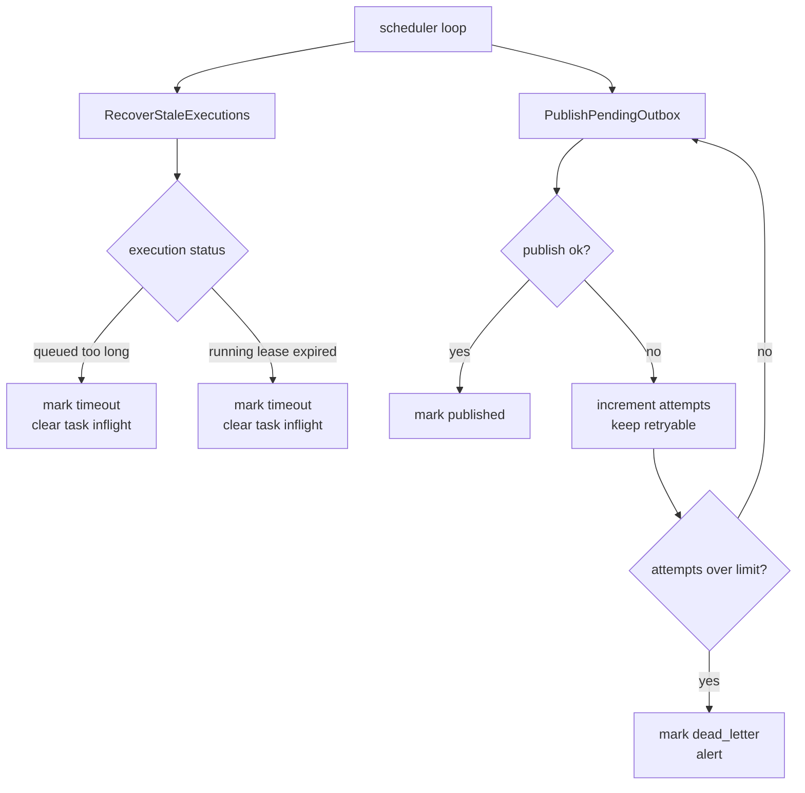

旧实现的问题是 publish 失败后会标 `failed`，主循环只取 `pending`，可能不会自动重试。新实现需要：

- outbox 状态：`pending/published/retry/dead_letter`
- retry backoff：例如 1s、5s、30s、5m
- dead letter 可在后台或 UI 中手动重放
- execution worker 需要 heartbeat 或足够保守的 lease

## 身份和权限

定时任务实际执行的是 delegated run。

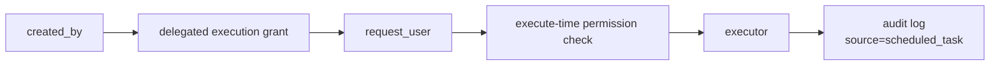

规则建议：

1. 创建时校验一次权限，避免创建无效任务。
2. 执行时重新校验权限，用户权限被收回后任务不能继续执行高风险动作。
3. `request_user` 默认等于创建人，除非有明确的代执行授权。
4. 所有执行上下文必须带 `client_source=scheduled_task`、`source_type`、`source_ref`、`trace_id`。
5. Table 写操作需要 idempotency key，避免 NATS 重投递造成重复新增。
6. 高风险动作未来应接审批策略，第一版先拒绝危险 action 或只允许白名单。

## API 草案

通用 scheduler API：

| 方法 | 路径 | 说明 |
| --- | --- | --- |
| `POST` | `/timer/api/v1/tasks` | 创建 timer task |
| `GET` | `/timer/api/v1/tasks` | 查询 task 列表 |
| `GET` | `/timer/api/v1/tasks/:id` | 查询 task |
| `PUT` | `/timer/api/v1/tasks/:id` | 更新调度配置 |
| `POST` | `/timer/api/v1/tasks/:id/pause` | 暂停 |
| `POST` | `/timer/api/v1/tasks/:id/resume` | 恢复 |
| `POST` | `/timer/api/v1/tasks/:id/cancel` | 取消 |
| `POST` | `/timer/api/v1/tasks/:id/run_now` | 立即执行 |
| `GET` | `/timer/api/v1/tasks/:id/executions` | 执行记录 |
| `POST` | `/timer/api/v1/executions/started` | worker 标记开始 |
| `POST` | `/timer/api/v1/executions/heartbeat` | worker 心跳 |
| `POST` | `/timer/api/v1/executions/finished` | worker 标记结束 |

业务 API 不直接暴露 timer 内部字段，返回聚合视图：

- `agent-server`: `/agent/api/v1/scheduled_agent_tasks`
- `app-server`: `/workspace/api/v1/scheduled_functions`
- `workflow-server`: `/workflow/api/v1/scheduled_workflows`

Agent 工具第一版：

| 工具 | 作用 |
| --- | --- |
| `create_scheduled_agent_task` | 创建定时会话 |
| `list_scheduled_agent_tasks` | 查询定时会话 |
| `run_scheduled_agent_task_now` | 立即跑一次定时会话 |
| `cancel_scheduled_agent_task` | 取消定时会话 |
| `create_scheduled_function_task` | 创建定时函数任务，第二阶段 |
| `list_scheduled_function_tasks` | 查询定时函数任务，第二阶段 |

## 前端入口

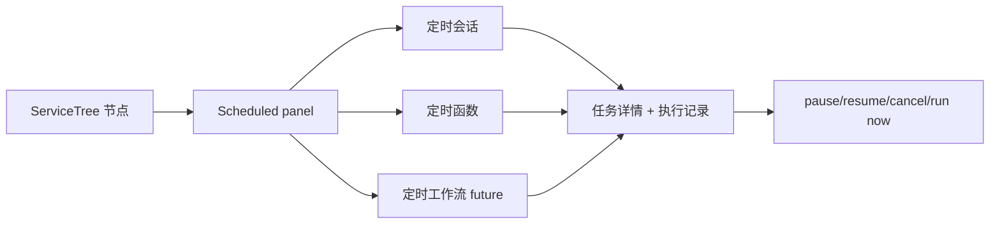

第一版前端可以先轻一点：

- ServiceTree 节点右侧面板展示该节点和子节点下的定时任务。
- MiniWorkstation/Agent 工具可创建定时会话。
- 详情页展示 scheduler task 状态和 execution 列表。
- 暂不做复杂可视化 cron 编辑器，先用表单字段。

## 实现阶段

### Phase 0: 设计和迁移准备

- 完成本设计文档。
- 对比旧实现文件，确认可复用代码。
- 定义新数据归属和迁移策略。

### Phase 1: 通用 timer-scheduler 骨架

- 恢复 `core/timer-scheduler`，但重做 outbox retry。
- 恢复 `pkg/scheduledsdk`，增加 heartbeat、idempotency key。
- 接入部署配置和健康检查。
- 不接业务 executor，先用测试 executor 验证 atime/cron/every。

### Phase 2: 定时会话 `agent.session`

- agent-server 新增 `agent_schedule_config`。
- 注册 `agent.session` worker。
- 接 `WorkspaceChatService.RunWorkspaceChat`。
- Agent 工具支持创建、查询、立即执行、取消。
- 前端先展示列表和执行记录。

### Phase 3: 定时函数 `app.function`

- app-server 新增 `app_function_schedule_config`。
- 实现薄 executor：校验 schema、重新校验权限、构造 RequestApp。
- 支持 Form submit、Chart query、Table callback。
- 加操作日志和幂等 key。

### Phase 4: 定时 workflow `workflow.run`

- workflow-server 实现运行 API 和 worker。
- schedule 配置引用 workflow version。
- workflow 稳定后可以由 scheduler 触发。

## 需要避免的旧坑

| 旧坑 | 新设计 |
| --- | --- |
| scheduler 和业务侧都算 `next_run_at` | 只由 scheduler 算 |
| outbox publish 失败后不自动重试 | retry/backoff/dead letter |
| 业务 execution 和 timer execution 双记录不清晰 | timer execution 是主记录，业务 detail 关联它 |
| executor 适配器太胖 | 拆薄为 load config、validate、execute、record detail |
| 执行身份容易模糊 | delegated run 模型，创建和执行都校验权限 |
| run_now 是否影响周期不清楚 | 第一版规定不改变原 `next_run_at`，但写 execution |
| NATS 重投递可能产生重复副作用 | execution_id/idempotency_key 传入业务执行 |
| 每秒 Agent 任务容易打爆系统 | 最小间隔、并发限制、预算策略 |

## 待定问题

1. `run_now` 是否计入 `run_count`？
   建议：计入 execution，不改变周期 `next_run_at`；`run_count` 可单独拆 `scheduled_run_count/manual_run_count`。

2. 失败后的周期任务是否继续？
   建议：cron/every 默认继续，但记录失败；连续失败超过阈值后暂停并通知。

3. `atime` 失败是否重试？
   建议：第一版不自动重试，后续通过 retry policy 开启。

4. 是否允许用户指定其他 `request_user`？
   建议：第一版不开放跨用户代执行，除非后续有明确授权模型。

5. 是否保留旧表名？
   建议：新表名表达 config/detail，避免继续暗示它们是状态源。

6. 是否先做 UI？
   建议：先 Agent 工具和 API，UI 跟随最小列表和详情。

## 第一版验收标准

- 能创建一个 `atime` 定时会话，到点自动产生 workspace session。
- 能查询 timer task 和 execution，看到 queued/running/success/failed。
- scheduler 重启后不会丢 due task。
- NATS 短暂失败后 outbox 能重试。
- 同一 task 不会并发执行。
- 用户取消任务后不再触发。
- 权限被收回后执行失败并记录原因。
- 所有执行都有 trace/source/client_source。
