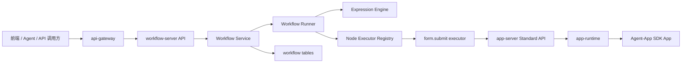

# Workflow MVP 设计与实施计划

> 日期：2026-05-11
> 分支：`codex/workflow-mvp`
> 状态：设计稿，用于指导 `workflow-server` 第一阶段实现。

## 1. 结论

我们应该新增独立的 `workflow-server`，它的定位是**标准能力编排服务**，第一阶段只做多个 `Form` 的串联执行：

```text
工作流输入 -> Form A -> 取 A 输出 -> Form B -> 取 B 输出 -> Form C -> 工作流输出
```

它和现有规划中的 `flow-server` 不是同一个东西：

| 服务 | 核心问题 | 第一阶段职责 |
| --- | --- | --- |
| `workflow-server` | 多个能力如何串起来自动执行 | Form 链式编排、输入输出映射、运行记录 |
| `flow-server` | 高风险动作是否需要先审批 | 审批策略、审批实例、审批通过后再执行 |

对 AI-Agent-OS 来说，workflow 有明确价值。单个小工具更像能力零件，独立开发者很难只靠一个小工具持续卖钱；workflow 可以把多个 Form/Table/Agent 能力组合成一个业务解决方案，更适合在 Hub 里售卖模板、行业包和自动化方案。

## 2. 产品定位

不要把第一版做成通用 n8n 克隆，也不要一开始做完整 BPM。

更适合当前项目的定位是：

> 基于 ServiceTree、Form、Table、Chart、Agent Tool 的轻量业务自动化编排层。

它的优势不是连接几百个外部 SaaS，而是：

- 能直接复用平台已生成的 Form/Table/Chart。
- 能把 Agent 生成的小能力包装成可复用流程。
- 能把流程作为 Hub 资产发布、复制、二次改造。
- 能天然沉淀运行记录、输入输出、文件引用、权限和审计。
- 后续能和 `timer-scheduler`、`flow-server`、Hub、企业权限组合。

## 3. MVP 范围

第一阶段只做一条最小但可销售、可演示、可扩展的链路。

### 3.1 必做

- 新增 `core/workflow-server` 服务。
- 支持手动触发 workflow。
- 支持顺序执行，实际定义仍使用 graph 模型。
- 节点类型只支持 `form.submit`。
- 支持从工作流输入、固定值、上一步输出映射到下一步输入。
- 支持文件字段引用透传。
- 持久化 workflow 定义、定义版本、运行实例、步骤运行实例。
- 失败即停止，并记录失败节点、输入、错误信息。
- 提供运行详情 API，前端能看到每一步的输入、输出、耗时、错误。

### 3.2 暂不做

- 视觉画布。
- 并行分支。
- 条件节点。
- 循环节点。
- 子工作流。
- 人工审批节点。
- 外部 HTTP 节点。
- 定时触发。
- 长时间等待和恢复。

这些能力不能在 MVP 里实现，但定义模型必须给它们留位置。

## 4. 核心设计原则

### 4.1 Graph Definition

工作流定义必须使用 `nodes + edges`，不要把核心模型写死成线性 `steps`。

MVP 可以只允许一条链：

```text
A -> B -> C
```

但存储模型仍然应该是：

```json
{
  "nodes": [],
  "edges": []
}
```

好处：

- 后续可以自然支持分支、并行、合并、子图和画布。
- 可以做拓扑校验、环检测、孤立节点检测。
- 可以把运行记录精确绑定到节点 ID。
- 可以让 AI 生成结构化图定义，而不是生成一段不可控脚本。

依据：

- n8n 这类自动化产品以节点和连接表达流程。
- Airflow、Argo 这类编排系统以 DAG 表达任务依赖。
- BPMN/Camunda 以节点、网关、事件、连线表达业务流程。

### 4.2 Expression Engine

输入映射必须独立成表达式引擎，不要在 runner 里做字符串替换。

MVP 表达式只支持：

```json
{ "$const": "固定值" }
{ "$ref": "input.file" }
{ "$ref": "steps.extract.output.text" }
```

后续再扩展：

```json
{ "$fn": "concat", "args": [{ "$ref": "input.title" }, { "$const": " - " }, { "$ref": "steps.a.output.summary" }] }
{ "$fn": "eq", "args": [{ "$ref": "steps.a.output.status" }, { "$const": "ok" }] }
{ "$fn": "jsonPath", "args": [{ "$ref": "steps.a.output.raw" }, { "$const": "$.items[0].name" }] }
```

好处：

- 安全，不执行任意 JS/Python。
- 可校验，可序列化，可被 AI 生成。
- 可以逐步增加函数白名单。
- 表达式错误可以在发布前或运行前定位到具体字段。

第一阶段建议新建 `pkg/workflowexpr`，只实现引用解析、固定值、基本类型校验。

### 4.3 Node Executor Registry

runner 不应该直接写死 `form.submit`。

建议定义执行器接口：

```go
type NodeExecutor interface {
	Type() string
	Validate(ctx context.Context, node Node, definition Definition) error
	Execute(ctx context.Context, input NodeInput, runtime RuntimeContext) (NodeOutput, error)
}
```

MVP 只注册一个执行器：

```text
form.submit -> FormSubmitExecutor
```

后续可以继续注册：

- `table.search`
- `table.create`
- `table.update`
- `chart.query`
- `agent.run`
- `approval.wait`
- `http.request`
- `condition`
- `foreach`
- `merge`
- `subworkflow.run`

好处：

- runner 只关心调度和状态，不关心每种节点怎么执行。
- 新节点类型不需要重写工作流主循环。
- 企业版能力、Hub 插件能力可以通过注册执行器扩展。

### 4.4 Run State Machine

运行实例必须有状态机，不要只存一个 `success bool`。

建议 run 状态：

```text
pending -> running -> success
pending -> running -> failed
pending -> running -> cancelled
pending -> running -> waiting -> running -> success
pending -> running -> timeout
```

建议 step 状态：

```text
pending
running
waiting
success
failed
skipped
cancelled
```

MVP 只用 `pending/running/success/failed/cancelled`，但字段要预留 `waiting/skipped/timeout`。

好处：

- 用户能看清楚卡在哪一步。
- 失败可以重试或从失败节点恢复。
- 后续能支持人工审批、异步回调、定时等待、取消、超时。
- 审计和运营分析有基础数据。

### 4.5 Definition Versioning

每次运行必须绑定 definition version。

原因很简单：用户改了 workflow 后，历史运行记录仍然要能解释当时按什么定义执行。

```text
workflow_definition
workflow_definition_version
workflow_run.version_id
```

MVP 可以先做手动发布版本，不需要复杂草稿协作。

## 5. 建议架构



关键点：

- `workflow-server` 不直接调用 `app-runtime`。
- `form.submit executor` 走 `app-server` 的标准提交路径。
- 权限、文件、运行时调用、表单输出结构都尽量沿用现有链路。
- `workflow-server` 只做编排、映射、状态、运行记录。

## 6. Definition JSON 草案

```json
{
  "schema_version": "workflow.v1",
  "mode": "sequence",
  "inputs": {
    "file": {
      "type": "files",
      "required": true,
      "title": "待处理文件"
    }
  },
  "triggers": [
    {
      "type": "manual"
    }
  ],
  "nodes": [
    {
      "id": "extract",
      "name": "提取文本",
      "type": "form.submit",
      "ref": "/system/tools/pdf/extract.form",
      "input": {
        "input_file": {
          "$ref": "input.file"
        }
      },
      "retry": {
        "max_attempts": 0
      }
    },
    {
      "id": "summary",
      "name": "生成摘要",
      "type": "form.submit",
      "ref": "/system/tools/text/summary.form",
      "depends_on": ["extract"],
      "input": {
        "text": {
          "$ref": "steps.extract.output.text"
        },
        "style": {
          "$const": "正式"
        }
      }
    }
  ],
  "edges": [
    {
      "from": "extract",
      "to": "summary"
    }
  ],
  "outputs": {
    "summary": {
      "$ref": "steps.summary.output.summary"
    }
  }
}
```

## 7. 数据模型

### 7.1 `workflow_definition`

| 字段 | 说明 |
| --- | --- |
| `id` | workflow ID |
| `name` | 名称 |
| `description` | 描述 |
| `app_id` | 所属应用，可为空 |
| `full_code_path` | 作为 ServiceTree 资源时的路径 |
| `status` | `draft/enabled/disabled` |
| `latest_version_id` | 最新发布版本 |
| `created_by` | 创建人 |
| `created_at/updated_at/deleted_at` | 通用时间字段 |

### 7.2 `workflow_definition_version`

| 字段 | 说明 |
| --- | --- |
| `id` | version ID |
| `workflow_id` | workflow ID |
| `version` | 递增版本号 |
| `definition_json` | 完整图定义 |
| `input_schema_json` | 对外输入 schema |
| `output_schema_json` | 对外输出 schema |
| `status` | `draft/published/archived` |
| `created_by/created_at` | 发布信息 |

### 7.3 `workflow_run`

| 字段 | 说明 |
| --- | --- |
| `id` | run ID |
| `workflow_id` | workflow ID |
| `version_id` | definition version ID |
| `status` | run 状态 |
| `input_json` | 本次输入 |
| `output_json` | 最终输出 |
| `error_message` | 失败信息 |
| `request_user` | 触发用户 |
| `request_user_dept` | 触发用户部门 |
| `trace_id` | 链路追踪 |
| `started_at/finished_at/duration_millis` | 执行时间 |

### 7.4 `workflow_step_run`

| 字段 | 说明 |
| --- | --- |
| `id` | step run ID |
| `run_id` | workflow run ID |
| `step_id` | 节点 ID |
| `step_name` | 节点名称 |
| `node_type` | 节点类型 |
| `node_ref` | 被调用资源 |
| `status` | step 状态 |
| `input_json` | 节点输入 |
| `output_json` | 节点输出 |
| `error_message` | 失败信息 |
| `attempt` | 第几次尝试 |
| `started_at/finished_at/duration_millis` | 执行时间 |

### 7.5 `workflow_run_event`

MVP 可选，但建议保留模型设计。

| 字段 | 说明 |
| --- | --- |
| `id` | event ID |
| `run_id` | workflow run ID |
| `step_run_id` | 可为空 |
| `event_type` | 事件类型 |
| `message` | 可读消息 |
| `payload_json` | 结构化上下文 |
| `created_at` | 事件时间 |

## 8. 执行流程

```text
1. 接收 Run 请求
2. 校验 workflow 是否 enabled
3. 读取 latest published version
4. 创建 workflow_run，状态 running
5. 解析 definition，校验 graph
6. 初始化上下文：input.xxx
7. 按拓扑顺序执行节点
8. 使用 expression engine 计算节点输入
9. 创建 workflow_step_run，状态 running
10. 调用对应 NodeExecutor
11. 保存 step 输出
12. 写入上下文：steps.node_id.output
13. 失败则标记 step failed 和 run failed
14. 全部成功后计算 workflow outputs
15. 标记 run success
```

## 9. API 草案

```text
POST   /workflow/api/v1/workflows
GET    /workflow/api/v1/workflows
GET    /workflow/api/v1/workflows/by_path?full_code_path=/user/app/foo.workflow
GET    /workflow/api/v1/workflows/:id
PUT    /workflow/api/v1/workflows/:id
POST   /workflow/api/v1/workflows/:id/publish
POST   /workflow/api/v1/workflows/:id/run
GET    /workflow/api/v1/runs/:run_id
GET    /workflow/api/v1/runs/:run_id/steps
POST   /workflow/api/v1/runs/:run_id/cancel
```

前端接入 ServiceTree 后，`by_path` 是关键解析接口：树节点只需要稳定保存 `full_code_path`，真实 workflow 定义由 workflow-server 维护。

## 10. 前端 MVP

第一版不要做画布，先做高密度、可控的表单式编辑器。

页面：

- Workflow 列表。
- Workflow 详情。
- Workflow 编辑器。
- Workflow 运行详情。

编辑器能力：

- 选择触发方式：第一版只有手动触发。
- 配置 workflow 输入字段。
- 添加步骤。
- 每一步选择一个 Form。
- 为 Form 输入字段选择来源：
  - 工作流输入
  - 上一步输出
  - 固定值
- 发布版本。
- 立即运行。

运行详情：

- 顶部展示 run 状态、耗时、触发人。
- 步骤列表展示状态、耗时、错误。
- 每个步骤可展开查看 input/output。
- 失败时清晰定位失败节点。

## 11. 与现有系统的接入点

### 11.1 app-server

`workflow-server` 第一阶段需要复用 `app-server` 的 Form 提交能力。

建议封装一个内部 client：

```go
type FormSubmitClient interface {
	Submit(ctx context.Context, req FormSubmitRequest) (FormSubmitResponse, error)
}
```

底层可以先走 HTTP 或已有 apicall，后续再根据服务间调用规范收敛。

### 11.2 agent-server

后续可以加 Agent tool：

```text
run_workflow
list_workflows
get_workflow_run
```

这样 Agent 可以把多个工具组合成正式 workflow，而不是每次在对话里临时串联。

### 11.3 timer-scheduler

定时触发不要在 workflow-server 里重造调度器。

后续应让 `timer-scheduler` 触发 workflow run：

```text
timer-scheduler -> workflow-server /runs
```

### 11.4 flow-server

后续人工审批节点应复用 `flow-server`：

```text
workflow node approval.wait -> flow-server -> waiting -> approved -> continue
```

这能避免 workflow 自己实现审批系统。

### 11.5 Hub

workflow 应该能作为 Hub 资产发布。

一个可售卖 workflow 包应包含：

- workflow definition
- 依赖的 Form/Table/Chart 资源
- 示例输入
- 示例输出
- 安装说明
- 版本号

## 12. 实施计划

### Phase 0：设计与边界冻结

交付：

- `docs/workflow-mvp-design-plan.md`
- `core/workflow-server/README.md`

验收：

- 明确 workflow-server 与 flow-server 的边界。
- 明确 MVP 不做哪些功能。
- 明确后续扩展点。

### Phase 1：后端服务骨架

交付：

- `core/workflow-server/cmd/app/main.go`
- `core/workflow-server/config`
- `core/workflow-server/model`
- `core/workflow-server/repository`
- `core/workflow-server/service`
- `core/workflow-server/api/v1`
- 数据库迁移或自动初始化。

验收：

- 服务能启动。
- 健康检查可用。
- workflow CRUD 可用。
- publish 后生成 definition version。

### Phase 2：表达式与 Runner

交付：

- `pkg/workflowexpr`
- graph validator
- runner state machine
- `form.submit` executor
- run/step 持久化

验收：

- 可以配置 A -> B 两个 Form。
- B 可以使用 A 的输出作为输入。
- 失败时 run 和 step 状态正确。
- 运行详情能查到每步 input/output/error。

### Phase 3：前端 MVP

交付：

- Workflow 列表页。
- Workflow 编辑页。
- Workflow 运行详情页。
- Form 选择器。
- 字段映射 UI。

验收：

- 用户不写 JSON 也能创建一个串联 Form 的 workflow。
- 用户能手动运行并看到每一步结果。

当前实现进度（2026-05-12）：

- 已把 `workflow` 作为 ServiceTree 一级资源类型接入，支持在目录右键创建工作流节点。
- 已接入工作区路由，点击 `workflow` 节点会渲染 `WorkflowView`。
- 已提供 JSON 定义编辑、保存草稿、发布、运行和步骤结果展示。
- 已接入全站资源搜索、权限资源类型、角色管理的 workflow 权限点。
- 暂未做 Form 选择器和字段映射 UI；下一步应在当前 JSON 定义之上加结构化节点编辑面板，而不是替换底层 definition。

### Phase 4：Agent 与 Hub 集成

交付：

- Agent tool：运行 workflow、查询 workflow、查询 run。
- Hub 发布/复制 workflow 的最小链路。

验收：

- Agent 能把用户描述的流程落成 workflow 草稿。
- workflow 能被复制到另一个 namespace 后运行。

## 13. 后续扩展路线

推荐顺序：

1. `table.search` 节点。
2. `table.create/update` 节点。
3. 条件节点 `condition`。
4. 定时触发。
5. 失败重试策略。
6. 人工审批节点。
7. 并行分支和 merge。
8. foreach。
9. 子工作流。
10. Hub workflow 模板市场。

关键原则：

- 每加一个节点类型，优先通过 Executor Registry 扩展。
- 每加一种表达式能力，优先通过函数白名单扩展。
- 每加一种触发器，优先复用已有平台服务。
- 每加一种复杂控制流，先扩展 graph validator 和 state machine。

## 14. 市面方案参考

| 产品类别 | 代表 | 可借鉴点 | 不照搬的点 |
| --- | --- | --- | --- |
| 自动化连接器 | n8n、Zapier、Make | 节点、连线、表达式、执行记录 | 不先做海量外部连接器 |
| 数据/任务编排 | Airflow、Argo、Dagster | DAG、依赖、重试、调度、日志 | 不先做工程化任务平台 |
| 持久执行 | Temporal、Inngest、Restate | durable run、activity、状态恢复 | 不在 MVP 做复杂长事务 |
| BPM/审批 | Camunda、Flowable | BPMN、人工任务、网关 | 审批留给 `flow-server` |

参考文档：

- [n8n workflows](https://docs.n8n.io/workflows/)
- [n8n expressions](https://docs.n8n.io/data/expressions/)
- [Apache Airflow tasks](https://airflow.apache.org/docs/apache-airflow/stable/core-concepts/tasks.html)
- [Argo Workflows](https://argo-workflows.readthedocs.io/)
- [Temporal documentation](https://docs.temporal.io/)
- [Prefect states](https://docs.prefect.io/v3/concepts/states)
- [Camunda BPMN process automation](https://docs.camunda.io/docs/guides/automating-a-process-using-bpmn/)

## 15. 一句话判断

这个 MVP 技术复杂度可控，真正要守住的是架构边界：第一版只做 Form 链式编排，但底层必须按 graph、expression、executor registry、state machine、definition versioning 来设计。这样现在不会重，后面加条件、循环、审批、定时、Hub 模板时也不会推倒重来。
