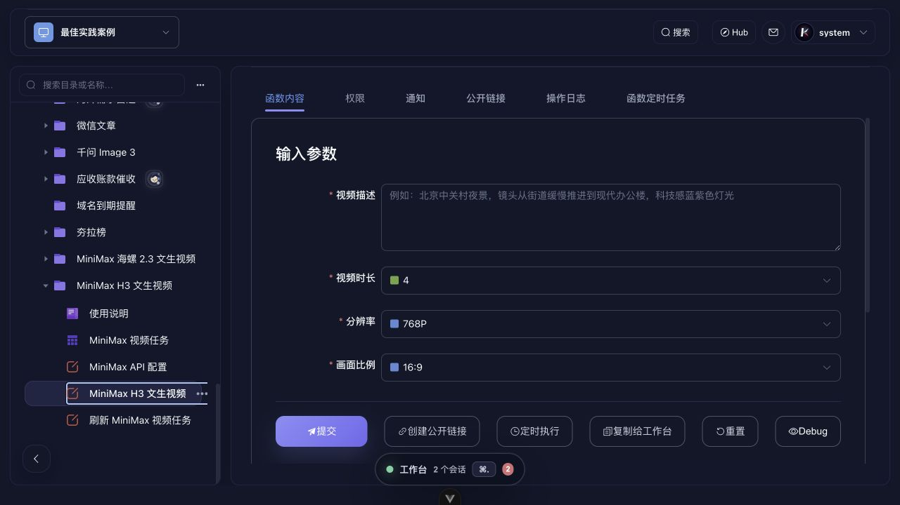
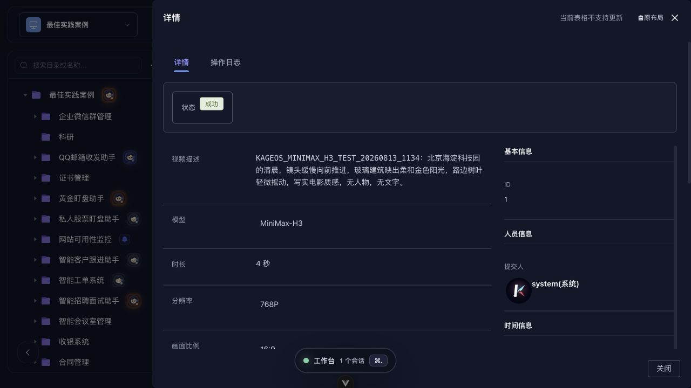

# MiniMax H3 目录配置与验收

> 由 Codex 的 siyuan-notes 技能管理。最后更新：2026-08-13。

## 当前状态

- kageos 工作空间：`system/democase`
- 目录路径：`/minimax_h3`
- 官方 model ID：`MiniMax-H3`
- 创建接口：`POST https://api.minimaxi.com/v2/video_generation`
- 查询接口：`GET https://api.minimaxi.com/v2/query/video_generation/{task_id}`
- 文生视频闭环已通过一次真实测试；Hub 尚未发布。

## 用户配置步骤

1. 在目录树打开“MiniMax H3 文生视频”。
2. 打开“MiniMax API 配置”。
3. 将 MiniMax 开放平台的 API Key 填入密码字段并提交。该表单是单例配置，后续调用默认读取这一条配置。
4. API Key 的完整值只保存在 kageos 单例配置与思源的 kageos 密钥文档中，不得写入普通 Table、任务历史、聊天、日志、Hub 包或截图。
5. 打开“MiniMax H3 文生视频”，填写描述，选择时长、分辨率和画面比例后提交。
6. 打开“MiniMax 视频任务”查看异步状态与下载结果。后台每 60 秒刷新一次待处理任务。

## 2026-08-13 真实验收

- 用户明确批准一次约 ¥2 的测试，并确认账户已充值。
- 只提交 1 次付费请求，没有自动重试或第二次计费提交。
- 参数：4 秒、768P、16:9；目录预计费用 ¥2。
- 提示词场景：北京海淀科技园清晨，写实电影质感，无人物、无文字。
- 结果：任务成功；成片已下载并持久化到工作空间，任务历史可追溯。
- 文件校验：MP4，2,136,079 字节，H.264 1344×768，AAC，约 4.46 秒；SHA-256 `dfe94cf052fab05ae831c8bfdde25f8314743696b4c9db4914d3721b68e10f88`。

## 发布前开放事项

- 旧“MiniMax 海螺 2.3 文生视频”目录仍在服务树中，应在发布 Hub 前退役，避免用户误选历史模型。
- 当前版本完成了文生视频；首尾帧、图片/视频/音频多模态参考仍待开发。
- 发布前补做敏感信息扫描、失败分支验收、Hub 安装后配置验证与演示素材整理。

## 官方资料

- [MiniMax 模型概览](https://platform.minimaxi.com/docs/guides/models-intro)
- [H3 V2 创建视频任务](https://platform.minimaxi.com/docs/api-reference/video-generation-v2-create)
- [H3 V2 查询任务](https://platform.minimaxi.com/docs/api-reference/video-generation-v2-query)
- [按量计费](https://platform.minimaxi.com/docs/guides/pricing-paygo)
